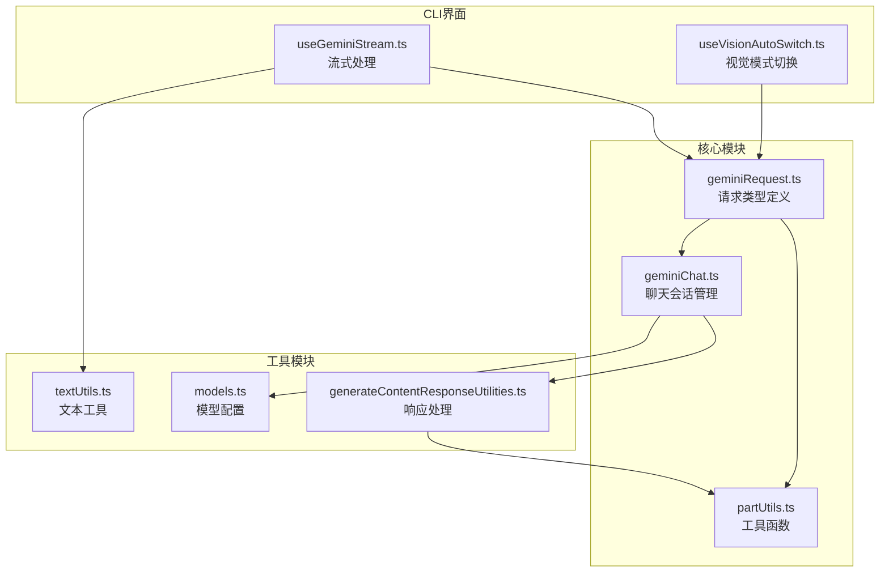
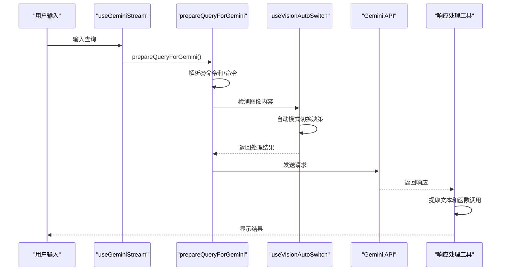
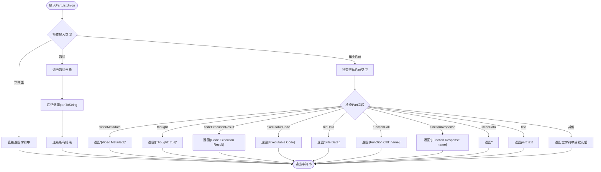
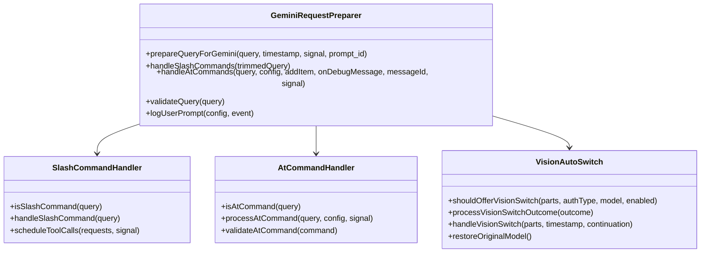
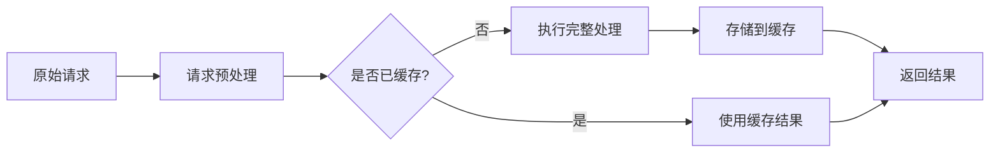

# Gemini API请求处理系统

<cite>
**本文档中引用的文件**
- [geminiRequest.ts](file://packages/core/src/core/geminiRequest.ts)
- [partUtils.ts](file://packages/core/src/utils/partUtils.ts)
- [geminiChat.ts](file://packages/core/src/core/geminiChat.ts)
- [geminiRequest.test.ts](file://packages/core/src/core/geminiRequest.test.ts)
- [useGeminiStream.ts](file://packages/cli/src/ui/hooks/useGeminiStream.ts)
- [useVisionAutoSwitch.test.ts](file://packages/cli/src/ui/hooks/useVisionAutoSwitch.test.ts)
- [generateContentResponseUtilities.ts](file://packages/core/src/utils/generateContentResponseUtilities.ts)
- [models.ts](file://packages/core/src/config/models.ts)
- [textUtils.ts](file://packages/core/src/utils/textUtils.ts)
</cite>

## 目录
1. [简介](#简介)
2. [项目结构概览](#项目结构概览)
3. [核心类型定义](#核心类型定义)
4. [架构概览](#架构概览)
5. [详细组件分析](#详细组件分析)
6. [请求处理流程](#请求处理流程)
7. [性能考量](#性能考量)
8. [错误处理机制](#错误处理机制)
9. [实际使用示例](#实际使用示例)
10. [故障排除指南](#故障排除指南)
11. [总结](#总结)

## 简介

Gemini API请求处理系统是一个专门为Qwen代码助手设计的多模态AI服务集成框架。该系统通过`GeminiCodeRequest`类型定义和`PartListUnion`结构，实现了对文本、图像、视频等多种数据类型的统一处理，为用户提供无缝的AI交互体验。

系统的核心设计理念是简化复杂的多模态请求处理，通过抽象层将不同类型的输入内容统一转换为符合Gemini API规范的格式，同时提供了强大的调试和日志记录功能。

## 项目结构概览



**图表来源**
- [geminiRequest.ts](file://packages/core/src/core/geminiRequest.ts#L1-L18)
- [partUtils.ts](file://packages/core/src/utils/partUtils.ts#L1-L170)
- [geminiChat.ts](file://packages/core/src/core/geminiChat.ts#L1-L50)

## 核心类型定义

### GeminiCodeRequest类型

`GeminiCodeRequest`是整个系统的核心类型定义，它本质上是对`PartListUnion`类型的别名：

```typescript
export type GeminiCodeRequest = PartListUnion;
```

这个简单而强大的设计使得：
- **类型一致性**：所有请求都遵循相同的接口规范
- **扩展性**：未来可以轻松添加额外的请求参数
- **简洁性**：避免了不必要的复杂包装

### PartListUnion基础结构

`PartListUnion`是Google GenAI库中定义的联合类型，支持多种数据格式：

```typescript
// 支持的数据类型
type SupportedPartTypes = 
  | string                           // 纯文本
  | Part                             // 复合部分
  | Part[]                           // 部分数组
  | (string | Part)[];              // 混合数组
```

### partListUnionToString函数

这是系统中最重要的调试工具之一，负责将复杂的Part结构转换为可读的字符串表示：

```typescript
export function partListUnionToString(value: PartListUnion): string {
  return partToString(value, { verbose: true });
}
```

**章节来源**
- [geminiRequest.ts](file://packages/core/src/core/geminiRequest.ts#L1-L18)
- [partUtils.ts](file://packages/core/src/utils/partUtils.ts#L15-L50)

## 架构概览



**图表来源**
- [useGeminiStream.ts](file://packages/cli/src/ui/hooks/useGeminiStream.ts#L257-L361)
- [geminiChat.ts](file://packages/core/src/core/geminiChat.ts#L1-L100)

## 详细组件分析

### PartToString函数实现

`partToString`函数是系统中最关键的转换函数，它能够处理各种类型的Part对象：



**图表来源**
- [partUtils.ts](file://packages/core/src/utils/partUtils.ts#L15-L50)

### 请求预处理流程



**图表来源**
- [useGeminiStream.ts](file://packages/cli/src/ui/hooks/useGeminiStream.ts#L257-L361)
- [useVisionAutoSwitch.test.ts](file://packages/cli/src/ui/hooks/useVisionAutoSwitch.test.ts#L1-L100)

**章节来源**
- [useGeminiStream.ts](file://packages/cli/src/ui/hooks/useGeminiStream.ts#L257-L449)
- [partUtils.ts](file://packages/core/src/utils/partUtils.ts#L15-L170)

## 请求处理流程

### 基础文本请求处理

对于简单的纯文本请求，系统会进行以下处理：

1. **输入验证**：检查字符串是否为空或仅包含空白字符
2. **命令解析**：识别并处理特殊命令（以`@`或`/`开头）
3. **日志记录**：记录用户查询到调试系统
4. **历史更新**：将用户消息添加到对话历史

### 图文混合请求处理

对于包含图像的混合请求，系统具有智能的自动切换功能：

```typescript
// 示例：检测图像内容
const parts: PartListUnion = [
  { text: '请分析这张图片' },
  { inlineData: { mimeType: 'image/png', data: 'base64encodeddata' } }
];
```

系统会根据以下条件决定是否触发视觉模式切换：
- 用户认证类型必须是QWEN_OAUTH
- 当前模型不是视觉模型
- 存在支持的图像格式（PNG、JPEG、JPG、GIF、WEBP）

### 函数调用请求处理

对于包含函数调用的请求，系统会：

1. **识别函数调用**：从Part结构中提取函数信息
2. **构建工具调用**：创建相应的工具调用请求
3. **调度执行**：将请求加入工具执行队列
4. **状态跟踪**：维护工具调用的状态信息

**章节来源**
- [useGeminiStream.ts](file://packages/cli/src/ui/hooks/useGeminiStream.ts#L257-L361)
- [useVisionAutoSwitch.test.ts](file://packages/cli/src/ui/hooks/useVisionAutoSwitch.test.ts#L45-L140)

## 性能考量

### 请求大小限制

系统内置了多种机制来处理大型请求：

1. **分块传输**：当消息过大时，系统会自动将其分割
2. **安全分割点**：使用`findLastSafeSplitPoint`函数确保分割不会破坏语法
3. **静态渲染优化**：利用React的`<Static />`组件减少重渲染

### 缓存和复用



### 内存管理

系统采用以下策略优化内存使用：
- **及时清理**：不再使用的Part对象会被自动释放
- **批量处理**：多个小请求会被合并处理以提高效率
- **流式处理**：大文件上传采用流式处理避免内存溢出

## 错误处理机制

### 无效请求格式检测

系统实现了多层次的错误检测机制：

```typescript
// 有效响应检测
function isValidResponse(response: GenerateContentResponse): boolean {
  if (response.usageMetadata) {
    return true;
  }
  
  if (response.candidates === undefined || response.candidates.length === 0) {
    return false;
  }
  
  if (response.candidates.some((candidate) => candidate.finishReason)) {
    return true;
  }
  
  const content = response.candidates[0]?.content;
  return content !== undefined && isValidContent(content);
}
```

### 恢复策略

当遇到错误时，系统会尝试以下恢复策略：

1. **指数退避重试**：使用线性回退算法重试失败的请求
2. **模型降级**：在特定情况下自动切换到备用模型
3. **内容过滤**：移除无效的历史记录项
4. **用户通知**：向用户显示适当的错误信息

### 循环检测

系统还包含了循环检测功能，防止无限循环：

```typescript
// 循环检测示例
if (hasCycleInSchema(schema)) {
  throw new Error('Detected potential cycle in schema');
}
```

**章节来源**
- [geminiChat.ts](file://packages/core/src/core/geminiChat.ts#L60-L120)
- [geminiChat.ts](file://packages/core/src/core/geminiChat.ts#L150-L200)

## 实际使用示例

### 纯文本请求示例

```typescript
// 简单的文本查询
const textQuery: PartListUnion = "解释一下什么是闭包";
const preparedQuery = await prepareQueryForGemini(
  textQuery, 
  Date.now(), 
  abortSignal, 
  "prompt-001"
);
```

### 图文混合请求示例

```typescript
// 包含图像的混合查询
const mixedQuery: PartListUnion = [
  { text: "分析这张代码截图：" },
  { 
    inlineData: { 
      mimeType: 'image/png', 
      data: 'iVBORw0KGgoAAAANSUhEUgAAAAEAAAABCAYAAAAfFcSJAAAADUlEQVR42mP8/5+hHgAHggJ/PchI7wAAAABJRU5ErkJggg==' 
    } 
  },
  { text: "\n请指出其中的错误" }
];
```

### 函数调用请求示例

```typescript
// 包含函数调用的查询
const functionQuery: PartListUnion = {
  functionCall: {
    name: "executePython",
    args: {
      code: "print('Hello, World!')"
    }
  }
};
```

### 调试和日志记录示例

```typescript
// 使用partListUnionToString进行调试
const debugInfo = partListUnionToString(mixedQuery);
console.log("请求详情:", debugInfo);
// 输出: "分析这张代码截图：<image/png>\n请指出其中的错误"
```

**章节来源**
- [geminiRequest.test.ts](file://packages/core/src/core/geminiRequest.test.ts#L1-L85)
- [useVisionAutoSwitch.test.ts](file://packages/cli/src/ui/hooks/useVisionAutoSwitch.test.ts#L45-L140)

## 故障排除指南

### 常见问题及解决方案

#### 1. 图像无法识别

**症状**：上传的图像没有被正确处理
**原因**：不支持的图像格式或权限问题
**解决方案**：
```typescript
// 检查图像格式支持
const isSupported = isSupportedImageMimeType(mimeType);
if (!isSupported) {
  console.warn('不支持的图像格式:', mimeType);
}
```

#### 2. 请求超时

**症状**：请求长时间无响应
**原因**：网络问题或API限制
**解决方案**：
- 检查网络连接
- 减少请求大小
- 使用指数退避重试

#### 3. 内容过滤

**症状**：响应被安全过滤器拦截
**原因**：内容违反使用政策
**解决方案**：
- 修改请求内容
- 使用更安全的模型
- 联系技术支持

### 调试技巧

#### 启用详细日志

```typescript
// 在开发环境中启用详细日志
const result = partListUnionToString(query, { verbose: true });
console.log("详细调试信息:", result);
```

#### 性能监控

```typescript
// 监控请求处理时间
const startTime = performance.now();
const response = await processRequest(query);
const endTime = performance.now();
console.log(`请求处理耗时: ${endTime - startTime}ms`);
```

**章节来源**
- [partUtils.ts](file://packages/core/src/utils/partUtils.ts#L15-L50)
- [geminiChat.ts](file://packages/core/src/core/geminiChat.ts#L60-L120)

## 总结

Gemini API请求处理系统是一个设计精良、功能完备的多模态AI服务集成框架。通过`GeminiCodeRequest`类型定义和`PartListUnion`结构，系统成功地将复杂的多模态请求处理抽象化，为开发者提供了简洁而强大的接口。

### 主要优势

1. **类型安全**：强类型定义确保了代码的可靠性和可维护性
2. **扩展性强**：模块化设计支持未来的功能扩展
3. **性能优化**：智能的缓存和分块传输机制提升了用户体验
4. **错误处理完善**：多层次的错误检测和恢复机制保证了系统的稳定性

### 技术特色

- **统一的请求格式**：通过`GeminiCodeRequest`实现了请求格式的统一
- **智能的视觉模式切换**：自动检测图像内容并提供切换选项
- **强大的调试工具**：`partListUnionToString`函数提供了丰富的调试信息
- **完善的错误处理**：多层次的错误检测和恢复策略

该系统不仅满足了当前的功能需求，还为未来的扩展预留了充足的空间，是一个值得学习和借鉴的优秀设计案例。