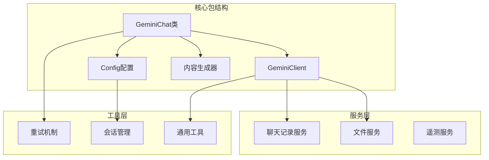
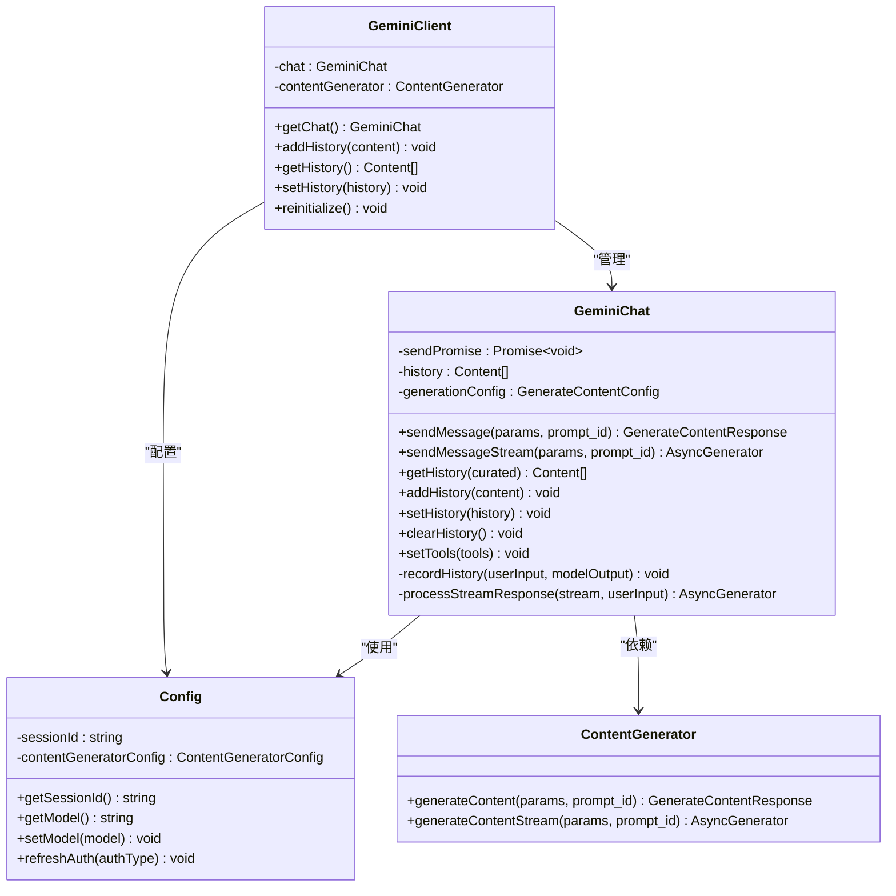
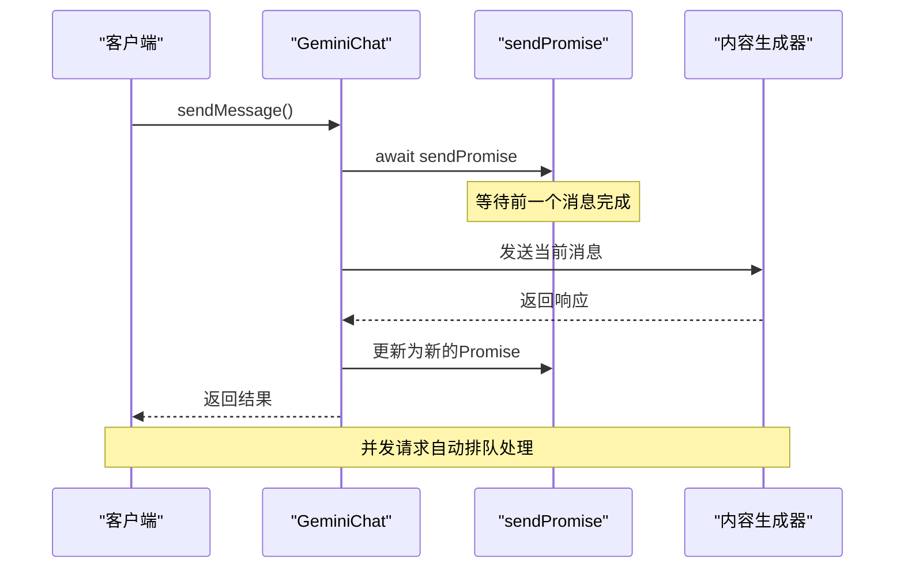
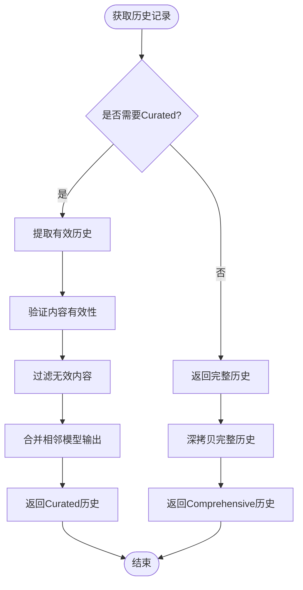
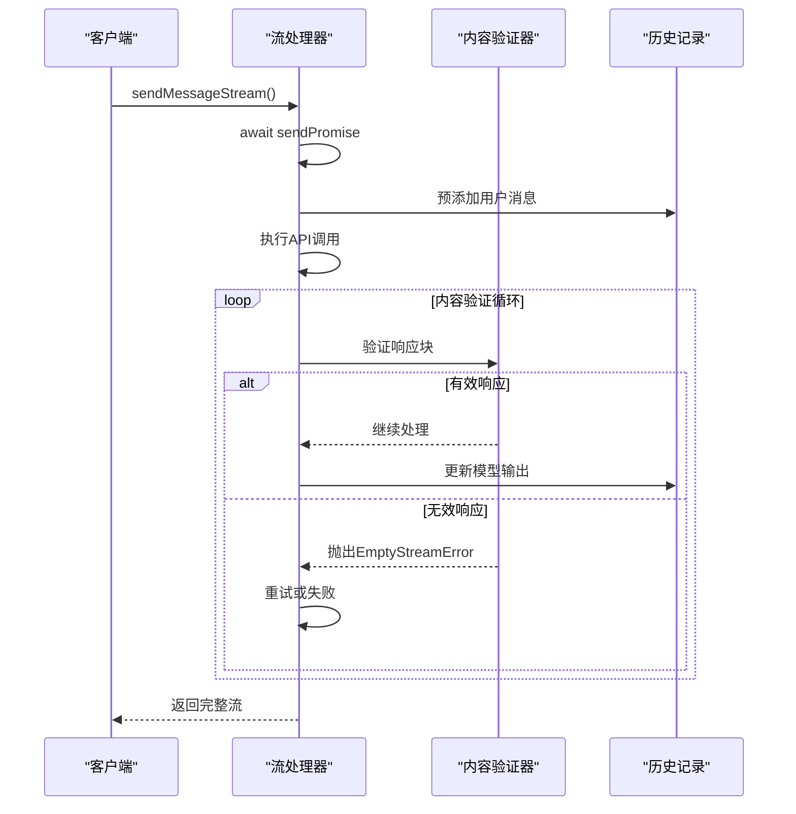
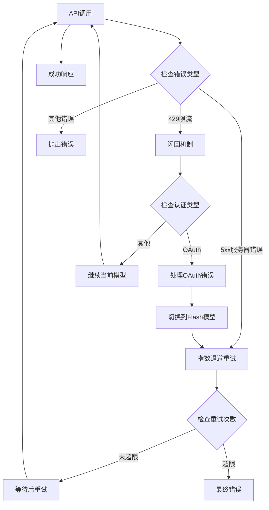
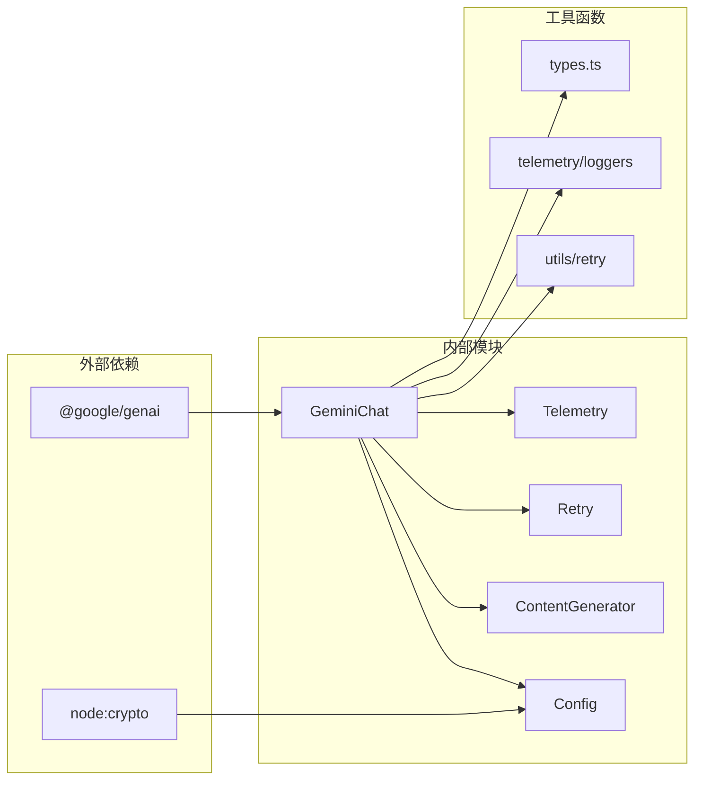

# GeminiChat会话管理机制深度分析

<cite>
**本文档引用的文件**
- [packages/core/src/core/geminiChat.ts](file://packages/core/src/core/geminiChat.ts)
- [packages/core/src/core/client.ts](file://packages/core/src/core/client.ts)
- [packages/core/src/config/config.ts](file://packages/core/src/config/config.ts)
- [packages/core/src/core/geminiChat.test.ts](file://packages/core/src/core/geminiChat.test.ts)
- [packages/core/src/services/chatRecordingService.ts](file://packages/core/src/services/chatRecordingService.ts)
- [packages/core/src/utils/session.ts](file://packages/core/src/utils/session.ts)
</cite>

## 目录
1. [引言](#引言)
2. [项目结构概览](#项目结构概览)
3. [核心组件分析](#核心组件分析)
4. [架构概览](#架构概览)
5. [详细组件分析](#详细组件分析)
6. [依赖关系分析](#依赖关系分析)
7. [性能考虑](#性能考虑)
8. [故障排除指南](#故障排除指南)
9. [结论](#结论)

## 引言

GeminiChat类是Qwen代码助手的核心会话管理组件，负责维护用户与Google Gemini模型之间的对话状态。该类通过精心设计的状态管理机制，确保消息按序处理、历史记录准确维护，并提供了强大的错误处理和重试机制。

本文档将深入分析GeminiChat类的设计理念、实现细节以及其在会话管理中的关键作用，特别关注其sendPromise机制、历史记录管理功能以及错误处理策略。

## 项目结构概览

GeminiChat类位于Qwen代码助手的核心包中，与其他组件紧密协作：



**图表来源**
- [packages/core/src/core/geminiChat.ts](file://packages/core/src/core/geminiChat.ts#L1-L50)
- [packages/core/src/core/client.ts](file://packages/core/src/core/client.ts#L1-L50)

**章节来源**
- [packages/core/src/core/geminiChat.ts](file://packages/core/src/core/geminiChat.ts#L1-L828)
- [packages/core/src/core/client.ts](file://packages/core/src/core/client.ts#L1-L339)

## 核心组件分析

### GeminiChat类设计原则

GeminiChat类采用了以下核心设计原则：

1. **单向数据流**：确保消息按顺序处理，避免并发冲突
2. **状态隔离**：每个会话实例维护独立的历史记录
3. **错误恢复**：提供完善的错误检测和重试机制
4. **性能优化**：通过深拷贝和缓存减少不必要的计算

### 关键数据结构

```typescript
// 会话历史记录结构
interface Content {
  role: 'user' | 'model';
  parts: Part[];
}

// 流事件类型
enum StreamEventType {
  CHUNK = 'chunk',
  RETRY = 'retry'
}
```

**章节来源**
- [packages/core/src/core/geminiChat.ts](file://packages/core/src/core/geminiChat.ts#L15-L30)
- [packages/core/src/core/geminiChat.ts](file://packages/core/src/core/geminiChat.ts#L32-L45)

## 架构概览

GeminiChat类采用分层架构设计，确保各组件职责清晰：



**图表来源**
- [packages/core/src/core/geminiChat.ts](file://packages/core/src/core/geminiChat.ts#L120-L150)
- [packages/core/src/core/client.ts](file://packages/core/src/core/client.ts#L140-L180)
- [packages/core/src/config/config.ts](file://packages/core/src/config/config.ts#L490-L520)

## 详细组件分析

### SendPromise机制详解

SendPromise是GeminiChat类的核心同步机制，确保消息按序处理：



**图表来源**
- [packages/core/src/core/geminiChat.ts](file://packages/core/src/core/geminiChat.ts#L250-L280)

#### 实现细节

```typescript
// 初始化时设置为空的Promise
private sendPromise: Promise<void> = Promise.resolve();

// 消息发送前等待当前Promise完成
await this.sendPromise;

// 创建新的Promise链
this.sendPromise = (async () => {
  // 处理响应并更新历史记录
  // ...
})();
```

这种设计确保了：
- **消息顺序性**：所有消息按发送顺序处理
- **并发安全**：避免多个请求同时修改历史记录
- **优雅降级**：即使某个请求失败，后续请求仍能正常执行

**章节来源**
- [packages/core/src/core/geminiChat.ts](file://packages/core/src/core/geminiChat.ts#L120-L130)
- [packages/core/src/core/geminiChat.ts](file://packages/core/src/core/geminiChat.ts#L250-L300)

### 历史记录管理系统

GeminiChat提供了两种历史记录模式：

#### Curated History vs Comprehensive History



**图表来源**
- [packages/core/src/core/geminiChat.ts](file://packages/core/src/core/geminiChat.ts#L180-L220)

#### 历史记录管理方法

```typescript
// 获取Curated历史（仅包含有效对话）
getHistory(curated: boolean = false): Content[] {
  const history = curated
    ? extractCuratedHistory(this.history)
    : this.history;
  // 使用深拷贝防止外部修改
  return structuredClone(history);
}

// 添加新历史记录
addHistory(content: Content): void {
  this.history.push(content);
}

// 设置完整历史记录
setHistory(history: Content[]): void {
  this.history = history;
}
```

#### Curated History算法

```typescript
function extractCuratedHistory(comprehensiveHistory: Content[]): Content[] {
  const curatedHistory: Content[] = [];
  let i = 0;
  
  while (i < comprehensiveHistory.length) {
    if (comprehensiveHistory[i].role === 'user') {
      curatedHistory.push(comprehensiveHistory[i]);
      i++;
    } else {
      // 处理模型输出，只保留有效的部分
      const modelOutput: Content[] = [];
      let isValid = true;
      
      while (i < comprehensiveHistory.length && 
             comprehensiveHistory[i].role === 'model') {
        modelOutput.push(comprehensiveHistory[i]);
        if (isValid && !isValidContent(comprehensiveHistory[i])) {
          isValid = false;
        }
        i++;
      }
      
      if (isValid) {
        curatedHistory.push(...modelOutput);
      }
    }
  }
  return curatedHistory;
}
```

**章节来源**
- [packages/core/src/core/geminiChat.ts](file://packages/core/src/core/geminiChat.ts#L180-L220)
- [packages/core/src/core/geminiChat.ts](file://packages/core/src/core/geminiChat.ts#L100-L140)

### 流式响应处理机制

GeminiChat支持流式响应处理，提供实时的消息接收体验：



**图表来源**
- [packages/core/src/core/geminiChat.ts](file://packages/core/src/core/geminiChat.ts#L360-L420)

#### 错误处理策略

```typescript
// 自定义错误类型
export class EmptyStreamError extends Error {
  constructor(message: string) {
    super(message);
    this.name = 'EmptyStreamError';
  }
}

// 流式响应处理中的错误检测
private async *processStreamResponse(
  streamResponse: AsyncGenerator<GenerateContentResponse>,
  userInput: Content,
): AsyncGenerator<GenerateContentResponse> {
  let hasReceivedValidChunk = false;
  let lastChunkIsInvalid = false;
  
  for await (const chunk of streamResponse) {
    if (isValidResponse(chunk)) {
      hasReceivedValidChunk = true;
      lastChunkIsInvalid = false;
      // 处理有效内容...
    } else {
      lastChunkIsInvalid = true;
    }
    yield chunk;
  }
  
  // 验证流完整性
  if (!hasReceivedValidChunk || lastChunkIsInvalid) {
    throw new EmptyStreamError(
      'Model stream ended with an invalid chunk or missing finish reason.'
    );
  }
}
```

**章节来源**
- [packages/core/src/core/geminiChat.ts](file://packages/core/src/core/geminiChat.ts#L140-L170)
- [packages/core/src/core/geminiChat.ts](file://packages/core/src/core/geminiChat.ts#L650-L720)

### 重试机制与错误恢复

GeminiChat实现了智能的重试机制，能够处理各种网络和模型错误：



**图表来源**
- [packages/core/src/core/geminiChat.ts](file://packages/core/src/core/geminiChat.ts#L280-L320)

#### 重试配置

```typescript
const INVALID_CONTENT_RETRY_OPTIONS: ContentRetryOptions = {
  maxAttempts: 3, // 初始调用 + 2次重试
  initialDelayMs: 500,
};

// 重试条件判断
shouldRetry: (error: unknown) => {
  if (error instanceof Error && error.message) {
    if (isSchemaDepthError(error.message)) return false;
    if (error.message.includes('429')) return true;
    if (error.message.match(/5\d{2}/)) return true;
  }
  return false;
}
```

**章节来源**
- [packages/core/src/core/geminiChat.ts](file://packages/core/src/core/geminiChat.ts#L50-L70)
- [packages/core/src/core/geminiChat.ts](file://packages/core/src/core/geminiChat.ts#L280-L320)

## 依赖关系分析

GeminiChat类的依赖关系体现了清晰的分层架构：



**图表来源**
- [packages/core/src/core/geminiChat.ts](file://packages/core/src/core/geminiChat.ts#L1-L20)
- [packages/core/src/config/config.ts](file://packages/core/src/config/config.ts#L1-L30)

**章节来源**
- [packages/core/src/core/geminiChat.ts](file://packages/core/src/core/geminiChat.ts#L1-L30)
- [packages/core/src/core/client.ts](file://packages/core/src/core/client.ts#L1-L30)

## 性能考虑

### 内存管理策略

1. **深拷贝优化**：历史记录返回时使用`structuredClone`进行深拷贝
2. **缓存机制**：避免重复计算相同的历史记录
3. **垃圾回收**：及时清理不再使用的Promise对象

### 性能优化建议

```typescript
// 推荐的会话管理实践
const chat = new GeminiChat(config, contentGenerator, generationConfig);

// 批量添加历史记录
const batchHistory = [userMsg, modelReply1, userMsg2, modelReply2];
batchHistory.forEach(msg => chat.addHistory(msg));

// 使用Curated历史进行模型推理
const curatedHistory = chat.getHistory(true);
const response = await chat.sendMessage({ message: userQuestion }, promptId);
```

### 内存使用分析

- **历史记录存储**：每条消息约占用100-200字节
- **并发处理**：sendPromise链的长度影响内存使用
- **流式处理**：流式响应比完整响应占用更多内存

## 故障排除指南

### 常见问题与解决方案

#### 1. EmptyStreamError错误

**症状**：流式响应在没有有效内容的情况下结束

**原因**：
- 模型输出为空或格式不正确
- 安全过滤器阻止了内容生成
- 网络连接不稳定

**解决方案**：
```typescript
try {
  const stream = await chat.sendMessageStream(params, promptId);
  for await (const chunk of stream) {
    if (chunk.type === StreamEventType.CHUNK) {
      // 处理有效内容
    }
  }
} catch (error) {
  if (error instanceof EmptyStreamError) {
    // 重试逻辑
    await chat.sendMessage(params, promptId);
  }
}
```

#### 2. 并发请求冲突

**症状**：多个sendMessage调用同时执行导致历史记录混乱

**解决方案**：
```typescript
// GeminiChat自动处理并发问题
// 不需要额外的锁机制
await chat.sendMessage({ message: "第一个消息" }, promptId1);
await chat.sendMessage({ message: "第二个消息" }, promptId2);
```

#### 3. 会话状态不一致

**症状**：历史记录与实际对话状态不符

**解决方案**：
```typescript
// 重新初始化会话
await config.refreshAuth(AuthType.LOGIN_WITH_GOOGLE);
const newChat = await client.getChat();
client.setHistory(existingHistory, { stripThoughts: true });
```

**章节来源**
- [packages/core/src/core/geminiChat.ts](file://packages/core/src/core/geminiChat.ts#L140-L170)
- [packages/core/src/core/geminiChat.ts](file://packages/core/src/core/geminiChat.ts#L650-L720)

## 结论

GeminiChat类通过精心设计的架构和机制，为Qwen代码助手提供了强大而可靠的会话管理能力。其核心特性包括：

1. **SendPromise机制**：确保消息按序处理，避免并发冲突
2. **双模式历史管理**：Curated History用于模型推理，Comprehensive History用于完整记录
3. **智能错误处理**：完善的重试机制和错误恢复策略
4. **流式响应支持**：实时消息接收和处理
5. **性能优化**：深拷贝和缓存机制减少资源消耗

这些设计使得GeminiChat能够在复杂的开发环境中稳定运行，为用户提供流畅的对话体验。通过深入理解这些机制，开发者可以更好地利用GeminiChat的功能，构建高质量的AI应用。