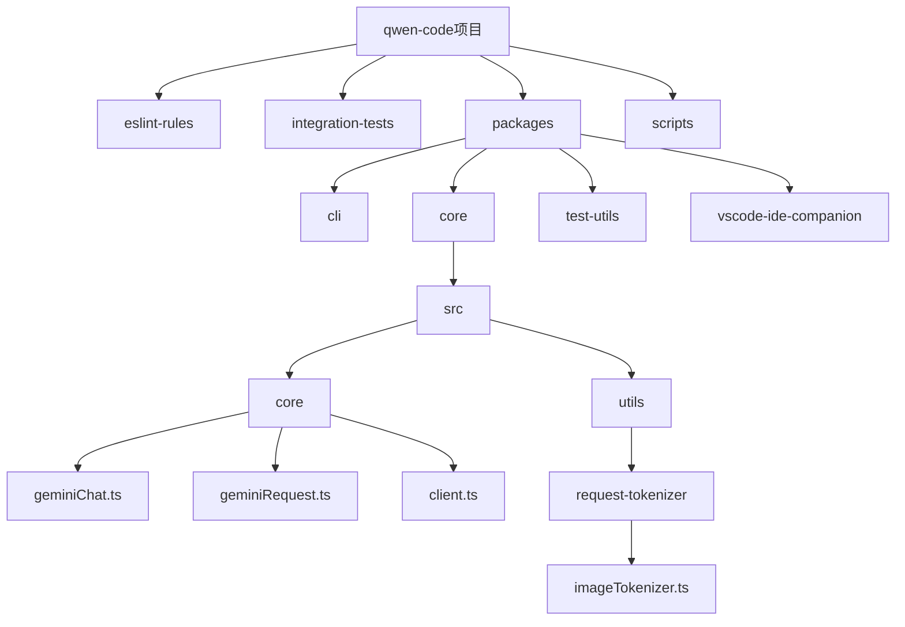
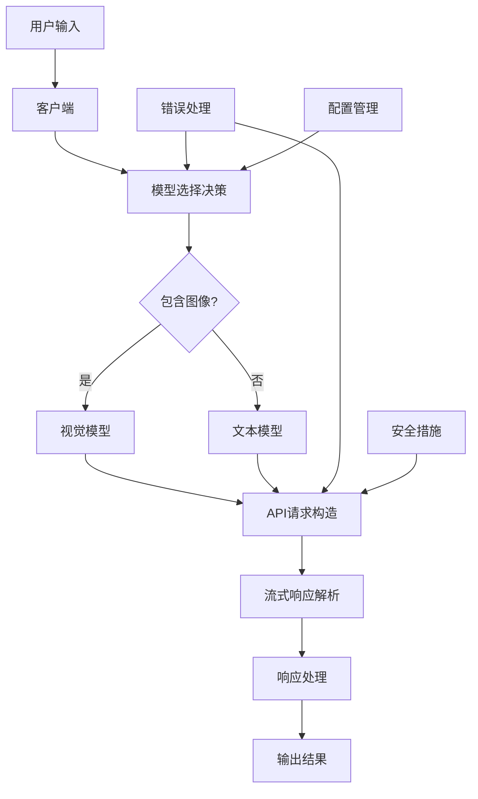
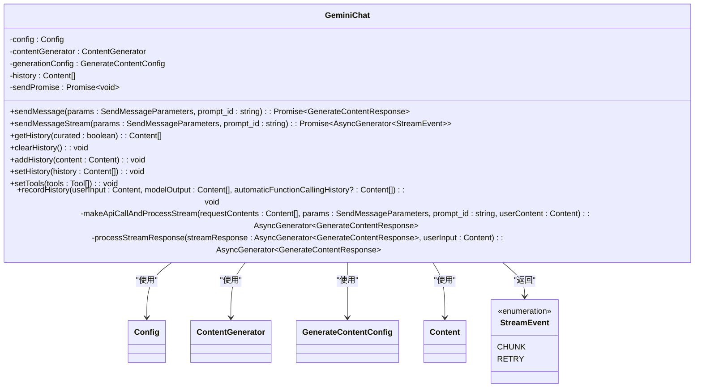
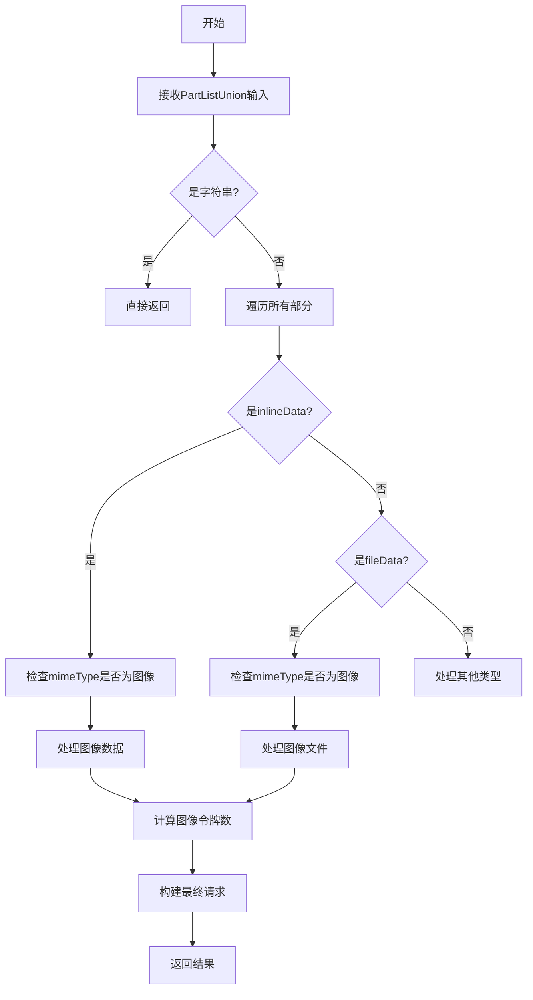
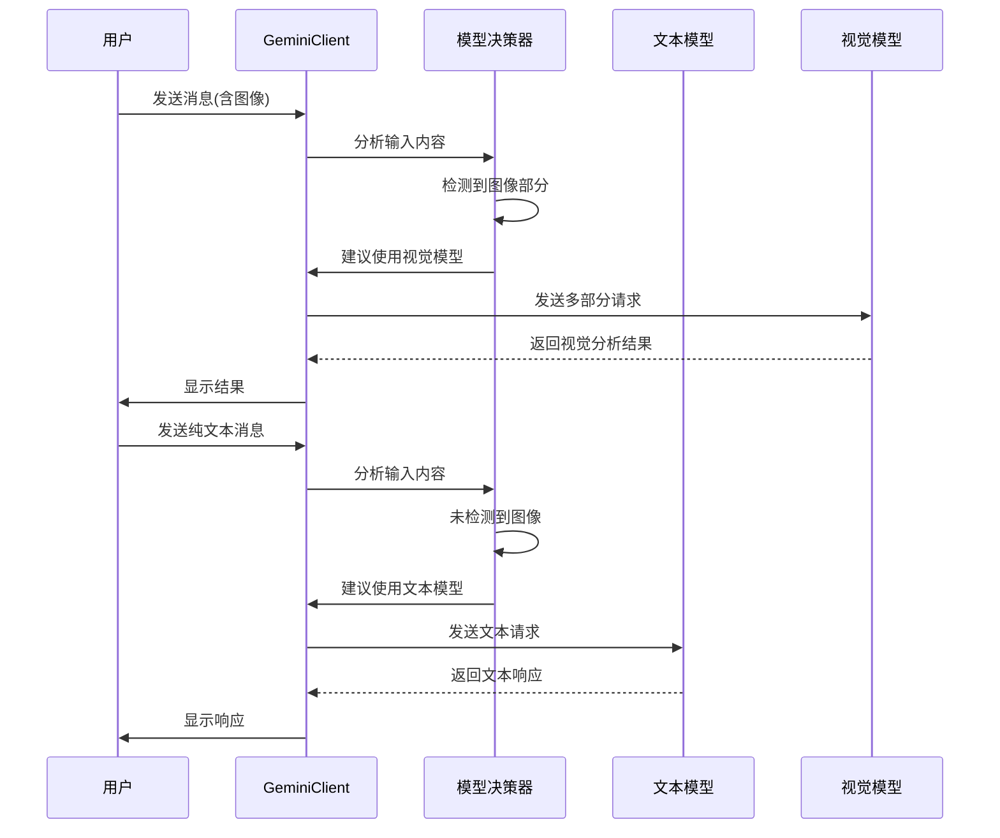
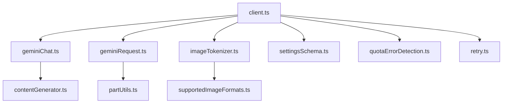
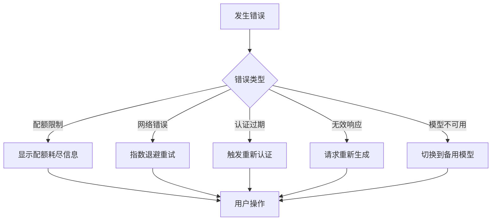

# 多模态模型集成

<cite>
**本文档中引用的文件**  
- [geminiChat.ts](file://packages/core/src/core/geminiChat.ts)
- [geminiRequest.ts](file://packages/core/src/core/geminiRequest.ts)
- [client.ts](file://packages/core/src/core/client.ts)
- [imageTokenizer.ts](file://packages/core/src/utils/request-tokenizer/imageTokenizer.ts)
- [settingsSchema.ts](file://packages/cli/src/config/settingsSchema.ts)
- [quotaErrorDetection.ts](file://packages/core/src/utils/quotaErrorDetection.ts)
- [retry.ts](file://packages/core/src/utils/retry.ts)
</cite>

## 目录
1. [引言](#引言)
2. [项目结构](#项目结构)
3. [核心组件](#核心组件)
4. [架构概述](#架构概述)
5. [详细组件分析](#详细组件分析)
6. [依赖分析](#依赖分析)
7. [性能考虑](#性能考虑)
8. [故障排除指南](#故障排除指南)
9. [结论](#结论)

## 引言
本文档深入探讨qwen-code与Gemini多模态模型的集成架构。重点分析聊天会话管理器的设计、API请求构造逻辑、模型切换决策机制以及错误处理和安全措施。通过详细分析核心文件，揭示系统如何根据输入内容动态选择文本模型或视觉模型，并提供完整的交互流程示例。

## 项目结构
qwen-code项目采用模块化架构，主要包含以下几个核心目录：

- **eslint-rules**: 包含自定义ESLint规则
- **integration-tests**: 集成测试套件
- **packages**: 核心功能包，包括cli、core等
- **scripts**: 构建和部署脚本

其中，`packages/core/src/core`目录包含多模态模型集成的核心实现，而`packages/cli/src/config`包含相关配置设置。

**图表来源**
- [geminiChat.ts](file://packages/core/src/core/geminiChat.ts)
- [geminiRequest.ts](file://packages/core/src/core/geminiRequest.ts)
- [client.ts](file://packages/core/src/core/client.ts)
- [imageTokenizer.ts](file://packages/core/src/utils/request-tokenizer/imageTokenizer.ts)

**章节来源**
- [geminiChat.ts](file://packages/core/src/core/geminiChat.ts)
- [geminiRequest.ts](file://packages/core/src/core/geminiRequest.ts)
- [client.ts](file://packages/core/src/core/client.ts)

## 核心组件
本项目的核心组件包括聊天会话管理器、API请求构造器和模型切换决策机制。这些组件协同工作，实现了多模态AI模型的智能集成。

聊天会话管理器（GeminiChat）负责维护对话历史并处理消息发送，API请求构造器（geminiRequest）处理多部分请求的构建，而模型切换决策机制（client.ts）则根据上下文内容自动在不同AI模型间切换。

**章节来源**
- [geminiChat.ts](file://packages/core/src/core/geminiChat.ts)
- [geminiRequest.ts](file://packages/core/src/core/geminiRequest.ts)
- [client.ts](file://packages/core/src/core/client.ts)

## 架构概述
qwen-code的多模态模型集成架构采用分层设计，各组件职责明确，协同工作。

**图表来源**
- [client.ts](file://packages/core/src/core/client.ts)
- [geminiRequest.ts](file://packages/core/src/core/geminiRequest.ts)

**章节来源**
- [client.ts](file://packages/core/src/core/client.ts)
- [geminiRequest.ts](file://packages/core/src/core/geminiRequest.ts)

## 详细组件分析

### 聊天会话管理器分析
GeminiChat类实现了聊天会话的核心功能，包括消息发送、历史管理、流式响应处理等。

#### 类图

**图表来源**
- [geminiChat.ts](file://packages/core/src/core/geminiChat.ts)

**章节来源**
- [geminiChat.ts](file://packages/core/src/core/geminiChat.ts)

### API请求构造逻辑分析
geminiRequest模块负责处理多部分请求的构建和媒体类型处理。

#### 流程图

**图表来源**
- [geminiRequest.ts](file://packages/core/src/core/geminiRequest.ts)
- [imageTokenizer.ts](file://packages/core/src/utils/request-tokenizer/imageTokenizer.ts)

**章节来源**
- [geminiRequest.ts](file://packages/core/src/core/geminiRequest.ts)

### 模型切换决策机制分析
client.ts中的模型切换决策机制根据输入内容自动在不同AI模型间无缝切换。

#### 序列图

**图表来源**
- [client.ts](file://packages/core/src/core/client.ts)

**章节来源**
- [client.ts](file://packages/core/src/core/client.ts)

## 依赖分析
系统各组件之间的依赖关系清晰，形成了一个稳定的架构。

**图表来源**
- [client.ts](file://packages/core/src/core/client.ts)
- [geminiChat.ts](file://packages/core/src/core/geminiChat.ts)
- [geminiRequest.ts](file://packages/core/src/core/geminiRequest.ts)
- [imageTokenizer.ts](file://packages/core/src/utils/request-tokenizer/imageTokenizer.ts)
- [settingsSchema.ts](file://packages/cli/src/config/settingsSchema.ts)
- [quotaErrorDetection.ts](file://packages/core/src/utils/quotaErrorDetection.ts)
- [retry.ts](file://packages/core/src/utils/retry.ts)

**章节来源**
- [client.ts](file://packages/core/src/core/client.ts)
- [geminiChat.ts](file://packages/core/src/core/geminiChat.ts)
- [geminiRequest.ts](file://packages/core/src/core/geminiRequest.ts)

## 性能考虑
系统在性能方面进行了多项优化：

1. **令牌计算优化**：使用ImageTokenizer精确计算图像令牌数，避免超出模型限制
2. **流式处理**：支持流式响应解析，减少等待时间
3. **缓存机制**：对频繁使用的模型和配置进行缓存
4. **异步处理**：所有API调用均为异步，避免阻塞主线程
5. **重试策略**：实现指数退避重试机制，提高请求成功率

这些优化确保了系统在处理多模态内容时的高效性和稳定性。

## 故障排除指南
系统实现了完善的错误处理机制，包括：

**章节来源**
- [quotaErrorDetection.ts](file://packages/core/src/utils/quotaErrorDetection.ts)
- [retry.ts](file://packages/core/src/utils/retry.ts)
- [client.ts](file://packages/core/src/core/client.ts)

### 错误处理机制
系统能够处理多种错误情况：

1. **模型配额限制**：检测到配额耗尽时，提供清晰的错误信息
2. **网络中断恢复**：通过重试机制自动恢复网络中断
3. **降级策略**：在主要模型不可用时，自动切换到备用模型
4. **无效内容处理**：对模型生成的无效内容进行检测和处理
5. **认证错误**：处理OAuth认证过期等问题

**图表来源**
- [quotaErrorDetection.ts](file://packages/core/src/utils/quotaErrorDetection.ts)
- [retry.ts](file://packages/core/src/utils/retry.ts)

### 安全考虑
系统实施了多项安全措施：

1. **图像内容审核**：在处理图像前进行内容安全检查
2. **隐私保护**：对敏感信息进行过滤和脱敏
3. **认证管理**：安全存储和管理用户认证信息
4. **输入验证**：对所有用户输入进行严格验证
5. **访问控制**：实施基于角色的访问控制

这些安全措施确保了系统在处理多模态内容时的安全性和合规性。

## 结论
qwen-code与Gemini多模态模型的集成架构设计精良，实现了智能的模型选择、高效的请求处理和可靠的错误恢复。通过分析核心组件，我们可以看到系统如何根据输入内容动态选择最适合的AI模型，并提供流畅的用户体验。该架构具有良好的可扩展性和维护性，为未来的功能增强奠定了坚实的基础。