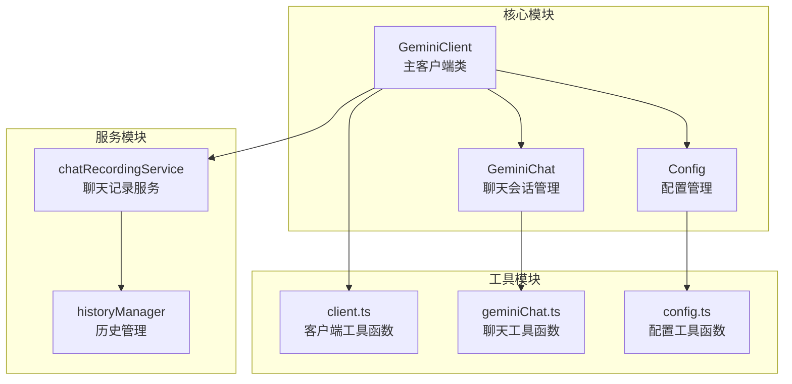
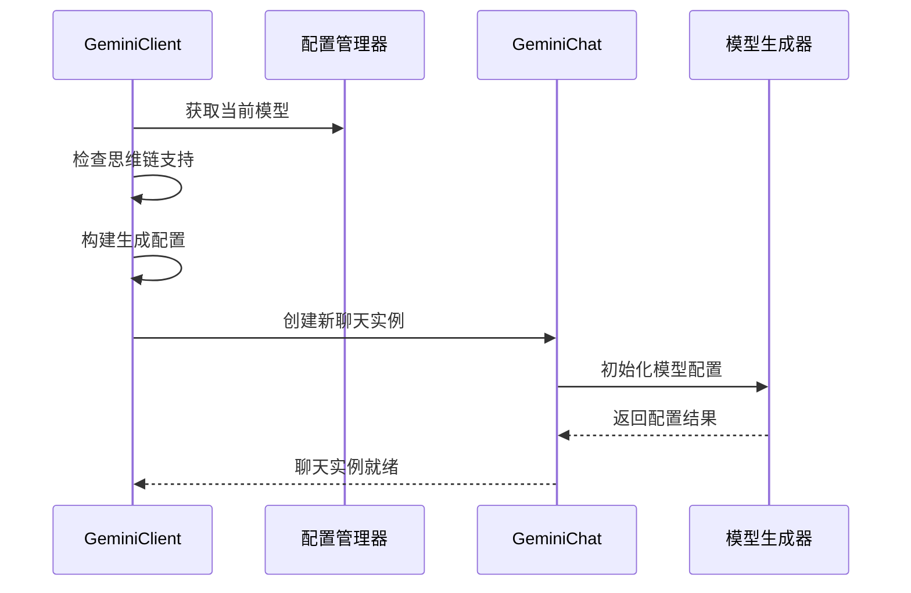
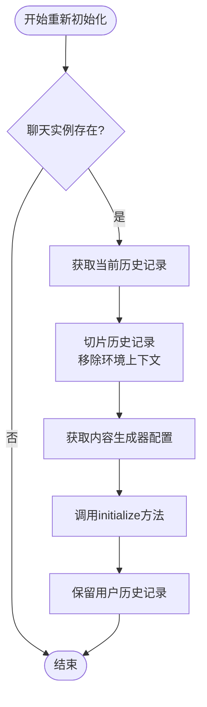
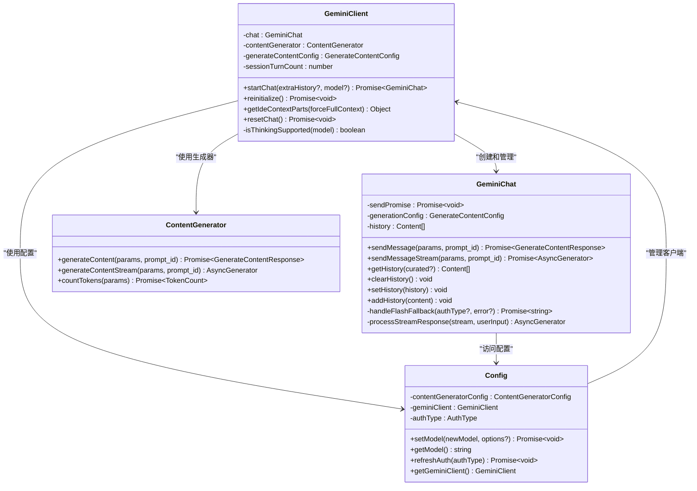
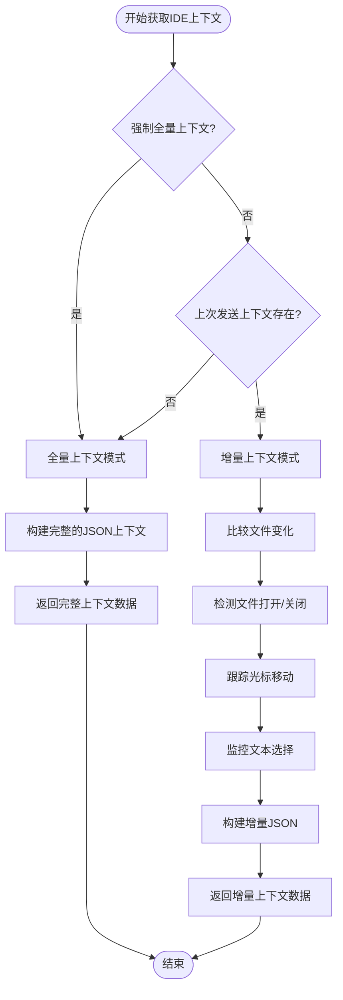
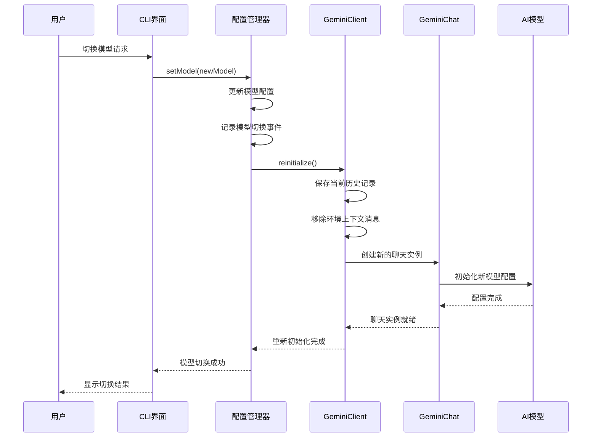
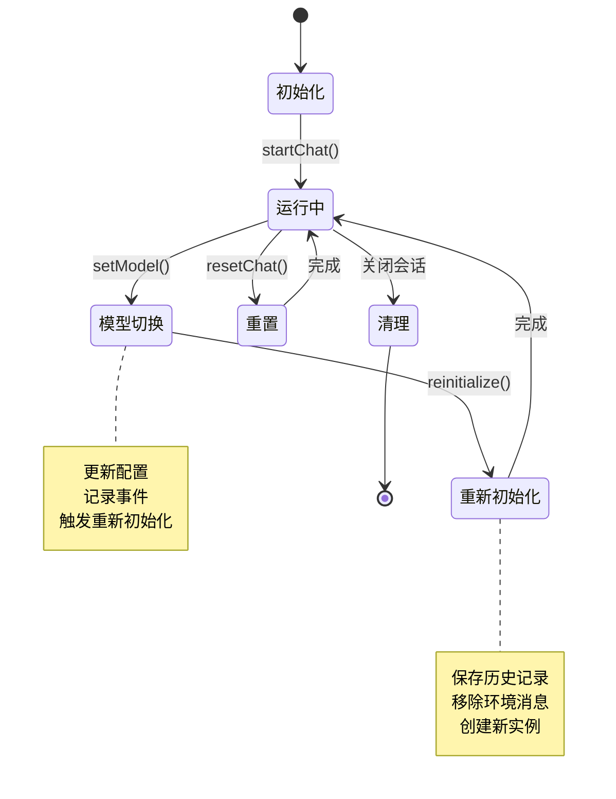
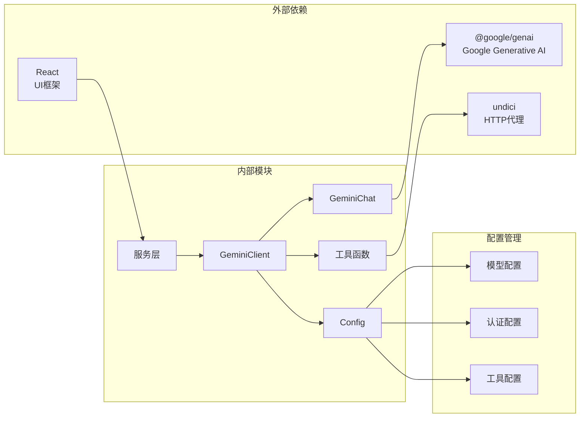

# 模型切换机制

<cite>
**本文档引用的文件**
- [packages/core/src/core/geminiChat.ts](file://packages/core/src/core/geminiChat.ts)
- [packages/core/src/core/client.ts](file://packages/core/src/core/client.ts)
- [packages/core/src/config/config.ts](file://packages/core/src/config/config.ts)
- [packages/core/src/core/client.test.ts](file://packages/core/src/core/client.test.ts)
- [packages/core/src/services/chatRecordingService.ts](file://packages/core/src/services/chatRecordingService.ts)
- [packages/cli/src/ui/hooks/useHistoryManager.ts](file://packages/cli/src/ui/hooks/useHistoryManager.ts)
</cite>

## 目录
1. [简介](#简介)
2. [项目结构概览](#项目结构概览)
3. [核心组件分析](#核心组件分析)
4. [架构概览](#架构概览)
5. [详细组件分析](#详细组件分析)
6. [依赖关系分析](#依赖关系分析)
7. [性能考虑](#性能考虑)
8. [故障排除指南](#故障排除指南)
9. [结论](#结论)

## 简介

GeminiClient是Qwen代码助手的核心组件，负责管理与Google Gemini AI模型的交互。该系统实现了复杂的模型自动切换机制，能够根据不同的条件和用户需求动态选择最适合的模型，并在模型切换时保持会话的一致性和完整性。

本文档深入分析了GeminiClient中模型自动切换的决策逻辑，包括`isThinkingSupported`函数如何根据模型名称判断思维链功能支持情况，`startChat`方法中基于模型特性的生成配置动态调整机制，以及`reinitialize`方法在配置变更时如何重建会话并保持历史记录一致性。

## 项目结构概览



**图表来源**
- [packages/core/src/core/client.ts](file://packages/core/src/core/client.ts#L1-L50)
- [packages/core/src/core/geminiChat.ts](file://packages/core/src/core/geminiChat.ts#L1-L50)
- [packages/core/src/config/config.ts](file://packages/core/src/config/config.ts#L1-L50)

## 核心组件分析

### isThinkingSupported函数

`isThinkingSupported`函数是模型切换机制的核心决策点，它根据模型名称判断是否支持思维链（Chain-of-Thought）功能：

```typescript
function isThinkingSupported(model: string) {
  if (model.startsWith('gemini-2.5')) return true;
  return false;
}
```

这个函数的实现逻辑非常简洁但至关重要：
- **模型识别**：通过检查模型名称前缀来确定支持情况
- **版本区分**：仅当模型名称以"gemini-2.5"开头时返回true
- **默认行为**：其他所有模型都不支持思维链功能

这种设计确保了只有特定版本的Gemini模型才能启用高级的思维链推理能力，同时避免了对不支持该功能的模型进行错误配置。

**章节来源**
- [packages/core/src/core/client.ts](file://packages/core/src/core/client.ts#L61-L63)

### startChat方法中的动态配置调整

`startChat`方法展示了基于模型特性进行动态配置调整的完整流程：



**图表来源**
- [packages/core/src/core/client.ts](file://packages/core/src/core/client.ts#L267-L311)

该方法的关键特性包括：

1. **环境上下文获取**：通过`getEnvironmentContext`获取IDE环境信息
2. **工具注册**：自动注册可用的工具声明
3. **系统指令构建**：根据用户记忆和模型特性生成系统指令
4. **思维链配置**：基于`isThinkingSupported`的结果动态添加思考配置
5. **历史初始化**：设置初始对话历史记录

**章节来源**
- [packages/core/src/core/client.ts](file://packages/core/src/core/client.ts#L267-L311)

### reinitialize方法的会话重建机制

`reinitialize`方法实现了在配置变更时重建会话并保持历史记录一致性的复杂逻辑：



**图表来源**
- [packages/core/src/core/client.ts](file://packages/core/src/core/client.ts#L230-L265)

该方法的核心步骤：

1. **历史记录保护**：保存当前聊天历史（排除环境上下文消息）
2. **配置获取**：从配置管理器获取最新的内容生成器配置
3. **实例重建**：使用保存的历史记录和新的配置重新初始化聊天实例
4. **状态同步**：确保会话状态与新的配置保持一致

**章节来源**
- [packages/core/src/core/client.ts](file://packages/core/src/core/client.ts#L230-L265)

## 架构概览



**图表来源**
- [packages/core/src/core/client.ts](file://packages/core/src/core/client.ts#L100-L200)
- [packages/core/src/core/geminiChat.ts](file://packages/core/src/core/geminiChat.ts#L100-L200)
- [packages/core/src/config/config.ts](file://packages/core/src/config/config.ts#L100-L200)

## 详细组件分析

### getIdeContextParts方法的上下文切换策略

`getIdeContextParts`方法实现了全量上下文与增量更新的智能切换机制：



**图表来源**
- [packages/core/src/core/client.ts](file://packages/core/src/core/client.ts#L327-L499)

该方法的两种工作模式：

#### 全量上下文模式
当满足以下任一条件时触发：
- 强制全量上下文标志被设置
- 上次发送的IDE上下文不存在

此模式会发送完整的IDE状态信息，包括：
- 所有打开文件列表
- 当前活动文件及其光标位置
- 选中的文本内容
- 文件路径信息

#### 增量上下文模式
当满足以下条件时触发：
- 上次发送的IDE上下文存在
- 不需要强制全量更新

此模式只发送变化的部分，显著减少传输的数据量：
- 新打开的文件
- 已关闭的文件
- 活动文件的变化（路径、光标、选区）
- 光标位置的移动
- 文本选择的变化

**章节来源**
- [packages/core/src/core/client.ts](file://packages/core/src/core/client.ts#L327-L499)

### 模型切换的完整处理流程



**图表来源**
- [packages/core/src/config/config.ts](file://packages/core/src/config/config.ts#L543-L592)
- [packages/core/src/core/client.ts](file://packages/core/src/core/client.ts#L230-L265)

这个流程展示了模型切换过程中的关键步骤：

1. **配置更新**：配置管理器更新模型设置并记录切换事件
2. **历史保护**：客户端保存当前聊天历史（排除环境消息）
3. **实例重建**：使用新的配置和历史记录创建新的聊天实例
4. **状态同步**：确保所有相关组件都使用新的配置
5. **用户体验**：向用户反馈切换结果和可能的影响

**章节来源**
- [packages/core/src/config/config.ts](file://packages/core/src/config/config.ts#L543-L592)

### 会话状态管理与历史记录同步



**图表来源**
- [packages/core/src/core/client.ts](file://packages/core/src/core/client.ts#L230-L265)
- [packages/core/src/services/chatRecordingService.ts](file://packages/core/src/services/chatRecordingService.ts#L129-L176)

会话状态管理的关键特性：

1. **历史记录保护**：在模型切换过程中保护用户的对话历史
2. **状态一致性**：确保所有组件使用相同的配置和状态
3. **错误恢复**：在重新初始化失败时提供适当的错误处理
4. **持久化存储**：将会话状态保存到磁盘文件中

**章节来源**
- [packages/core/src/services/chatRecordingService.ts](file://packages/core/src/services/chatRecordingService.ts#L129-L176)

## 依赖关系分析



**图表来源**
- [packages/core/src/core/client.ts](file://packages/core/src/core/client.ts#L1-L50)
- [packages/core/src/config/config.ts](file://packages/core/src/config/config.ts#L1-L50)

**章节来源**
- [packages/core/src/core/client.ts](file://packages/core/src/core/client.ts#L1-L50)
- [packages/core/src/config/config.ts](file://packages/core/src/config/config.ts#L1-L50)

## 性能考虑

### 上下文传输优化

模型切换机制采用了多种策略来优化性能：

1. **增量更新**：只传输变化的上下文信息，而不是整个状态
2. **JSON压缩**：使用紧凑的JSON格式减少传输大小
3. **缓存机制**：缓存已发送的上下文信息，避免重复传输
4. **异步处理**：使用异步操作避免阻塞主线程

### 内存管理

系统实现了有效的内存管理策略：

1. **历史记录截断**：定期清理过期的对话历史
2. **流式处理**：使用流式API处理大型响应
3. **垃圾回收**：及时释放不再使用的对象引用
4. **资源池化**：复用昂贵的对象实例

### 错误处理与恢复

系统具备完善的错误处理机制：

1. **重试机制**：自动重试临时性错误
2. **降级策略**：在部分功能不可用时提供基本功能
3. **状态回滚**：在操作失败时恢复到之前的状态
4. **日志记录**：详细记录错误信息用于调试

## 故障排除指南

### 常见问题及解决方案

#### 模型切换失败

**症状**：模型切换后聊天功能异常
**原因**：可能是配置更新失败或历史记录损坏
**解决方案**：
1. 检查模型配置是否正确
2. 重置聊天会话
3. 清理历史记录文件

#### 上下文丢失

**症状**：切换模型后对话历史不连续
**原因**：历史记录保护机制失效
**解决方案**：
1. 检查文件权限设置
2. 验证磁盘空间充足
3. 重新初始化聊天会话

#### 性能问题

**症状**：模型切换响应缓慢
**原因**：上下文过大或网络延迟
**解决方案**：
1. 启用增量上下文模式
2. 减少同时打开的文件数量
3. 优化网络连接

**章节来源**
- [packages/core/src/core/geminiChat.ts](file://packages/core/src/core/geminiChat.ts#L100-L200)
- [packages/core/src/core/client.ts](file://packages/core/src/core/client.ts#L230-L265)

## 结论

GeminiClient的模型切换机制是一个精心设计的系统，它成功地平衡了功能丰富性、性能优化和用户体验。通过`isThinkingSupported`函数的智能决策、`startChat`方法的动态配置调整、`reinitialize`方法的会话重建机制以及`getIdeContextParts`方法的上下文切换策略，该系统能够在各种场景下提供稳定可靠的模型切换功能。

主要优势包括：

1. **智能决策**：基于模型特性的自动配置调整
2. **状态一致性**：完整的会话状态管理和历史记录保护
3. **性能优化**：增量上下文传输和高效的内存管理
4. **错误恢复**：完善的错误处理和状态回滚机制
5. **扩展性**：模块化的架构设计便于功能扩展

这个模型切换机制为用户提供了一个无缝的AI交互体验，无论是在不同模型之间切换还是在认证方式变更时，都能保持会话的连续性和数据的完整性。