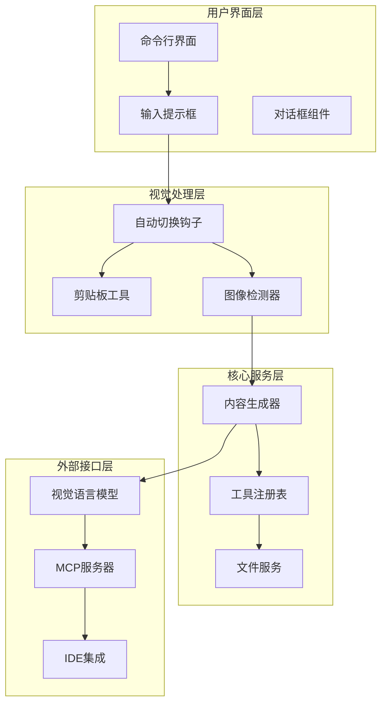
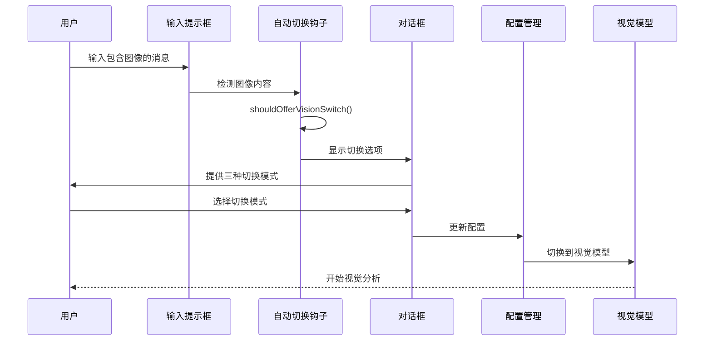
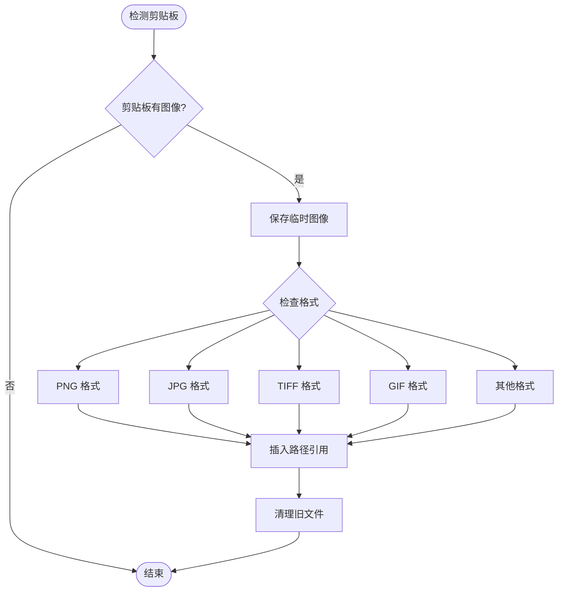
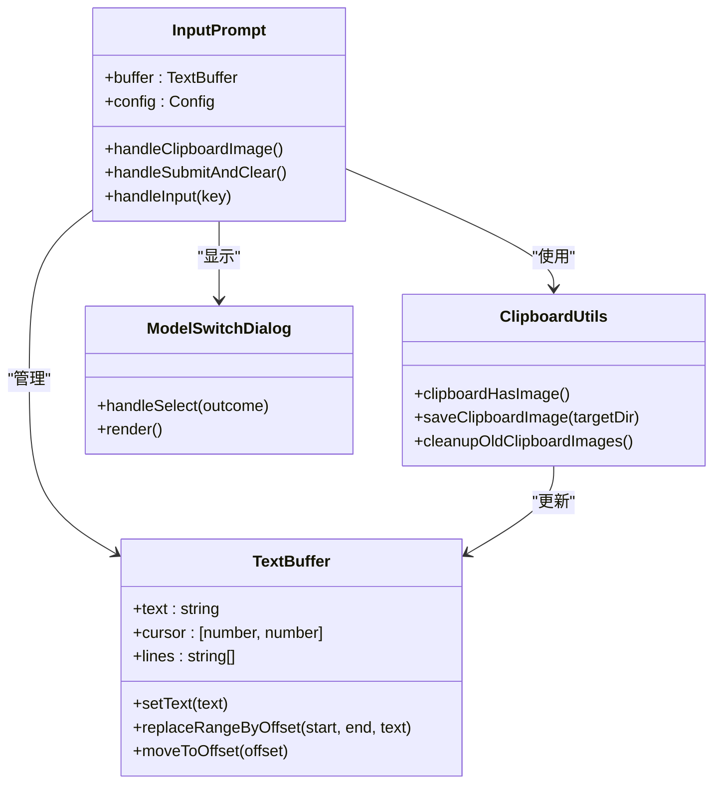

# Qwen Code 视觉功能使用场景

<cite>
**本文档中引用的文件**
- [README.md](file://README.md)
- [useVisionAutoSwitch.ts](file://packages/cli/src/ui/hooks/useVisionAutoSwitch.ts)
- [ModelSwitchDialog.tsx](file://packages/cli/src/ui/components/ModelSwitchDialog.tsx)
- [edit.ts](file://packages/core/src/tools/edit.ts)
- [read-file.ts](file://packages/core/src/tools/read-file.ts)
- [clipboardUtils.ts](file://packages/cli/src/ui/utils/clipboardUtils.ts)
- [InputPrompt.tsx](file://packages/cli/src/ui/components/InputPrompt.tsx)
- [qwen_code.py](file://integration-tests/terminal-bench/qwen_code.py)
- [edit.test.ts](file://integration-tests/edit.test.ts)
- [config.ts](file://packages/cli/src/config/config.ts)
- [settings.ts](file://packages/cli/src/config/settings.ts)
</cite>

## 目录
1. [简介](#简介)
2. [项目架构概览](#项目架构概览)
3. [核心视觉功能组件](#核心视觉功能组件)
4. [典型使用场景](#典型使用场景)
5. [操作流程详解](#操作流程详解)
6. [用户界面设计](#用户界面设计)
7. [配置管理](#配置管理)
8. [最佳实践指南](#最佳实践指南)
9. [故障排除](#故障排除)
10. [总结](#总结)

## 简介

Qwen Code 是一个强大的命令行 AI 工作流工具，专门针对 Qwen3-Coder 模型进行了优化。该工具不仅具备传统的代码理解和编辑能力，还集成了先进的视觉模型支持，能够自动检测输入中的图像并无缝切换到具备多模态分析能力的视觉模型。

视觉功能是 Qwen Code 的一大特色，它允许用户通过截图生成代码、分析图表创建数据结构、从界面原型生成前端代码等多种应用场景。本文档将详细介绍这些视觉功能的实际应用案例和使用模式。

## 项目架构概览

Qwen Code 采用模块化架构设计，视觉功能作为核心特性被深度集成在各个组件中：



**图表来源**
- [useVisionAutoSwitch.ts](file://packages/cli/src/ui/hooks/useVisionAutoSwitch.ts#L1-L50)
- [InputPrompt.tsx](file://packages/cli/src/ui/components/InputPrompt.tsx#L1-L100)

## 核心视觉功能组件

### 自动视觉模型切换系统

Qwen Code 的视觉功能基于智能的自动切换机制，当检测到图像输入时会自动提示用户切换到视觉模型：



**图表来源**
- [useVisionAutoSwitch.ts](file://packages/cli/src/ui/hooks/useVisionAutoSwitch.ts#L100-L200)
- [ModelSwitchDialog.tsx](file://packages/cli/src/ui/components/ModelSwitchDialog.tsx#L50-L90)

### 剪贴板图像处理

系统提供了完整的剪贴板图像处理功能，支持多种图像格式：



**图表来源**
- [clipboardUtils.ts](file://packages/cli/src/ui/utils/clipboardUtils.ts#L40-L100)

**章节来源**
- [useVisionAutoSwitch.ts](file://packages/cli/src/ui/hooks/useVisionAutoSwitch.ts#L1-L364)
- [clipboardUtils.ts](file://packages/cli/src/ui/utils/clipboardUtils.ts#L1-L148)

## 典型使用场景

### 场景一：通过截图生成代码实现

这是最常用的视觉功能场景之一，用户可以通过截图快速生成代码实现：

**操作步骤：**
1. 截取目标界面或代码片段的屏幕截图
2. 将截图粘贴到 Qwen Code 的输入框中
3. 系统自动检测到图像并提示切换到视觉模型
4. 使用适当的提示词描述需求
5. 获取生成的代码实现

**提示词工程技巧：**
- "请根据这个界面截图生成对应的代码实现"
- "分析这个UI设计并转换为React组件"
- "从这个原型图生成前端代码"

### 场景二：分析图表创建数据结构

用户可以上传图表图像，让 AI 分析并生成相应的数据结构：

**操作步骤：**
1. 上传图表图像（柱状图、饼图、流程图等）
2. 指定需要的数据结构类型
3. 获取结构化的数据表示

**提示词示例：**
- "分析这个图表并生成JSON数据结构"
- "提取图表中的数据并转换为数组格式"
- "根据图表内容创建数据库表结构"

### 场景三：从界面原型生成前端代码

这是视觉功能的重要应用场景，可以直接从界面原型生成前端代码：

**操作步骤：**
1. 上传界面原型或设计稿
2. 指定目标技术栈（React、Vue、HTML/CSS等）
3. 获取完整的前端代码实现

**提示词示例：**
- "从这个界面原型生成React组件代码"
- "分析这个设计稿并转换为HTML/CSS"
- "根据这个原型图生成完整的前端页面"

### 场景四：文档扫描和信息提取

用户可以扫描文档并提取其中的关键信息：

**操作步骤：**
1. 扫描或拍摄文档图像
2. 使用 OCR 功能提取文本
3. 进行进一步的信息处理

**提示词示例：**
- "从这个文档扫描中提取关键信息"
- "识别并整理这个表格中的数据"
- "分析这个手写笔记并转换为结构化文本"

**章节来源**
- [qwen_code.py](file://integration-tests/terminal-bench/qwen_code.py#L1-L70)
- [edit.test.ts](file://integration-tests/edit.test.ts#L1-L65)

## 操作流程详解

### 图像上传方法

Qwen Code 支持多种图像上传方式：

#### 1. 剪贴板直接粘贴
```typescript
// 自动检测剪贴板中的图像
if (await clipboardHasImage()) {
  const imagePath = await saveClipboardImage(config.getTargetDir());
  if (imagePath) {
    // 插入相对路径引用
    const relativePath = path.relative(config.getTargetDir(), imagePath);
    const insertText = `@${relativePath}`;
    buffer.replaceRangeByOffset(offset, offset, insertText);
  }
}
```

#### 2. 文件拖拽上传
用户可以直接将图像文件拖拽到输入框中，系统会自动识别并处理。

#### 3. 路径引用
用户可以在输入中直接引用本地图像文件：
```
@/path/to/screenshot.png
```

### 提示词工程技巧

有效的提示词是获得高质量输出的关键：

#### 基础提示词模板
```
请分析这个图像，并：
- 识别图像中的元素
- 解释其功能和用途
- 生成相应的代码实现
- 提供详细的说明文档
```

#### 高级提示词策略
```
基于这个界面设计：
1. 识别所有交互元素
2. 分析用户流程
3. 生成可复用的组件代码
4. 包含必要的样式和逻辑
5. 提供组件使用示例
```

### 结果优化策略

#### 1. 分步处理
对于复杂的图像分析，建议分步进行：
- 第一步：识别图像中的元素
- 第二步：分析元素之间的关系
- 第三步：生成初步代码框架
- 第四步：优化和完善代码

#### 2. 多轮迭代
利用对话历史记录进行多轮优化：
```
第一轮：生成基础代码
第二轮：添加错误处理
第三轮：优化性能
第四轮：添加单元测试
```

#### 3. 结果验证
建立验证机制确保输出质量：
- 代码语法检查
- 功能完整性验证
- 性能基准测试

**章节来源**
- [InputPrompt.tsx](file://packages/cli/src/ui/components/InputPrompt.tsx#L180-L220)
- [clipboardUtils.ts](file://packages/cli/src/ui/utils/clipboardUtils.ts#L40-L100)

## 用户界面设计

### 图像显示和注释叠加

Qwen Code 的用户界面提供了直观的图像处理体验：



**图表来源**
- [InputPrompt.tsx](file://packages/cli/src/ui/components/InputPrompt.tsx#L50-L150)
- [clipboardUtils.ts](file://packages/cli/src/ui/utils/clipboardUtils.ts#L1-L50)

### 代码建议布局

界面采用现代化的布局设计，提供清晰的代码建议展示：

#### 1. 实时预览
- 图像上传后立即显示预览
- 支持缩放和平移功能
- 提供图像元数据信息

#### 2. 交互式提示
- 智能提示词建议
- 自动补全功能
- 错误高亮显示

#### 3. 结果面板
- 分割视图展示原始图像和处理结果
- 支持多标签页切换
- 提供导出功能

### 视觉反馈机制

系统提供多层次的视觉反馈：

#### 1. 加载状态指示
- 图像处理进度条
- 计算状态指示器
- 错误状态提醒

#### 2. 成功确认
- 处理完成通知
- 结果摘要展示
- 下一步操作指引

#### 3. 错误处理
- 清晰的错误信息
- 自动重试机制
- 回滚选项

**章节来源**
- [InputPrompt.tsx](file://packages/cli/src/ui/components/InputPrompt.tsx#L1-L200)
- [ModelSwitchDialog.tsx](file://packages/cli/src/ui/components/ModelSwitchDialog.tsx#L50-L90)

## 配置管理

### 视觉模型配置选项

Qwen Code 提供了灵活的视觉模型配置选项：

#### 1. 自动切换模式
```json
{
  "experimental": {
    "vlmSwitchMode": "once"
  }
}
```

**可用模式：**
- `"once"` - 仅本次查询切换，然后恢复
- `"session"` - 整个会话期间切换
- `"persist"` - 继续使用当前模型（不切换）

#### 2. 禁用视觉模型
```json
{
  "experimental": {
    "visionModelPreview": false
  }
}
```

#### 3. 命令行覆盖
```bash
# 设置一次性切换
qwen --vlm-switch-mode once

# 设置会话级切换
qwen --vlm-switch-mode session

# 完全禁用
qwen --vlm-switch-mode persist
```

### YOLO 模式配置

在 YOLO 模式下，系统会在检测到图像时自动进行视觉切换而无需用户交互：

```bash
qwen --yolo
```

### 配置优先级

配置按以下优先级生效：
1. 命令行参数
2. 用户设置文件
3. 工作区设置
4. 系统默认值

**章节来源**
- [config.ts](file://packages/cli/src/config/config.ts#L560-L570)
- [settings.ts](file://packages/cli/src/config/settings.ts#L398-L402)

## 最佳实践指南

### 图像质量要求

为了获得最佳的视觉分析效果，请遵循以下图像质量要求：

#### 1. 分辨率标准
- 最小分辨率：640x480像素
- 推荐分辨率：1920x1080像素或更高
- 确保图像清晰度足够高

#### 2. 格式兼容性
- 支持的格式：PNG、JPG、GIF、TIFF、WEBP
- 不推荐使用低质量压缩格式
- 避免过度模糊的图像

#### 3. 内容规范
- 确保图像内容完整可见
- 避免遮挡重要信息
- 保持适当的对比度

### 查询描述最佳实践

#### 1. 明确具体
```
❌ 不好的描述："帮我分析这个图"
✅ 好的描述："分析这个流程图并生成相应的Python代码实现"
```

#### 2. 结构化提问
```
请分析这个界面设计：
1. 识别所有按钮和输入框
2. 分析用户交互流程
3. 生成React组件代码
4. 添加必要的样式
```

#### 3. 技术栈指定
```
从这个原型图生成：
- React组件代码
- TypeScript类型定义
- 样式组件
- 单元测试
```

### 性能优化建议

#### 1. 图像预处理
- 在上传前调整图像大小
- 移除不必要的背景元素
- 确保文字清晰可读

#### 2. 分块处理
- 对于大型图像，考虑分块处理
- 优先处理最重要的区域
- 使用适当的采样策略

#### 3. 缓存策略
- 合理使用图像缓存
- 定期清理临时文件
- 优化存储空间使用

### 安全注意事项

#### 1. 敏感信息保护
- 避免上传包含敏感信息的图像
- 使用水印保护重要数据
- 定期清理临时文件

#### 2. 权限控制
- 确保只有授权用户可以访问图像
- 实施适当的访问控制
- 监控异常访问行为

#### 3. 数据隐私
- 遵守数据保护法规
- 实施数据加密传输
- 提供数据删除选项

## 故障排除

### 常见问题及解决方案

#### 1. 图像无法识别
**症状：** 系统无法检测到图像内容
**解决方案：**
- 检查图像格式是否受支持
- 确认图像文件未损坏
- 验证图像分辨率是否足够

#### 2. 视觉模型切换失败
**症状：** 无法切换到视觉模型
**解决方案：**
- 检查网络连接状态
- 验证认证凭据有效性
- 查看日志文件获取详细错误信息

#### 3. 处理速度过慢
**症状：** 图像处理耗时过长
**解决方案：**
- 减少图像分辨率
- 使用更高效的图像格式
- 考虑分块处理大型图像

#### 4. 输出质量不佳
**症状：** 生成的代码不符合预期
**解决方案：**
- 提供更详细的提示词
- 使用更精确的查询描述
- 尝试不同的视觉模型

### 调试技巧

#### 1. 启用详细日志
```bash
VERBOSE=true qwen
```

#### 2. 检查配置状态
```bash
qwen --version
qwen --help
```

#### 3. 测试基本功能
```bash
qwen --test-image-processing
```

### 错误代码参考

| 错误代码 | 描述 | 解决方案 |
|---------|------|----------|
| VLM-001 | 图像格式不支持 | 转换为支持的格式 |
| VLM-002 | 视觉模型不可用 | 检查认证状态 |
| VLM-003 | 图像过大 | 压缩或裁剪图像 |
| VLM-004 | 处理超时 | 减少图像复杂度 |

**章节来源**
- [useVisionAutoSwitch.ts](file://packages/cli/src/ui/hooks/useVisionAutoSwitch.ts#L250-L300)
- [edit.ts](file://packages/core/src/tools/edit.ts#L1-L100)

## 总结

Qwen Code 的视觉功能为开发者提供了强大而灵活的多模态开发体验。通过智能的自动切换机制、直观的用户界面和丰富的配置选项，用户可以轻松地将视觉分析能力融入日常开发工作流中。

### 主要优势

1. **智能化切换** - 自动检测图像并提供合适的切换选项
2. **多格式支持** - 支持主流图像格式和剪贴板操作
3. **灵活配置** - 提供多种切换模式和个性化设置
4. **高效处理** - 优化的图像处理管道和缓存机制
5. **安全可靠** - 完善的安全措施和错误处理

### 应用前景

随着视觉 AI 技术的不断发展，Qwen Code 的视觉功能将在以下方面发挥更大作用：

- **自动化开发** - 从设计到代码的全流程自动化
- **跨平台适配** - 支持多种设备和平台的设计稿
- **协作增强** - 团队间的视觉内容共享和协作
- **教育辅助** - 编程教学和学习的新方式

通过合理使用这些视觉功能，开发者可以显著提升工作效率，减少重复劳动，并获得更好的开发体验。建议用户根据实际需求选择合适的配置选项，并遵循最佳实践指南以获得最佳效果。