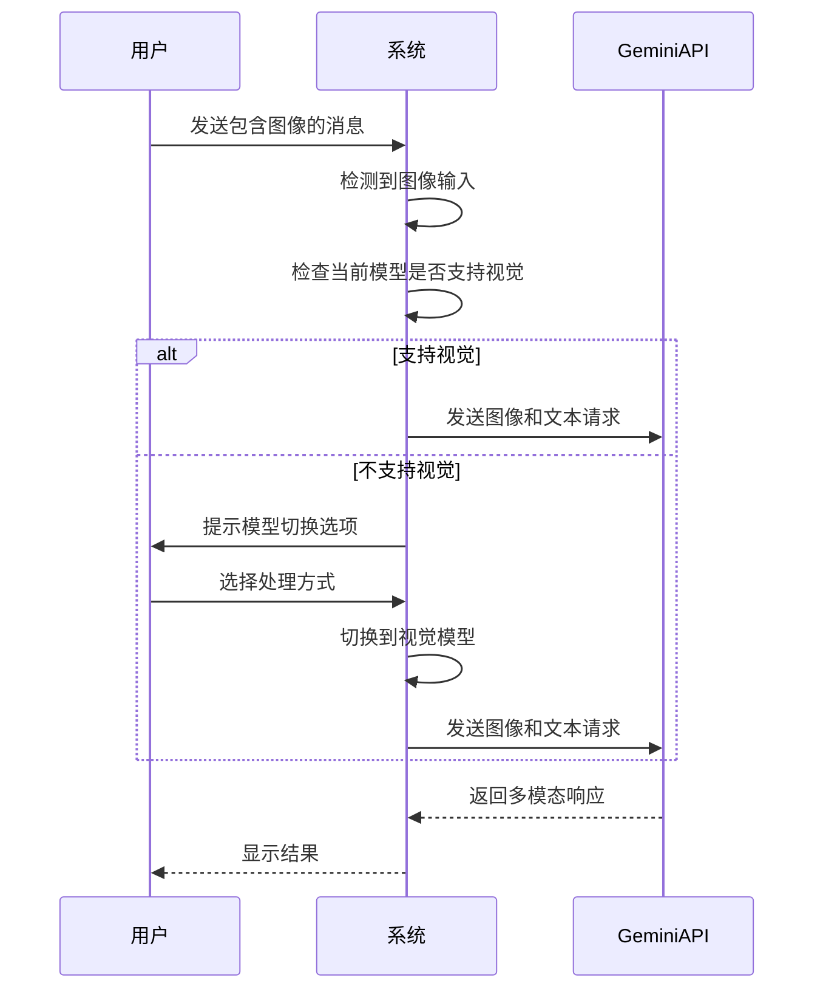
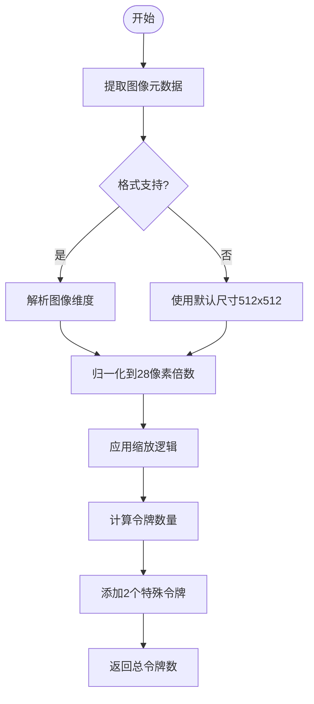
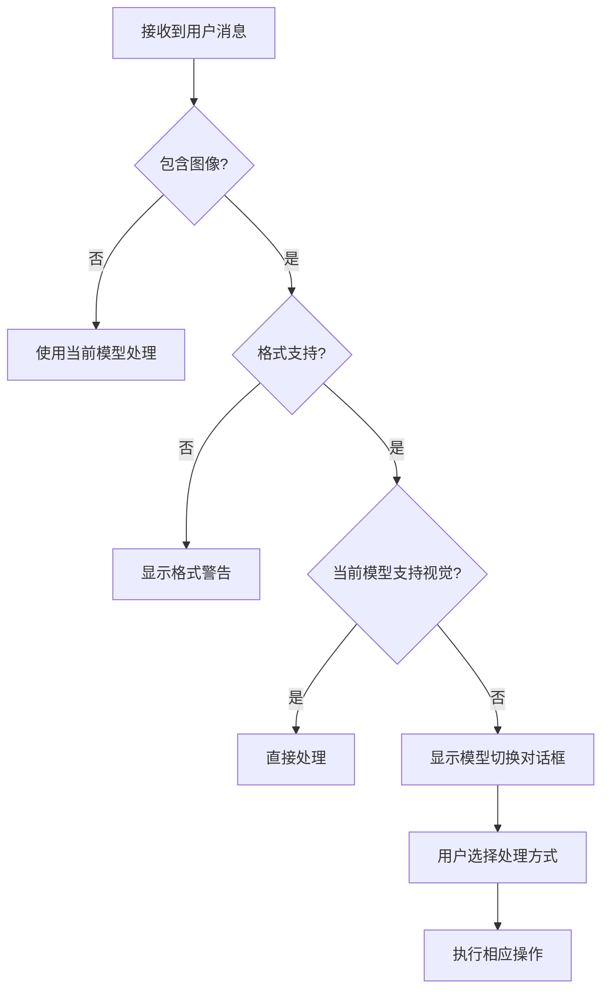

# 视觉模型支持

<cite>
**本文档中引用的文件**  
- [geminiChat.ts](file://packages/core/src/core/geminiChat.ts)
- [geminiRequest.ts](file://packages/core/src/core/geminiRequest.ts)
- [imageTokenizer.ts](file://packages/core/src/utils/request-tokenizer/imageTokenizer.ts)
- [messageInspectors.ts](file://packages/core/src/utils/messageInspectors.ts)
- [useVisionAutoSwitch.ts](file://packages/cli/src/ui/hooks/useVisionAutoSwitch.ts)
- [ModelSwitchDialog.tsx](file://packages/cli/src/ui/components/ModelSwitchDialog.tsx)
- [supportedImageFormats.ts](file://packages/core/src/utils/request-tokenizer/supportedImageFormats.ts)
</cite>

## 目录
1. [简介](#简介)
2. [视觉模型交互机制](#视觉模型交互机制)
3. [图像令牌化处理](#图像令牌化处理)
4. [输入内容检测与视觉切换](#输入内容检测与视觉切换)
5. [实际应用场景](#实际应用场景)
6. [图像预处理策略](#图像预处理策略)
7. [安全考虑](#安全考虑)
8. [性能优化方法](#性能优化方法)
9. [结论](#结论)

## 简介
qwen-code系统提供了对视觉模型的全面支持，能够自动检测并处理图像输入。该功能允许用户上传图像进行多模态分析和代码生成，通过智能检测机制识别图像内容并触发视觉模型切换。系统支持多种图像格式，包括PNG、JPEG、WebP、BMP、TIFF、HEIC等，并实现了高效的图像预处理和令牌计算机制。

**本节不分析具体源文件，因此无来源**

## 视觉模型交互机制
系统通过geminiChat.ts和geminiRequest.ts文件与Google AI服务进行交互。geminiChat.ts实现了聊天会话的核心逻辑，维护用户与模型之间的对话历史，并处理消息发送和响应接收。geminiRequest.ts定义了发送到Gemini API的请求结构，作为PartListUnion类型的别名，可以包含文本、图像等多种内容类型。

当检测到图像输入时，系统会根据配置自动切换到支持视觉的模型。在YOLO模式下，系统会自动切换而无需用户交互；在其他模式下，系统会提示用户选择处理方式。这种机制确保了视觉功能的无缝集成和灵活使用。

**Diagram sources**
- [geminiChat.ts](file://packages/core/src/core/geminiChat.ts#L1-L200)
- [geminiRequest.ts](file://packages/core/src/core/geminiRequest.ts#L1-L20)

## 图像令牌化处理
imageTokenizer.ts文件负责将图像数据转换为模型可理解的格式。该模块实现了图像元数据提取和令牌计算功能，支持多种图像格式的维度解析。

系统采用基于像素的令牌计算方法，遵循以下规则：
- 28×28像素 = 1个令牌
- 每张图像最少4个令牌
- 每张图像最多16384个令牌
- 额外2个特殊令牌（vision_bos + vision_eos）

图像处理流程包括：
1. 从Base64数据中提取图像元数据
2. 根据MIME类型解析图像维度
3. 应用缩放逻辑调整图像大小
4. 计算最终令牌数量

对于不支持的图像格式，系统会返回默认元数据（512×512）作为回退方案。

**Diagram sources**
- [imageTokenizer.ts](file://packages/core/src/utils/request-tokenizer/imageTokenizer.ts#L29-L76)
- [supportedImageFormats.ts](file://packages/core/src/utils/request-tokenizer/supportedImageFormats.ts#L1-L55)

## 输入内容检测与视觉切换
messageInspectors.ts和useVisionAutoSwitch.ts文件共同实现了输入内容检测逻辑。系统通过分析消息内容来识别图像并触发视觉模型切换。

检测流程包括：
1. 检查消息中是否包含图像部分
2. 验证图像格式是否受支持
3. 判断当前模型是否支持视觉功能
4. 根据配置决定是否提供视觉切换选项

系统支持多种视觉切换模式：
- 一次性切换：仅本次请求使用视觉模型
- 会话级切换：整个会话期间使用视觉模型
- 持续使用当前模型：不切换，继续使用当前模型

用户可以通过ModelSwitchDialog组件选择处理方式，该组件提供了清晰的选项说明和操作指引。

**Diagram sources**
- [useVisionAutoSwitch.ts](file://packages/cli/src/ui/hooks/useVisionAutoSwitch.ts#L209-L252)
- [ModelSwitchDialog.tsx](file://packages/cli/src/ui/components/ModelSwitchDialog.tsx#L52-L88)

## 实际应用场景
视觉模型支持功能在多种场景下具有重要应用价值：

### 代码生成场景
用户可以上传界面截图或设计图，系统分析图像内容后生成相应的代码实现。例如，上传一个网页设计图，系统可以生成HTML/CSS代码；上传移动应用界面，系统可以生成相应的UI代码。

### 错误诊断场景
开发者可以上传错误截图或日志文件图像，系统通过视觉分析识别错误模式，并提供修复建议。这对于调试图形界面问题特别有用。

### 文档理解场景
用户可以上传PDF文档、扫描件或图表图像，系统提取其中的关键信息并进行分析。这对于处理历史文档或非数字化资料非常有价值。

### 教学辅助场景
学生可以上传手写笔记或作业，系统识别内容后提供反馈和指导。教师可以上传教学材料，系统帮助生成教学资源。

这些场景展示了多模态能力如何增强代码辅助工具的功能，使其能够处理更复杂的任务和更丰富的输入类型。

**Section sources**
- [geminiChat.ts](file://packages/core/src/core/geminiChat.ts#L200-L400)
- [imageTokenizer.ts](file://packages/core/src/utils/request-tokenizer/imageTokenizer.ts#L300-L505)

## 图像预处理策略
系统实现了多种图像预处理策略以确保处理效率和质量：

### 尺寸标准化
系统将图像尺寸归一化到28像素的倍数，这与令牌计算机制相匹配。对于大尺寸图像，系统会按比例缩小；对于小尺寸图像，系统会按比例放大。

### 格式支持
系统支持以下图像格式：
- BMP
- JPEG/JPG
- PNG
- TIFF
- WebP
- HEIC

每种格式都有专门的解析器来提取维度信息，确保准确的令牌计算。

### 内存优化
系统采用流式处理方式，避免将整个图像加载到内存中。对于大型图像，系统只读取必要的头部信息来确定尺寸。

### 错误处理
当图像解析失败时，系统会使用默认尺寸（512×512）作为回退方案，确保处理流程不会中断。同时，系统会记录警告信息供后续分析。

**Section sources**
- [imageTokenizer.ts](file://packages/core/src/utils/request-tokenizer/imageTokenizer.ts#L262-L304)
- [supportedImageFormats.ts](file://packages/core/src/utils/request-tokenizer/supportedImageFormats.ts#L1-L55)

## 安全考虑
系统在视觉功能实现中考虑了多项安全因素：

### 输入验证
所有图像输入都经过严格的格式验证，只允许支持的图像类型。这防止了恶意文件的上传和处理。

### 内容过滤
系统集成了内容安全过滤机制，可以检测和阻止不当内容的处理，确保符合使用政策。

### 数据隐私
图像数据在处理完成后立即从内存中清除，不会持久化存储。所有传输都通过加密通道进行，保护用户数据隐私。

### 资源限制
系统对单个图像的令牌数量设置了上限（16384令牌），防止资源耗尽攻击。同时，对图像尺寸也有合理限制。

### 权限控制
视觉功能的使用受到用户权限控制，只有经过身份验证的用户才能使用该功能。

**Section sources**
- [useVisionAutoSwitch.ts](file://packages/cli/src/ui/hooks/useVisionAutoSwitch.ts#L65-L119)
- [geminiChat.ts](file://packages/core/src/core/geminiChat.ts#L1-L200)

## 性能优化方法
为了确保视觉功能的高效运行，系统采用了多种性能优化方法：

### 令牌计算优化
系统使用高效的数学计算方法来确定图像令牌数量，避免复杂的图像处理操作。通过直接解析图像头部信息获取尺寸，而不是解码整个图像。

### 缓存机制
系统对频繁使用的图像处理结果进行缓存，避免重复计算。这在处理相似尺寸的图像时特别有效。

### 异步处理
图像元数据提取和令牌计算在异步任务中执行，不会阻塞主处理流程。这确保了用户界面的响应性。

### 批量处理
系统支持批量图像处理，可以同时计算多个图像的令牌数量，提高整体处理效率。

### 资源管理
系统监控内存使用情况，对大型图像进行适当的降采样处理，确保在有限资源下稳定运行。

这些优化方法共同确保了视觉功能的可靠性和高效性，即使在处理复杂多模态输入时也能保持良好的性能表现。

**Section sources**
- [imageTokenizer.ts](file://packages/core/src/utils/request-tokenizer/imageTokenizer.ts#L300-L505)
- [geminiChat.ts](file://packages/core/src/core/geminiChat.ts#L200-L400)

## 结论
qwen-code的视觉模型支持功能通过智能的图像检测、高效的令牌化处理和灵活的模型切换机制，实现了强大的多模态处理能力。系统能够自动识别图像输入，将其转换为模型可理解的格式，并根据需要切换到适当的视觉模型。

该功能的设计考虑了实际使用场景、安全性和性能优化，确保了功能的实用性和可靠性。通过支持多种图像格式和实现高效的预处理策略，系统能够处理各种复杂的视觉输入任务。

未来可以进一步优化图像压缩算法、增强内容理解能力，并扩展支持更多的视觉模型，为用户提供更强大、更智能的代码辅助体验。

**本节不分析具体源文件，因此无来源**