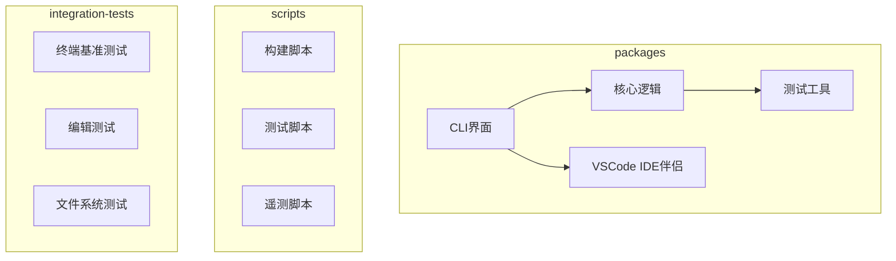
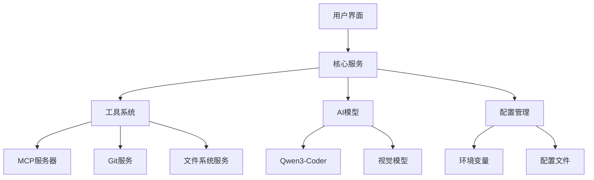
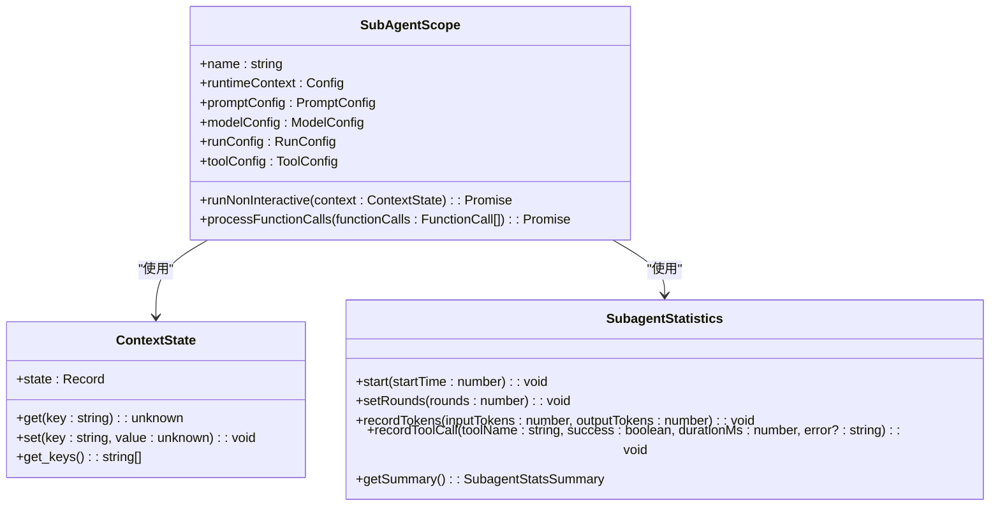
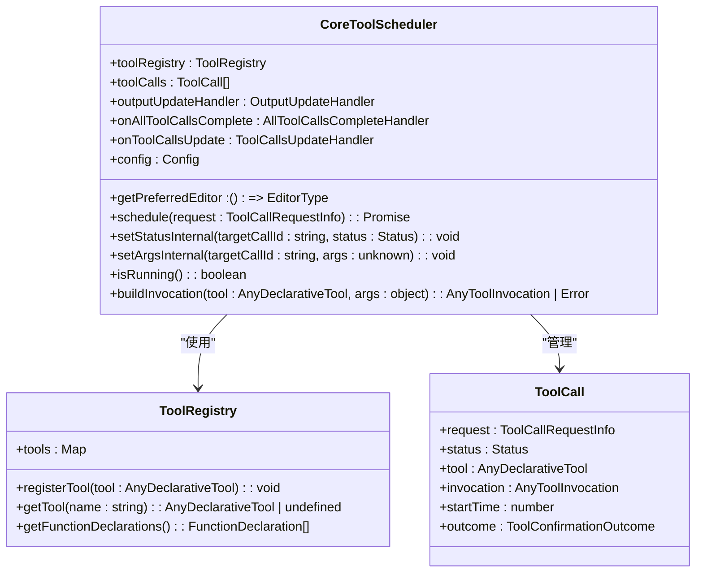
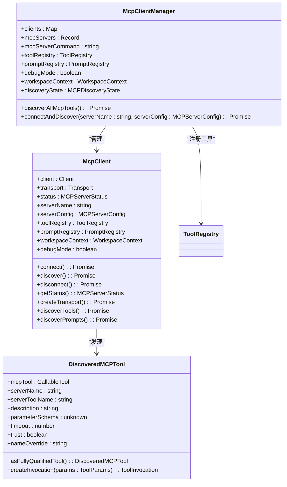

# 项目概述

<cite>
**本文档中引用的文件**  
- [README.md](file://README.md)
- [package.json](file://package.json)
- [packages/core/src/index.ts](file://packages/core/src/index.ts)
- [packages/cli/src/ui/App.tsx](file://packages/cli/src/ui/App.tsx)
- [packages/core/src/subagents/subagent.ts](file://packages/core/src/subagents/subagent.ts)
- [packages/core/src/core/coreToolScheduler.ts](file://packages/core/src/core/coreToolScheduler.ts)
- [packages/core/src/tools/mcp-client.ts](file://packages/core/src/tools/mcp-client.ts)
- [packages/core/src/services/gitService.ts](file://packages/core/src/services/gitService.ts)
- [packages/core/src/services/fileSystemService.ts](file://packages/core/src/services/fileSystemService.ts)
</cite>

## 目录
1. [简介](#简介)
2. [项目结构](#项目结构)
3. [核心组件](#核心组件)
4. [架构概述](#架构概述)
5. [详细组件分析](#详细组件分析)
6. [依赖分析](#依赖分析)
7. [性能考虑](#性能考虑)
8. [故障排除指南](#故障排除指南)
9. [结论](#结论)

## 简介

qwen-code 是一个基于人工智能的命令行开发工具，旨在通过AI技术增强开发者在代码理解、编辑和工作流自动化方面的能力。该项目源自Gemini CLI，专为Qwen3-Coder模型优化，提供强大的代码分析、自动化任务处理和智能辅助功能。qwen-code支持多种认证方式，包括推荐的Qwen OAuth（每日2000次免费请求）和OpenAI兼容API，适用于不同地区的用户。项目具备超越传统上下文窗口限制的能力，支持视觉模型输入，并能自动化复杂的Git操作。

## 项目结构

qwen-code项目采用多包工作区结构，主要分为CLI界面、核心逻辑和工具系统三个部分。这种分层架构使得各组件职责清晰，便于维护和扩展。



**Diagram sources**
- [package.json](file://package.json#L3-L7)
- [packages/core/src/index.ts](file://packages/core/src/index.ts)

**Section sources**
- [package.json](file://package.json)
- [packages/core/src/index.ts](file://packages/core/src/index.ts)

## 核心组件

qwen-code的核心组件包括CLI界面、核心逻辑处理、工具系统和IDE集成。CLI界面提供用户交互入口，核心逻辑处理负责AI模型调用和上下文管理，工具系统实现各种开发任务的自动化，IDE集成则提供与主流开发环境的无缝连接。项目通过Model Context Protocol (MCP)实现与外部工具和服务的通信，支持subagents进行复杂任务的分解和执行，以及tool scheduler对工具调用进行调度和管理。

**Section sources**
- [packages/core/src/index.ts](file://packages/core/src/index.ts)
- [packages/cli/src/ui/App.tsx](file://packages/cli/src/ui/App.tsx)

## 架构概述

qwen-code采用分层架构设计，从上至下分为用户界面层、核心服务层和工具集成层。用户界面层处理用户输入和输出展示，核心服务层管理AI模型调用、会话状态和上下文管理，工具集成层则通过MCP协议与外部工具和服务进行交互。这种架构设计使得系统具有良好的可扩展性和可维护性，同时支持多种认证方式和模型切换策略。



**Diagram sources**
- [packages/core/src/index.ts](file://packages/core/src/index.ts)
- [packages/core/src/services/gitService.ts](file://packages/core/src/services/gitService.ts)
- [packages/core/src/services/fileSystemService.ts](file://packages/core/src/services/fileSystemService.ts)

## 详细组件分析

### Subagents分析

Subagents是qwen-code中用于处理复杂任务的核心机制。每个subagent是一个独立的AI代理，负责执行特定的子任务。通过subagents，系统能够将复杂的开发任务分解为多个可管理的步骤，提高任务执行的效率和准确性。



**Diagram sources**
- [packages/core/src/subagents/subagent.ts](file://packages/core/src/subagents/subagent.ts)

**Section sources**
- [packages/core/src/subagents/subagent.ts](file://packages/core/src/subagents/subagent.ts)

### 工具调度器分析

工具调度器（Tool Scheduler）是qwen-code中负责管理和执行各种开发工具的核心组件。它通过统一的接口管理所有可用工具的调用，确保工具执行的安全性和效率。



**Diagram sources**
- [packages/core/src/core/coreToolScheduler.ts](file://packages/core/src/core/coreToolScheduler.ts)
- [packages/core/src/tools/tool-registry.ts](file://packages/core/src/tools/tool-registry.ts)

**Section sources**
- [packages/core/src/core/coreToolScheduler.ts](file://packages/core/src/core/coreToolScheduler.ts)

### MCP客户端分析

MCP（Model Context Protocol）客户端是qwen-code与外部工具和服务进行通信的关键组件。它通过标准化的协议实现与各种MCP服务器的连接和交互，扩展了系统的功能边界。



**Diagram sources**
- [packages/core/src/tools/mcp-client.ts](file://packages/core/src/tools/mcp-client.ts)
- [packages/core/src/tools/mcp-client-manager.ts](file://packages/core/src/tools/mcp-client-manager.ts)
- [packages/core/src/tools/mcp-tool.ts](file://packages/core/src/tools/mcp-tool.ts)

**Section sources**
- [packages/core/src/tools/mcp-client.ts](file://packages/core/src/tools/mcp-client.ts)

## 依赖分析

qwen-code项目依赖于多个核心库和工具，这些依赖关系构成了系统的基础架构。主要依赖包括AI模型接口库、版本控制库、文件系统操作库和用户界面库。

```mermaid
graph TD
A[qwen-code] --> B[@google/genai]
A --> C[simple-git]
A --> D[strip-ansi]
A --> E[ink]
A --> F[react]
A --> G[@modelcontextprotocol/sdk]
A --> H[undici]
A --> I[yargs]
A --> J[zod]
B --> K[AI模型接口]
C --> L[Git操作]
D --> M[ANSI转义序列处理]
E --> N[命令行UI]
F --> O[React框架]
G --> P[MCP协议]
H --> Q[HTTP客户端]
I --> R[命令行参数解析]
J --> S[数据验证]
```

**Diagram sources**
- [package.json](file://package.json#L50-L88)
- [packages/cli/package.json](file://packages/cli/package.json#L50-L88)

**Section sources**
- [package.json](file://package.json)
- [packages/cli/package.json](file://packages/cli/package.json)

## 性能考虑

qwen-code在设计时充分考虑了性能优化，通过多种机制确保系统的高效运行。系统实现了会话令牌限制配置，允许用户控制会话的令牌使用量以优化成本和性能。通过/compress命令可以压缩对话历史，/clear命令可以清除所有对话历史，/stats命令可以检查当前的令牌使用情况。此外，系统还支持视觉模型自动切换，当检测到输入中的图像时，可以自动切换到视觉模型进行多模态分析。

## 故障排除指南

当遇到问题时，可以参考以下常见问题的解决方案：

**Section sources**
- [README.md](file://README.md#L350-L400)
- [docs/troubleshooting.md](file://docs/troubleshooting.md)

## 结论

qwen-code作为一个AI驱动的命令行开发工具，通过创新的架构设计和先进的技术实现，为开发者提供了强大的代码理解、编辑和工作流自动化能力。项目采用分层架构，将CLI界面、核心逻辑、工具系统和IDE集成组件清晰分离，确保了系统的可维护性和可扩展性。通过MCP协议、subagents和tool scheduler等核心技术，qwen-code能够处理复杂的开发任务，支持多种认证方式和模型切换策略，为开发者提供了灵活高效的开发体验。