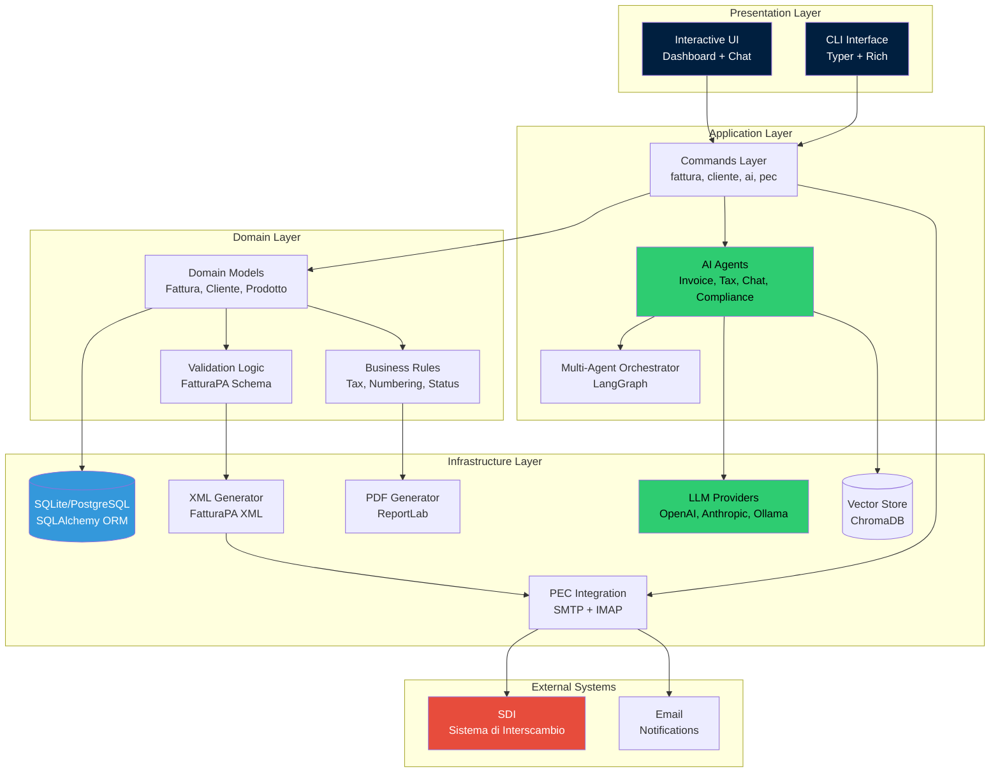
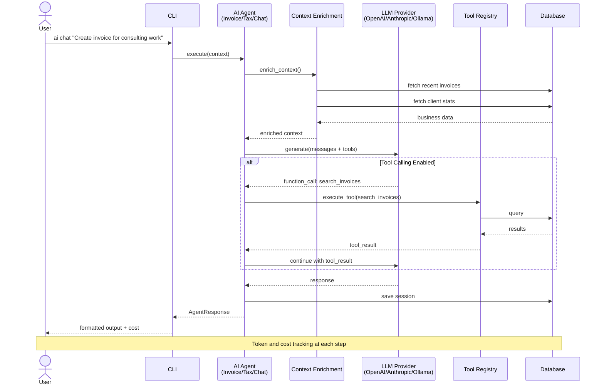
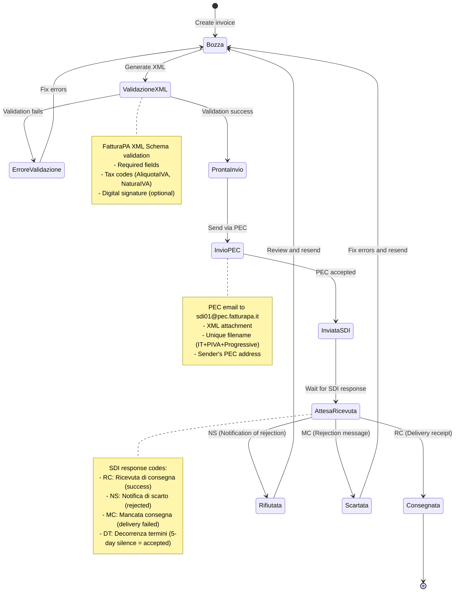
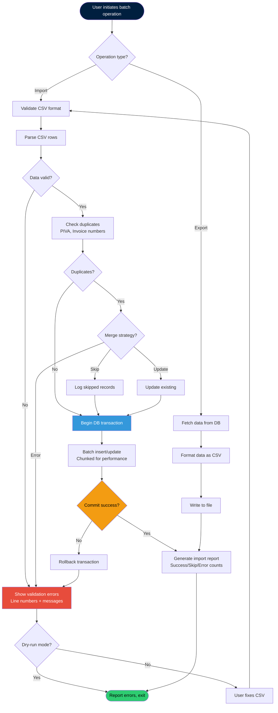
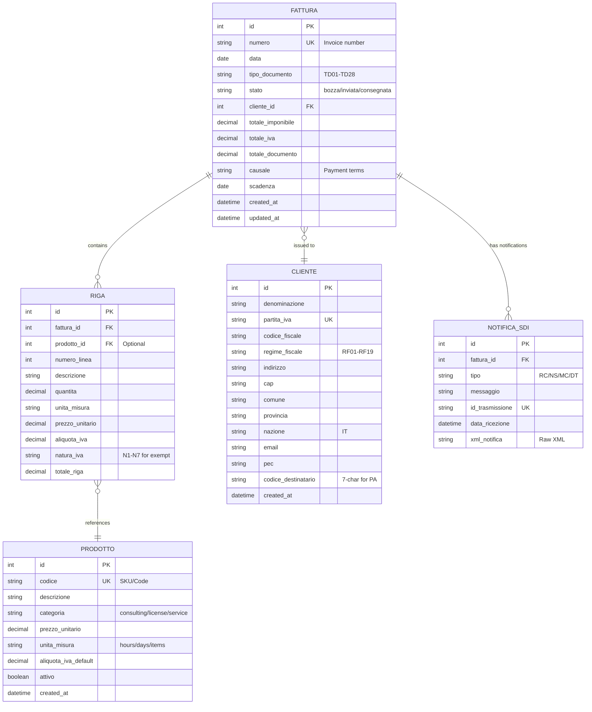

# OpenFatture Architecture Diagrams

**Visual reference for system architecture, data flows, and workflows**

This document contains Mermaid diagrams that illustrate the architecture and key workflows of OpenFatture. All diagrams are version-controlled and can be rendered in GitHub, VS Code, and other Markdown viewers that support Mermaid.

---

## Table of Contents

- [System Architecture](#system-architecture)
- [AI Agent Flow](#ai-agent-flow)
- [SDI Workflow](#sdi-workflow)
- [Batch Operations](#batch-operations)
- [Data Model](#data-model)
- [Multi-Agent Orchestration](#multi-agent-orchestration)

---

## System Architecture

High-level overview of OpenFatture's layered architecture:



**Key Components:**

- **Presentation:** Typer CLI + Rich UI for terminal interaction
- **Application:** Command handlers + AI agent orchestration
- **Domain:** Core business logic and models
- **Infrastructure:** Database, file generation, external integrations
- **External:** SDI (Italian tax authority), email notifications

---

## AI Agent Flow

How AI agents process requests and interact with the system:



**Flow Details:**

1. **Context Enrichment:** Automatic injection of business data (current stats, recent invoices)
2. **Tool Calling:** Optional function calling for data retrieval (search, stats, details)
3. **Multi-Provider:** Supports OpenAI, Anthropic (Claude), and local Ollama
4. **Session Tracking:** All conversations persisted with token/cost metadata

---

## SDI Workflow

Electronic invoice submission to Italian SDI (Sistema di Interscambio):



**Status Legend:**

- **Bozza:** Draft invoice, editable
- **InviataSDI:** Submitted to SDI via PEC
- **Consegnata:** Successfully delivered to recipient
- **Rifiutata/Scartata:** Rejected by SDI or recipient, requires fixes

---

## Batch Operations

CSV import/export workflow for bulk operations:



**Batch Import Features:**

- **Dry-run mode:** Validate without modifying database
- **Duplicate detection:** PIVA, invoice numbers, email addresses
- **Transaction safety:** Atomic operations with rollback on failure
- **Progress reporting:** Real-time progress for large files
- **Error handling:** Line-by-line error messages with suggested fixes

**Supported Entities:**

- Clients (CSV → Cliente table)
- Products (CSV → Prodotto table)
- Invoices (CSV → Fattura + Riga tables)

---

## Data Model

Database schema (SQLAlchemy ORM):



**Key Relationships:**

- **Fattura → Cliente:** Many-to-one (many invoices per client)
- **Fattura → Riga:** One-to-many (invoice lines)
- **Riga → Prodotto:** Many-to-one (optional product reference)
- **Fattura → Notifica_SDI:** One-to-many (SDI responses)

**Invoice Lifecycle:**

1. **Bozza:** Draft, editable
2. **Inviata:** Submitted to SDI, awaiting response
3. **Consegnata:** Delivered, immutable
4. **Rifiutata/Scartata:** Rejected, can be cloned and resubmitted

---

## Multi-Agent Orchestration

LangGraph workflow for AI-assisted invoice creation (Phase 4.4):

```mermaid
graph TD
    Start([User input:<br/>"3 hours GDPR consulting"]) --> DescriptionAgent

    subgraph "Invoice Assistant Agent"
        DescriptionAgent[Generate detailed description<br/>RAG: previous invoices]
        DescriptionAgent --> DescriptionOut["Professional description<br/>GDPR consulting:<br/>- Regulatory analysis<br/>- Gap assessment<br/>- Action plan<br/>Duration: 3 hours"]
    end

    DescriptionOut --> TaxAgent

    subgraph "Tax Advisor Agent"
    TaxAgent[Suggest VAT treatment<br/>Knowledge base: Italian tax law]
        TaxAgent --> TaxOut["VAT rate: 22%<br/>VAT nature: null<br/>ReverseCharge: false<br/>Notes: Standard consulting"]
    end

    TaxOut --> ComplianceAgent

    subgraph "Compliance Checker Agent"
        ComplianceAgent[Validate FatturaPA compliance<br/>Rule-based + LLM heuristics]
        ComplianceAgent --> ComplianceOut{Compliant?}
    end

    ComplianceOut -->|No| ShowIssues[Show validation issues<br/>Severity: ERROR/WARNING<br/>Suggested fixes]
    ShowIssues --> HumanReview

    ComplianceOut -->|Yes| HumanReview[Human approval checkpoint<br/>Review + edit if needed]

    HumanReview --> Decision{Approved?}
    Decision -->|No| End([Cancel])
    Decision -->|Yes| CreateInvoice[Create Fattura<br/>Save to database]

    CreateInvoice --> GenerateXML[Generate FatturaPA XML]
    GenerateXML --> GeneratePDF[Generate PDF]
    GeneratePDF --> Success([Invoice created<br/>Ready to send])

    style Start fill:#001f3f,color:#fff
    style Success fill:#2ECC71,color:#000
    style ShowIssues fill:#E74C3C,color:#fff
    style HumanReview fill:#F39C12,color:#000
```

**Orchestration Benefits:**

- **Sequential agents:** Each agent focuses on one task
- **Human-in-the-loop:** Final approval before invoice creation
- **Stateful workflow:** LangGraph manages state across agents
- **Error recovery:** Validation failures loop back for fixes
- **Traceability:** Full audit trail of AI decisions

---

## Export Options

All diagrams can be exported as:

1. **PNG images** (for presentations):
   ```bash
   # Using mermaid-cli (mmdc)
   npm install -g @mermaid-js/mermaid-cli
   mmdc -i docs/ARCHITECTURE_DIAGRAMS.md -o media/diagrams/
   ```

2. **SVG** (for web, scalable):
   ```bash
   mmdc -i docs/ARCHITECTURE_DIAGRAMS.md -o media/diagrams/ -t default -b transparent -e svg
   ```

3. **Interactive HTML** (GitHub Pages):
   - Diagrams auto-render in GitHub Markdown viewer
   - Can be embedded in Sphinx/MkDocs documentation

---

## Diagram Maintenance

**When to update:**

- Architecture changes (new layers, components)
- New workflows added (e.g., payment reconciliation)
- SDI process updates (AgID spec changes)
- Data model migrations (schema changes)

**Best Practices:**

- Keep diagrams simple (max 15-20 nodes)
- Use consistent color scheme (#001f3f primary, #2ECC71 success, #E74C3C error)
- Add descriptive notes for complex steps
- Version diagrams alongside code (same PR)
- Generate PNG exports for social/presentations

---

## Related Documentation

- [AI Architecture](AI_ARCHITECTURE.md) - Detailed AI module documentation
- [CLI Reference](CLI_REFERENCE.md) - All command syntax and examples
- [Quickstart Guide](QUICKSTART.md) - 5-minute setup tutorial
- [README](../README.md) - Project overview and features

---

**Last Updated:** October 10, 2025
**Diagrams Version:** 1.0
**Mermaid Syntax:** v10.x+
