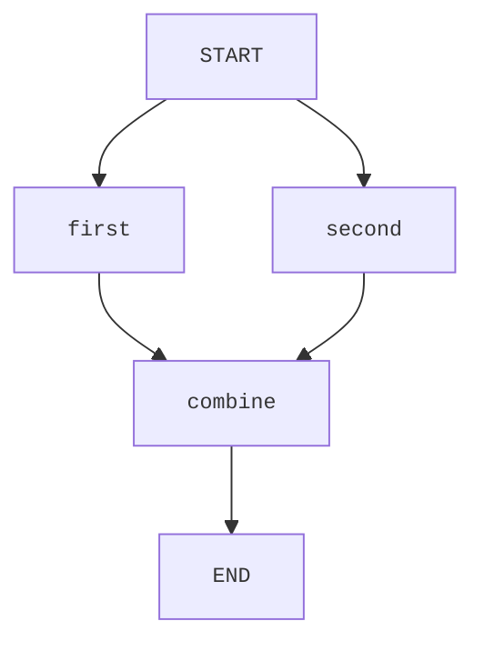

# Orcheo Python SDK

The Python SDK offers a strongly typed way to generate Orcheo workflow requests without forcing a specific HTTP client dependency.

## Workflow authoring

```python
from pydantic import BaseModel
from orcheo_sdk import OrcheoClient, Workflow, WorkflowNode


class UppercaseConfig(BaseModel):
    prefix: str


class UppercaseNode(WorkflowNode[UppercaseConfig, str]):
    type_name = "Uppercase"

    async def run(self, state, context) -> str:
        message = state.get_input("message", "")
        return f"{self.config.prefix}{message.upper()}"


workflow = Workflow(name="demo")
workflow.add_node(UppercaseNode("upper", UppercaseConfig(prefix="Result: ")))

# Prepare deployment request metadata for the Orcheo backend
client = OrcheoClient(base_url="http://localhost:8000")
request = client.build_deployment_request(workflow)
```

### Multi-node workflows

Edges between nodes are derived from the dependencies you provide when registering
each node. Every dependency is converted into an edge in the exported graph, so
you only need to describe how data should flow between nodes:



```python
workflow = Workflow(name="fan-in")

workflow.add_node(UppercaseNode("first", UppercaseConfig(prefix="A: ")))
workflow.add_node(UppercaseNode("second", UppercaseConfig(prefix="B: ")))
workflow.add_node(
    AppendNode("combine", AppendConfig(suffix="!")),
    depends_on=["first", "second"],
)

graph_config = workflow.to_graph_config()
assert graph_config["edges"] == [
    ("START", "first"),
    ("START", "second"),
    ("combine", "END"),
    ("first", "combine"),
    ("second", "combine"),
]
```

> **Note:** Workflows should be deployed to the managed Orcheo runtime for
> execution once you are happy with the authored graph configuration.

## Usage

```python
from orcheo_sdk import OrcheoClient

client = OrcheoClient(base_url="http://localhost:8000")
trigger_url = client.workflow_trigger_url("example-workflow")
ws_url = client.websocket_url("example-workflow")
```

## Development

```bash
uv sync --all-groups
uv run pytest tests/sdk -q
```
