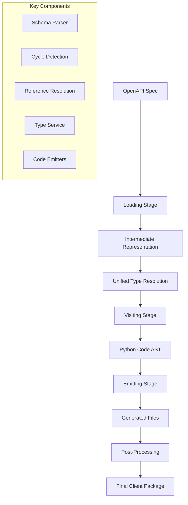

# PyOpenAPI Generator

[](https://python.org)
[](https://opensource.org/licenses/MIT)
[](https://github.com/psf/black)
[](https://github.com/astral-sh/ruff)

**Modern, enterprise-grade Python client generator for OpenAPI specifications.**

PyOpenAPI Generator creates async-first, strongly-typed Python clients from OpenAPI specs. Built for production use with advanced cycle detection, unified type resolution, and zero runtime dependencies.

## 🚀 Why PyOpenAPI Generator?

### Modern Python Architecture
- **Async-First**: Built for `async`/`await` with `httpx` for optimal performance
- **Type Safety**: Complete type hints, dataclass models, and mypy compatibility
- **Zero Dependencies**: Generated clients are completely self-contained

### Enterprise-Grade Reliability
- **Advanced Cycle Detection**: Handles complex schemas with circular references
- **Unified Type Resolution**: Consistent, testable type resolution across all components
- **Production Ready**: Comprehensive error handling and robust code generation

### Developer Experience
- **IDE Support**: Rich autocomplete and type checking in modern IDEs
- **Tag Organization**: Operations grouped by OpenAPI tags for intuitive navigation
- **Smart Features**: Auto-detected pagination, response unwrapping, and structured exceptions

## 📦 Installation

```bash
pip install pyopenapi-gen
```

Or with Poetry:
```bash
poetry add pyopenapi-gen
```

## ⚡ Quick Start

### 1. Generate Your First Client
```bash
pyopenapi-gen openapi.yaml \
  --project-root . \
  --output-package my_api_client
```

### 2. Use the Generated Client
```python
import asyncio
from my_api_client.client import APIClient
from my_api_client.core.config import ClientConfig

async def main():
    config = ClientConfig(base_url="https://api.example.com")
    async with APIClient(config) as client:
        # Type-safe API calls with full IDE support
        users = await client.users.list_users(page=1)
        
        # Automatic pagination
        async for user in client.users.list_users_paginated():
            print(f"User: {user.name}")

asyncio.run(main())
```

## 🔧 Configuration Options

### Standalone Client (Default)
```bash
pyopenapi-gen openapi.yaml \
  --project-root . \
  --output-package my_api_client
```
Creates self-contained client with embedded core dependencies.

### Shared Core (Multiple Clients)
```bash
pyopenapi-gen openapi.yaml \
  --project-root . \
  --output-package clients.api_client \
  --core-package clients.core
```
Multiple clients share a single core implementation.

### Additional Options
```bash
--force           # Overwrite without prompting
--no-postprocess  # Skip formatting and type checking
```

## ✨ Key Features

| Feature | Description |
|---------|-------------|
| 🔒 **Type Safety** | Complete type hints, dataclass models, and mypy compatibility |
| ⚡ **Async-First** | Built for modern Python `async`/`await` patterns with `httpx` |
| 🔌 **Pluggable Auth** | Bearer, API key, OAuth2, and custom authentication strategies |
| 🔄 **Smart Pagination** | Auto-detected cursor/page/offset patterns with async iteration |
| 📦 **Zero Dependencies** | Generated clients are completely self-contained |
| 🛡️ **Robust Parsing** | Advanced cycle detection and graceful handling of complex specs |
| 🎯 **Structured Errors** | Rich exception hierarchy with meaningful error messages |
| 🏷️ **Tag Organization** | Operations grouped by OpenAPI tags for intuitive navigation |

## Generated Client Structure

```
my_api_client/
├── client.py           # Main APIClient with tag-grouped methods
├── core/               # Self-contained runtime dependencies
│   ├── config.py       # Configuration management
│   ├── http_transport.py # HTTP client abstraction
│   ├── exceptions.py   # Error hierarchy
│   └── auth/           # Authentication plugins
├── models/             # Dataclass models from schemas
│   └── user.py
├── endpoints/          # Operation methods grouped by tag
│   └── users.py
└── __init__.py
```

## 🔐 Authentication

PyOpenAPI Generator supports multiple authentication patterns out of the box:

### Bearer Token
```python
from my_api_client.core.auth.plugins import BearerAuth

config = ClientConfig(
    base_url="https://api.example.com",
    auth=BearerAuth("your-token")
)
```

### API Key (Header, Query, or Cookie)
```python
from my_api_client.core.auth.plugins import ApiKeyAuth

config = ClientConfig(
    base_url="https://api.example.com",
    auth=ApiKeyAuth("your-key", location="header", name="X-API-Key")
)
```

### OAuth2 with Refresh
```python
from my_api_client.core.auth.plugins import OAuth2Auth

def refresh_token():
    # Your token refresh logic
    return "new-token"

config = ClientConfig(
    base_url="https://api.example.com",
    auth=OAuth2Auth("initial-token", refresh_callback=refresh_token)
)
```

### Composite Authentication
```python
from my_api_client.core.auth.base import CompositeAuth
from my_api_client.core.auth.plugins import BearerAuth, HeadersAuth

config = ClientConfig(
    base_url="https://api.example.com",
    auth=CompositeAuth(
        BearerAuth("token"),
        HeadersAuth({"X-Custom-Header": "value"})
    )
)
```

## 📊 Advanced Features

### Pagination Support
```python
# Manual pagination
page = 1
while True:
    users = await client.users.list_users(page=page, limit=20)
    if not users:
        break
    # Process users
    page += 1

# Automatic pagination (if supported by the API)
async for user in client.users.list_users_paginated():
    print(f"User: {user.name}")
```

### Error Handling
```python
try:
    user = await client.users.get_user(user_id=123)
except client.exceptions.UserNotFoundError as e:
    print(f"User not found: {e.detail}")
except client.exceptions.ClientError as e:
    print(f"Client error: {e}")
except client.exceptions.ServerError as e:
    print(f"Server error: {e}")
```

### Response Unwrapping
Many APIs wrap responses in a `data` field. PyOpenAPI Generator automatically detects and unwraps these patterns:

```python
# API returns: {"data": {"id": 1, "name": "John"}, "meta": {...}}
# Your code receives: User(id=1, name="John")
user = await client.users.get_user(user_id=1)
print(user.name)  # "John"
```

## 🚧 Known Limitations

Some OpenAPI features have simplified implementations. Contributions welcome!

| Limitation | Current Behavior |
|------------|------------------|
| **Parameter Serialization** | Uses HTTP client defaults instead of OpenAPI `style`/`explode` |
| **Complex Multipart** | Basic file upload support; complex schemas simplified |
| **Response Headers** | Only response body returned, headers ignored |
| **Parameter Defaults** | Schema defaults not applied to method signatures |

> 💡 **Contributing**: See our [Contributing Guide](CONTRIBUTING.md) to help enhance OpenAPI specification coverage!

## 🏗️ Architecture

PyOpenAPI Generator uses a sophisticated three-stage pipeline designed for enterprise-grade reliability:



### Why This Architecture?

**Complex Schema Handling**: Modern OpenAPI specs contain circular references, deep nesting, and intricate type relationships. Our architecture handles these robustly.

**Production Ready**: Each stage has clear responsibilities and clean interfaces, enabling comprehensive testing and reliable code generation.

**Extensible**: Plugin-based authentication, customizable type resolution, and modular emitters make the system adaptable to various use cases.

## 📚 Documentation

- **[Architecture Guide](docs/architecture.md)** - Deep dive into the system design
- **[Type Resolution](docs/unified_type_resolution.md)** - How types are resolved and generated
- **[Contributing Guide](CONTRIBUTING.md)** - How to contribute to the project
- **[API Reference](docs/)** - Complete API documentation

## 🤝 Contributing

We welcome contributions! PyOpenAPI Generator is designed to be extensible and maintainable.

### Quick Start for Contributors
```bash
# 1. Fork and clone the repository
git clone https://github.com/your-username/pyopenapi-gen.git
cd pyopenapi-gen

# 2. Set up development environment
source .venv/bin/activate  # Activate virtual environment
poetry install --with dev

# 3. Run quality checks
make quality-fix  # Auto-fix formatting and linting
make quality      # Run all quality checks
make test         # Run tests with coverage
```

### Development Workflow
```bash
# Essential commands for development
make quality-fix    # Auto-fix formatting and linting issues
make quality        # Run all quality checks (format, lint, typecheck, security)
make test          # Run tests with 85% coverage requirement
make test-fast     # Run tests, stop on first failure

# Individual quality commands
make format        # Format code with Black
make lint-fix      # Fix linting issues with Ruff
make typecheck     # Type checking with mypy
make security      # Security scanning with Bandit
```

### Release Process
The project uses **automated semantic versioning** with conventional commits:

```bash
# Conventional commit format triggers automatic releases
git commit -m "feat(auth): add OAuth2 support"    # → Minor version bump
git commit -m "fix(parser): resolve memory leak"  # → Patch version bump

# Push to main triggers automatic PyPI release
git push origin main
```

All releases are automatically published to PyPI with generated changelogs. See [Release Management](CLAUDE.md#release-management--semantic-versioning) for complete details.

See our [Contributing Guide](CONTRIBUTING.md) for detailed information on:
- 📋 Development setup and workflow
- 🧪 Testing guidelines and standards
- 📖 Documentation standards
- 🔄 Pull request process
- 🏗️ Architecture and design patterns

## 📄 License

MIT License - see [LICENSE](LICENSE) file for details.

Generated clients are self-contained and can be distributed under any license compatible with your project.

## 🙏 Acknowledgments

- Built with [httpx](https://www.python-httpx.org/) for modern async HTTP
- Type safety with [mypy](https://mypy.readthedocs.io/) strict mode
- Code quality with [Black](https://black.readthedocs.io/) and [Ruff](https://docs.astral.sh/ruff/)
- Visitor pattern for clean, maintainable code generation

---

**Made with ❤️ for the Python community**
