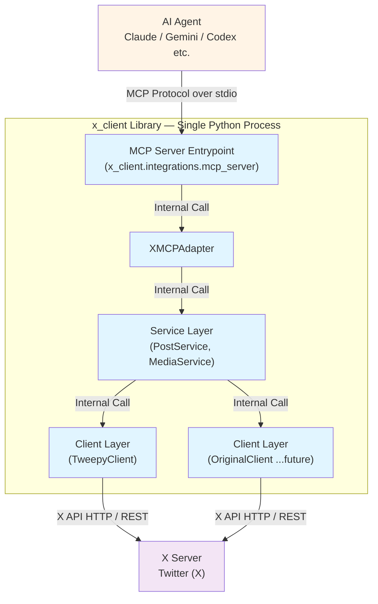

# X (Twitter) API クライアント

X (Twitter) API と連携するための Python クライアントです。AI アシスタント（Claude、Gemini など）から MCP 経由で X API を操作できます。

## 本ライブラリの立ち位置

このライブラリは **X API のクライアント**です。MCP サーバーとしても機能しますが、名前の `x_client` は X (Twitter) サーバーに対するクライアントという意味です。



**役割の整理**:
- **AI Agent (MCP Client)**: Claude Code、Claude Desktop、Gemini などの AI アシスタント
- **MCP Server**: 本ライブラリが提供する MCP プロトコル対応サーバー
- **X Client**: 本ライブラリのコア機能。X API に対するクライアント
- **X Server**: Twitter/X 本体のサーバー

つまり、本ライブラリは：
1. **MCP の視点**: MCP **サーバー**として AI エージェントにツールを提供
2. **X API の視点**: X API **クライアント**として X サーバーと通信

という二つの顔を持っています。MCPではなく、X APIをライブラリとして利用することも可能です。（README.md下部）

## 必要条件
- Python 3.13 以上
- X (Twitter) 開発者アカウントと API キー一式
- パッケージ管理ツール [uv](https://docs.astral.sh/uv/)（推奨）

## MCP (Model Context Protocol) で利用する

AI アシスタント（Claude Code、Claude Desktop、codex-cli、Gemini など）から X API を操作できます。

### 🚀 推奨設定：uvx による統一実行

すべての環境で **uvx** を使用することで、依存関係の自動管理、常に最新版への更新が可能です。

### 設定方法

各 AI ツールの MCP 設定ファイルに以下を記述します：

**TOML 形式 (Codex-CLIなど)**:
* PyPI公開版
```toml
[mcp.servers.x_client]
command = "uvx"
args = ["--from", "pyx-mcp", "x-mcp-server"]

[mcp.servers.x_client.env]
X_API_KEY = "your-api-key"
X_API_SECRET = "your-api-secret"
X_ACCESS_TOKEN = "your-access-token"
X_ACCESS_TOKEN_SECRET = "your-access-token-secret"
```

* github最新版
```toml
[mcp.servers.x_client]
command = "uvx"
args = ["--from", "git+https://github.com/hellocybernetics/pyX-MCP", "x-mcp-server"]

[mcp.servers.x_client.env]
X_API_KEY = "your-api-key"
X_API_SECRET = "your-api-secret"
X_ACCESS_TOKEN = "your-access-token"
X_ACCESS_TOKEN_SECRET = "your-access-token-secret"
```


**JSON 形式（Claude Code, Gemini CLI など）**:
* PyPI公開版
```json
{
  "mcpServers": {
    "x_client": {
      "command": "uvx",
      "args": ["--from", "pyx-mcp", "x-mcp-server"],
      "env": {
        "X_API_KEY": "your-api-key",
        "X_API_SECRET": "your-api-secret",
        "X_ACCESS_TOKEN": "your-access-token",
        "X_ACCESS_TOKEN_SECRET": "your-access-token-secret"
      }
    }
  }
}
```
* github最新版
```json
{
  "mcpServers": {
    "x_client": {
      "command": "uvx",
      "args": ["--from", "git+https://github.com/hellocybernetics/pyX-MCP", "x-mcp-server"],
      "env": {
        "X_API_KEY": "your-api-key",
        "X_API_SECRET": "your-api-secret",
        "X_ACCESS_TOKEN": "your-access-token",
        "X_ACCESS_TOKEN_SECRET": "your-access-token-secret"
      }
    }
  }
}
```

### 設定ファイルの場所

- **Claude Code**: `mcp_settings.json`
- **codex-cli**: 設定ファイル（TOML/JSON）
- **Claude Desktop**:
  - macOS: `~/Library/Application Support/Claude/claude_desktop_config.json`
  - Windows: `%APPDATA%\Claude\claude_desktop_config.json`
  - Linux: `~/.config/Claude/claude_desktop_config.json`
- **Gemini**: `~/.gemini/mcp_config.json` (または Gemini 指定パス)

**重要**: 設定後、AI ツールを完全に再起動してください。

### 動作確認

AI アシスタントに以下のように依頼します：

```
「利用可能な X API ツールを一覧表示して」
```

または

```
「Hello from MCP! と投稿して」
```

### uvx 設定のメリット

- ✅ **環境非依存**: Node.js 不要、Python 環境のみで動作
- ✅ **自動依存管理**: uv が仮想環境を自動構築・キャッシュ
- ✅ **常に最新**: `--from pyx-mcp` により PyPI の最新版を自動取得
- ✅ **統一的な設定**: すべての AI アシスタントで同じ設定方法

---

## 提供機能

MCP 経由で以下のツールが利用可能です：

### 投稿機能
- **create_post**: テキスト投稿、画像/動画付き投稿、リプライ、引用投稿
- **delete_post**: 投稿の削除
- **get_post**: 投稿IDから投稿を取得
- **create_thread**: 長文を自動分割してスレッド投稿

### リポスト機能
- **repost_post**: 投稿をリポスト
- **undo_repost**: リポストを取り消し

### 検索機能
- **search_recent_posts**: 最近7日間の投稿を検索（著者情報付き）

### メディアアップロード
- **upload_image**: 画像アップロード（JPEG/PNG/WebP/GIF、最大5MB）
- **upload_video**: 動画アップロード（MP4、最大512MB、チャンクアップロード対応）

### 認証・状態確認
- **get_auth_status**: 認証状態とレート制限情報を取得

### 使用例

```
あなた: 「Hello from Claude via MCP!」と投稿して

Claude: create_post ツールを使用します...
       投稿が完了しました！投稿ID: 1234567890
```

```
あなた: 「MCP プロトコル」について最近の投稿を検索して

Claude: search_recent_posts ツールを使用します...
       3件の投稿が見つかりました:
       1. @user1: MCP を使ってみた...
       2. @user2: Model Context Protocol は...
```

### アーキテクチャ

```
AI アシスタント ↔ MCP Server (stdio) ↔ XMCPAdapter ↔ Service Layer ↔ X API
```

### エラーハンドリング

- **ConfigurationError**: 認証情報不足。`.env` と環境変数を確認
- **AuthenticationError**: トークン失効。OAuth フローを再実行
- **RateLimitExceeded**: レート制限到達。`reset_at` を参照してバックオフを実施
- **MediaProcessingTimeout/Failed**: 動画処理の完了待機がタイムアウト。`timeout` や動画品質を調整

### トラブルシューティング

- **Missing credentials**: `echo $X_API_KEY` で環境変数を確認。`.env` が 0o600 で保存されているか確認
- **Invalid token**: OAuth フローを再実行して認証情報を更新
- **Video timeout**: `upload_video` の `timeout` を延長するか、`ffmpeg` で再エンコード

---

## ライブラリとして利用する

Python コードから直接呼び出すことも可能です。

### インストール

```bash
uv add pyx-mcp
```

### 認証情報の取得方法

本ライブラリを使用するには、X (Twitter) の開発者アカウントから以下の4つの認証情報を取得する必要があります。

1.  **X Developer Portalにアクセス**:
    -   [https://developer.x.com/en/portal/dashboard](https://developer.x.com/en/portal/dashboard) にアクセスし、ログインします。

2.  **アプリケーションの選択または作成**:
    -   既存のアプリケーションを選択するか、新しいアプリケーションを作成します。

3.  **キーとトークンの確認**:
    -   アプリケーションのダッシュボードで、「Keys and Tokens」タブに移動します。

4.  **生成と権限設定**:
    -   **API Key and Secret**: 「Consumer Keys」セクションで確認または再生成します。
    -   **Access Token and Secret**: 「Authentication Tokens」セクションで、**Read and Write** (読み書き) 権限を持つアクセストークンとシークレットを生成します。

取得したこれらの値を、後述する環境変数または `.env` ファイルに設定してください。

## 認証情報の設定

環境変数または `.env` ファイルで認証情報を設定します：

```bash
export X_API_KEY="your_api_key"
export X_API_SECRET="your_api_secret"
export X_ACCESS_TOKEN="your_access_token"
export X_ACCESS_TOKEN_SECRET="your_access_token_secret"
export X_BEARER_TOKEN="your_bearer_token"  # v2 API用（オプション）
```

または `.env` ファイル（プロジェクト直下に配置）:
```bash
X_API_KEY=your_api_key
X_API_SECRET=your_api_secret
X_ACCESS_TOKEN=your_access_token
X_ACCESS_TOKEN_SECRET=your_access_token_secret
X_BEARER_TOKEN=your_bearer_token
```

`.env` は自動的に 0o600（所有者のみ読み書き可）に設定されます。`.env*` は `.gitignore` 済みです。

---

### 基本的な使い方

```python
from x_client.config import ConfigManager
from x_client.factory import XClientFactory
from x_client.services.post_service import PostService
from x_client.services.media_service import MediaService

# 1. 認証情報を読み込み
config = ConfigManager()
client = XClientFactory.create_from_config(config)

# 2. サービス層を初期化
post_service = PostService(client)
media_service = MediaService(client)

# 3. 投稿を作成
post = post_service.create_post(text="Hello from x_client!")
print(f"Post created: {post.id}")

# 4. 画像付き投稿
from pathlib import Path
media_result = media_service.upload_image(Path("image.png"))
post = post_service.create_post(
    text="Check out this image!",
    media_ids=[media_result.media_id]
)

# 5. 長文スレッド投稿
thread = post_service.create_thread(
    """Python 3.13 highlights... (long text)""",
    chunk_limit=200,
)
for idx, segment_post in enumerate(thread.posts, start=1):
    print(f"Segment {idx}: {segment_post.id}")
if not thread.succeeded:
    print("Thread failed", thread.error)

# 6. リポスト操作
repost_state = post_service.repost_post(post.id)
print("Reposted:", repost_state.reposted)

undo_state = post_service.undo_repost(post.id)
print("Repost removed:", not undo_state.reposted)

# 7. 著者情報付き検索
search_results = post_service.search_recent(
    "from:twitterdev",
    expansions=["author_id"],
    user_fields=["username", "verified"],
    post_fields=["created_at"],
)
for item in search_results:
    author = item.author.username if item.author else "unknown"
    print(author, item.text)
```

### MCP アダプター経由での利用（上記のAPI簡易版となる）

MCP クライアント以外からも直接呼び出せます：

```python
from x_client.integrations.mcp_adapter import XMCPAdapter

adapter = XMCPAdapter()  # 認証情報は ConfigManager が自動読み込み

post = adapter.create_post({"text": "Hello from MCP!"})
print(post)

media = adapter.upload_image({"path": "/path/to/image.png"})
adapter.create_post({"text": "Image post", "media_ids": [media["media_id"]]})
```

### ロギングと可観測性

`PostService` には構造化ログとイベントフックが組み込まれています：

```python
import logging
from x_client.config import ConfigManager
from x_client.factory import XClientFactory
from x_client.services.post_service import PostService

logging.basicConfig(level=logging.INFO)

client = XClientFactory.create_from_config(ConfigManager())

def metrics_hook(event: str, payload: dict[str, object]) -> None:
    # Prometheus / OpenTelemetry などへの連携ポイント
    print("metrics", event, payload)

post_service = PostService(client, event_hook=metrics_hook)
post_service.create_post("observability ready!")
```

イベントフックは成功・失敗双方を単一コールバックへ集約するため、メトリクス送出や分散トレーシングとの連携が容易です。

---

## 開発環境での利用

### セットアップ

```bash
cd /path/to/twitter
uv pip install -e .
```

これにより `x-mcp-server` コマンドが `.venv/bin/` に作成されます。

### MCP サーバーをローカルパスで実行

開発中の MCP サーバーを直接実行する場合：

```json
{
  "mcpServers": {
    "x-client": {
      "command": "/absolute/path/to/twitter/.venv/bin/x-mcp-server",
      "env": {
        "X_API_KEY": "your-api-key",
        "X_API_SECRET": "your-api-secret",
        "X_ACCESS_TOKEN": "your-access-token",
        "X_ACCESS_TOKEN_SECRET": "your-access-token-secret"
      }
    }
  }
}
```

<details>
<summary>代替方法 (クリックして展開)</summary>

**方法2: uv 直接使用**
```json
{
  "mcpServers": {
    "x-client": {
      "command": "uv",
      "args": ["run", "--directory", "/absolute/path/to/twitter", "python", "-m", "x_client.integrations.mcp_server"],
      "env": {
        "X_API_KEY": "your-api-key",
        "X_API_SECRET": "your-api-secret",
        "X_ACCESS_TOKEN": "your-access-token",
        "X_ACCESS_TOKEN_SECRET": "your-access-token-secret"
      }
    }
  }
}
```

**方法3: ランチャースクリプト**
```json
{
  "mcpServers": {
    "x-client": {
      "command": "/absolute/path/to/twitter/scripts/run_mcp_server.sh",
      "env": { "X_API_KEY": "...", "X_API_SECRET": "...", "X_ACCESS_TOKEN": "...", "X_ACCESS_TOKEN_SECRET": "..." }
    }
  }
}
```
</details>

**重要**: `/absolute/path/to/twitter` を実際のプロジェクトパスに置き換えてください。

---

## CLI で利用する

`examples/create_post.py` を使うと、コマンドラインから簡単に投稿できます。

### 基本的な使い方

```bash
# テキストのみ
python examples/create_post.py "Hello from x_client!"

# 画像付き
python examples/create_post.py "Check out this image!" --image path/to/image.png

# 動画付き（最大512MB、チャンクアップロード対応）
python examples/create_post.py "Check out this video!" --video path/to/video.mp4

# 別パスの .env を利用
python examples/create_post.py "Hello with custom env" --dotenv /secure/path/.env
```

### スレッド投稿

```bash
# 長文スレッド投稿（chunk_limit=180 で自動分割）
python examples/create_post.py "Long form update..." --thread --chunk-limit 180

# ファイルからスレッドを投稿（UTF-8 テキストを想定）
python examples/create_post.py --thread-file docs/thread_draft.txt

# 日本語の長文スレッド例（280文字未満で適度に改行）
python examples/create_post.py --thread-file examples/long_thread_ja.txt --chunk-limit 180

# 英語の長文スレッド例（センテンス区切りを維持）
python examples/create_post.py --thread-file examples/long_thread_en.txt --chunk-limit 240

# レートリミット回避のため各投稿間で 8 秒待つ
python examples/create_post.py --thread-file examples/long_thread_en.txt --segment-pause 8
```

### その他の操作

```bash
# 失敗したスレッドの先頭ツイートを削除（重複エラーの解消に利用）
python examples/create_post.py --delete 1234567890123456789

# リポスト / リポストの取り消し
python examples/create_post.py --repost 1234567890
python examples/create_post.py --undo-repost 1234567890
```

### 言語別の考慮事項

- **日本語**: 全角文字が多い場合は 280 文字ギリギリまで詰めると読みづらくなるため、`--chunk-limit` を 150-200 文字程度に抑えて文節ごとのまとまりを維持してください。また、句読点直後で分割されると文脈が途切れやすいので、テキストファイル側で段落ごとに空行を入れておくと安全です。

- **英語**: URL や絵文字を含むときは Twitter 側で 23 文字換算されるため、余裕を持って `--chunk-limit` を設定します。センテンス単位で改行しておくと、分割後も読みやすさが保たれます。

### 注意事項

- スレッドを再投稿する場合、X 側の仕様で 24 時間以内に全く同じ本文を投稿すると **Duplicate content** エラーになります。前回投稿したスレッドを削除するか、テキストにタイムスタンプなどの一意な語句を追加してください。

- X API は短時間に連続で投稿すると HTTP 429 (Too Many Requests) を返すことがあります。本ライブラリでは `RateLimitExceeded` を検知するとレスポンスヘッダーの `x-rate-limit-reset` に従って待機してから再試行しますが、429 が発生した場合は 2～3 分ほど待ってからコマンドを再実行してください。`--segment-pause` を 5–10 秒程度に設定すると 429 を事前に回避しやすくなります。


---

## テスト

```bash
# MCP サーバーの動作テスト
uv run python scripts/test_mcp_server.py

# ユニットテスト
uv run pytest tests/unit/test_mcp_adapter.py -v

# 全テスト実行
uv run pytest

# カバレッジ付き実行
uv run pytest --cov=x_client --cov-report=html

# 詳細モード
uv run pytest -v

# 特定のテストファイル
uv run pytest tests/unit/test_tweepy_client.py
```

---

## 主な機能

- デュアルクライアント構成：投稿は tweepy.Client (v2)、メディアは tweepy.API (v1.1)
- `.env` を用いた安全な認証情報管理と OAuth フロー統合
- `PostService` / `MediaService` による高レベル API
- 長文スレッド投稿ユーティリティと自動リプライチェーン構築
- リポスト／取り消し API と MCP ツール
- 検索 API の expansions／fields 指定対応と著者情報解決
- サービス層に組み込まれた構造化ログとイベントフック
- MCP (Model Context Protocol) 統合による AI アシスタントからの操作


---

## サポート

バグ報告や改善提案は issue もしくは pull request でお知らせください。プロジェクト方針や設計に関する詳細は `docs/` を参照のうえ、必要に応じてコメントを追加してください。
