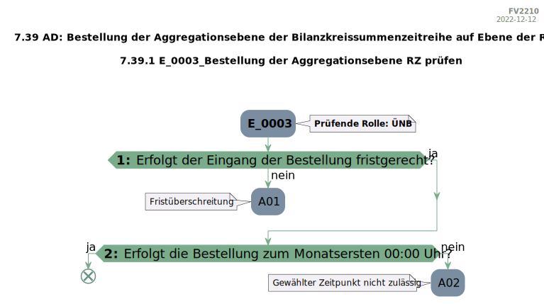

# rebdhuhn

[](LICENSE)


🇩🇪 Dieses Repository enthält ein Python-Paket namens [`rebdhuhn`](https://pypi.org/project/rebdhuhn), das genutzt werden kann, um aus .docx-Dateien extrahierte maschinenlesbare Tabellen, die einen Entscheidungsbaum (EBD) modellieren, in echte Graphen zu konvertieren. Diese Entscheidungsbäume sind Teil eines regulatorischen Regelwerks für die deutsche Energiewirtschaft und kommen in der Eingangsprüfung der Marktkommunikation zum Einsatz.

🇬🇧 This repository contains the source code of the Python package [`rebdhuhn`](https://pypi.org/project/rebdhuhn).

## Rationale

Assume, that you scraped the Entscheidungsbaumdiagramm tables by EDI@Energy from their somewhat "digitized" PDF/DOCX files.
(To do so, you can use the package [`ebdamame`](https://github.com/Hochfrequenz/ebdamame).)
Also assume, that the result of your scraping is a [`rebdhuhn.models.EbdTable`](src/rebdhuhn/models/ebd_table.py).

The package `rebdhuhn` contains logic to convert your scraped data into a graph.
This graph can then be exported e.g. as SVG and/or UML.

## How to use `rebdhuhn`?

Install the package from pypi:

```bash
pip install rebdhuhn
```

### Create an Instance of `EbdTable`

`EbdTable` contains the raw data by BDEW in a machine-readable format.
Creating instances of `EbdTable` is out of scope for this package.
Ask Hochfrequenz for support on this topic.
In the following example we hard code the information.

```python
from rebdhuhn.graph_conversion import convert_table_to_graph
from rebdhuhn.models import EbdCheckResult, EbdTable, EbdTableMetaData, EbdTableRow, EbdTableSubRow, EbdGraph

ebd_table: EbdTable  # this is the result of scraping the docx file
ebd_table = EbdTable(  # this data shouldn't be handwritten
    metadata=EbdTableMetaData(
        ebd_code="E_0003",
        chapter="MaBiS",
        section="7.39 AD: Bestellung der Aggregationsebene der Bilanzkreissummenzeitreihe auf Ebene der Regelzone",
        ebd_name="Bestellung der Aggregationsebene RZ prüfen",
        role="ÜNB",
    ),
    rows=[
        EbdTableRow(
            step_number="1",
            description="Erfolgt der Eingang der Bestellung fristgerecht?",
            sub_rows=[
                EbdTableSubRow(
                    check_result=EbdCheckResult(result=False, subsequent_step_number=None),
                    result_code="A01",
                    note="Fristüberschreitung",
                ),
                EbdTableSubRow(
                    check_result=EbdCheckResult(result=True, subsequent_step_number="2"),
                    result_code=None,
                    note=None,
                ),
            ],
        ),
        EbdTableRow(
            step_number="2",
            description="Erfolgt die Bestellung zum Monatsersten 00:00 Uhr?",
            sub_rows=[
                EbdTableSubRow(
                    check_result=EbdCheckResult(result=False, subsequent_step_number=None),
                    result_code="A02",
                    note="Gewählter Zeitpunkt nicht zulässig",
                ),
                EbdTableSubRow(
                    check_result=EbdCheckResult(result=True, subsequent_step_number="Ende"),
                    result_code=None,
                    note=None,
                ),
            ],
        ),
    ],
)
assert isinstance(ebd_table, EbdTable)

ebd_graph = convert_table_to_graph(ebd_table)
assert isinstance(ebd_graph, EbdGraph)
```

#### Export as PlantUML

```python
from rebdhuhn import convert_graph_to_plantuml

plantuml_code = convert_graph_to_plantuml(ebd_graph)
with open("e_0003.puml", "w+", encoding="utf-8") as uml_file:
    uml_file.write(plantuml_code)
```

The file `e_0003.puml` now looks like this:

```puml
@startuml
...
if (<b>1: </b> Erfolgt der Eingang der Bestellung fristgerecht?) then (ja)
else (nein)
    :A01;
    note left
        Fristüberschreitung
    endnote
    kill;
endif
if (<b>2: </b> Erfolgt die Bestellung zum Monatsersten 00:00 Uhr?) then (ja)
    end
else (nein)
    :A02;
    note left
        Gewählter Zeitpunkt nicht zulässig
    endnote
    kill;
endif
@enduml
```

#### Export the graph as SVG

First, make sure to have a local instance of [kroki](https://kroki.io) up and running via docker (localhost:8125):

Add the required `.env` file to the repository root by opening a new terminal session, changing the directory to
```bash
cd path\to\rebdhuhn\repository\root
```
and executing the `create_env_file.py` script via
```bash
python create_env_file.py
```
Run the `docker-desktop` app on your local maschine and host the local kroki instance on PORT `8125` via
```bash
docker-compose up -d
```

To export the graph as SVG, use
```python
from rebdhuhn import convert_plantuml_to_svg_kroki
from rebdhuhn.kroki import Kroki

kroki_client = Kroki()
svg_code = convert_plantuml_to_svg_kroki(plantuml_code, kroki_client)
with open("e_0003.svg", "w+", encoding="utf-8") as svg_file:
    svg_file.write(svg_code)
```



## How to use this Repository on Your Machine (for development)

Please follow the instructions in
our [Python Template Repository](https://github.com/Hochfrequenz/python_template_repository#how-to-use-this-repository-on-your-machine)
. And for further information, see the [Tox Repository](https://github.com/tox-dev/tox).

## Contribute

You are very welcome to contribute to this template repository by opening a pull request against the main branch.

## Related Tools and Context

This repository is part of the [Hochfrequenz Libraries and Tools for a truly digitized market communication](https://github.com/Hochfrequenz/digital_market_communication/).
