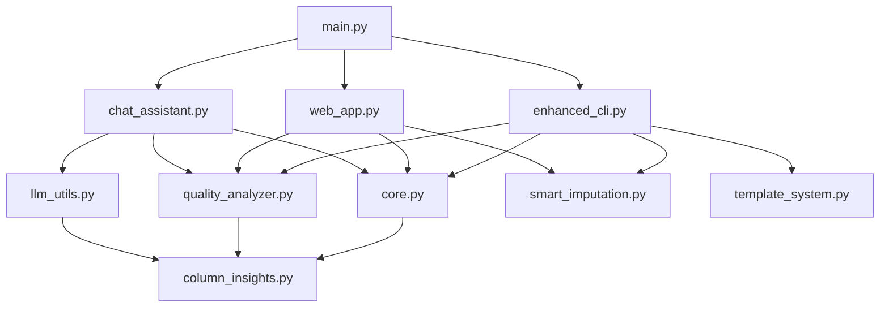

# 🏗️ ScrubPy Architecture Deep Dive

> **Technical documentation of ScrubPy's system architecture, design patterns, and internal workings**

## 📋 Table of Contents
- [System Overview](#system-overview)
- [Core Architecture Patterns](#core-architecture-patterns)
- [Data Flow Architecture](#data-flow-architecture)
- [Module Dependency Graph](#module-dependency-graph)
- [Interface Layer Design](#interface-layer-design)
- [AI Integration Architecture](#ai-integration-architecture)
- [Performance Architecture](#performance-architecture)
- [Extension Points](#extension-points)
- [Design Decisions](#design-decisions)

---

## 🔍 System Overview

### Architectural Principles
ScrubPy follows a **layered architecture** with clear separation of concerns:

```
┌─────────────────────────────────────────┐
│          PRESENTATION LAYER             │
├─────────────────────────────────────────┤
│           INTERFACE LAYER               │  
├─────────────────────────────────────────┤
│          APPLICATION LAYER              │
├─────────────────────────────────────────┤
│            DOMAIN LAYER                 │
├─────────────────────────────────────────┤
│         INFRASTRUCTURE LAYER            │
└─────────────────────────────────────────┘
```

### Layer Responsibilities

| Layer | Components | Responsibility |
|-------|------------|----------------|
| **Presentation** | Streamlit UI, Rich CLI | User interaction, visual feedback |
| **Interface** | `web_app.py`, `cli.py`, `chat_assistant.py` | Interface-specific logic |
| **Application** | `enhanced_cli.py`, orchestration logic | Workflow coordination |
| **Domain** | `core.py`, `quality_analyzer.py`, `column_insights.py` | Business logic |
| **Infrastructure** | `llm_utils.py`, file handlers, templates | External integrations |

---

## 🔧 Core Architecture Patterns

### 1. Strategy Pattern (Cleaning Operations)
```python
# Abstract strategy interface
class CleaningStrategy:
    def execute(self, df: pd.DataFrame, **kwargs) -> pd.DataFrame:
        pass

# Concrete implementations
class RemoveMissingStrategy(CleaningStrategy):
    def execute(self, df, **kwargs):
        return drop_missing_values(df)

class ImputationStrategy(CleaningStrategy):
    def execute(self, df, method="mean", **kwargs):
        return SmartImputer(df, strategy=method).impute_all()
```

### 2. Factory Pattern (Interface Creation)
```python
class InterfaceFactory:
    @staticmethod
    def create_interface(interface_type: str):
        if interface_type == "web":
            return StreamlitInterface()
        elif interface_type == "cli":
            return EnhancedCLI()
        elif interface_type == "chat":
            return ChatAssistant()
```

### 3. Observer Pattern (Progress Tracking)
```python
class ProgressObserver:
    def update(self, operation: str, progress: float):
        pass

class WebProgressObserver(ProgressObserver):
    def update(self, operation: str, progress: float):
        st.progress(progress)
        st.write(f"Executing: {operation}")
```

### 4. Template Method Pattern (Analysis Pipeline)
```python
class AnalysisPipeline:
    def analyze(self, df: pd.DataFrame):
        self.preprocess(df)
        self.detect_patterns(df)
        self.assess_quality(df)  
        self.generate_recommendations(df)
        return self.create_report(df)
    
    # Template methods implemented by subclasses
    def detect_patterns(self, df): pass
    def assess_quality(self, df): pass
```

### 5. Adapter Pattern (LLM Integration)
```python
class LLMAdapter:
    def __init__(self, provider: str):
        if provider == "ollama":
            self.client = OllamaClient()
        elif provider == "openai":
            self.client = OpenAIClient()
    
    def query(self, prompt: str) -> str:
        return self.client.generate(prompt)
```

---

## 🌊 Data Flow Architecture

### Primary Data Flow
```
┌──────────────┐    ┌─────────────────┐    ┌──────────────────┐
│  Raw Data    │───▶│   Ingestion     │───▶│   Validation     │
│  (CSV/Excel) │    │   Pipeline      │    │   & Profiling    │
└──────────────┘    └─────────────────┘    └──────────────────┘
                                                      │
┌──────────────┐    ┌─────────────────┐             ▼
│ Clean Data   │◀───│   Cleaning      │    ┌──────────────────┐
│ (Output)     │    │   Pipeline      │◀───│   Analysis       │
└──────────────┘    └─────────────────┘    │   Engine         │
                                           └──────────────────┘
```

### Detailed Flow Sequence

#### 1. Data Ingestion
```python
# File loading with format detection
def load_data_flow(filepath: str) -> pd.DataFrame:
    # Step 1: Format detection
    file_type = detect_file_type(filepath)
    
    # Step 2: Appropriate loader selection  
    if file_type == "excel":
        handler = ExcelHandler()
        df = handler.smart_load(filepath)
    elif file_type == "large_csv":
        handler = LargeFileHandler()
        df = handler.chunk_load(filepath)
    else:
        df = pd.read_csv(filepath)
    
    # Step 3: Initial validation
    validate_dataframe(df)
    return df
```

#### 2. Analysis Pipeline
```python
def analysis_flow(df: pd.DataFrame) -> AnalysisResult:
    # Parallel analysis execution
    with ThreadPoolExecutor() as executor:
        # Submit analysis tasks
        column_future = executor.submit(get_column_insights, df)
        quality_future = executor.submit(SmartDataQualityAnalyzer(df).analyze_all)
        profile_future = executor.submit(DataProfiler(df).generate_profile)
        
        # Collect results
        column_insights = column_future.result()
        quality_report = quality_future.result()
        profile_data = profile_future.result()
    
    return AnalysisResult(column_insights, quality_report, profile_data)
```

#### 3. Cleaning Pipeline
```python
def cleaning_flow(df: pd.DataFrame, operations: List[Operation]) -> pd.DataFrame:
    # State management for undo functionality
    state_manager = StateManager(df)
    
    for operation in operations:
        # Save state before operation
        state_manager.save_checkpoint()
        
        # Execute operation with error handling
        try:
            df = operation.execute(df)
            operation.status = "success"
        except Exception as e:
            # Rollback on failure
            df = state_manager.rollback()
            operation.status = "failed" 
            operation.error = str(e)
    
    return df
```

---

## 🕸️ Module Dependency Graph

### Core Dependencies


### Dependency Layers
```python
# Layer 1: Infrastructure (No dependencies)
- pandas, numpy, streamlit, typer (external)

# Layer 2: Core Domain (Infrastructure only)  
- core.py
- profiling.py
- utils.py

# Layer 3: Analysis Engine (Core + Infrastructure)
- column_insights.py  
- quality_analyzer.py
- smart_imputation.py

# Layer 4: Advanced Features (Analysis + Core)
- template_system.py
- advanced_text_cleaning.py
- large_file_handler.py
- enhanced_file_handler.py

# Layer 5: AI Integration (All layers)
- llm_utils.py
- chat_assistant.py

# Layer 6: Application Logic (All layers)
- enhanced_cli.py
- eda_analysis.py
- smart_eda.py

# Layer 7: Interface Layer (Application + All)
- web_app.py
- enhanced_web_app.py
- cli.py (legacy)

# Layer 8: Entry Points (Interface + All)
- main.py
- __main__.py
```

---

## 🎨 Interface Layer Design

### Multi-Interface Architecture
```python
class BaseInterface(ABC):
    """Abstract base for all user interfaces"""
    
    def __init__(self, df: pd.DataFrame):
        self.df = df
        self.analyzer = SmartDataQualityAnalyzer(df)
        self.insights = get_column_insights(df)
    
    @abstractmethod
    def display_summary(self):
        pass
    
    @abstractmethod  
    def execute_operation(self, operation: str):
        pass
    
    @abstractmethod
    def show_results(self, result: Any):
        pass
```

### Streamlit Web Interface
```python
class StreamlitInterface(BaseInterface):
    """Rich web interface with interactive components"""
    
    def __init__(self):
        self.setup_page_config()
        self.initialize_session_state()
    
    def render_layout(self):
        # Sidebar: Controls and operations
        with st.sidebar:
            self.render_operation_controls()
        
        # Main area: Data display and results
        col1, col2 = st.columns([2, 1])
        with col1:
            self.display_dataframe()
        with col2:
            self.display_quality_metrics()
    
    def handle_file_upload(self):
        """Handle drag-and-drop file uploads"""
        uploaded_file = st.file_uploader(
            "Drop your data file here",
            type=['csv', 'xlsx', 'xls'],
            help="Supports CSV and Excel formats"
        )
        
        if uploaded_file:
            # Dynamic loader selection
            if uploaded_file.name.endswith(('.xlsx', '.xls')):
                handler = ExcelHandler()
                self.df = handler.load_from_streamlit(uploaded_file)
            else:
                self.df = pd.read_csv(uploaded_file)
```

### Enhanced CLI Interface  
```python
class EnhancedCLI(BaseInterface):
    """Rich terminal interface with interactive menus"""
    
    def __init__(self):
        self.console = Console()
        self.config = ScrubPyConfig()
    
    def show_interactive_menu(self):
        """Rich menu system with keyboard navigation"""
        choices = [
            "📊 Analyze Dataset",
            "🧹 Clean Data", 
            "🤖 AI Assistant",
            "📝 Generate Report",
            "⚙️ Settings"
        ]
        
        selection = inquirer.select(
            message="What would you like to do?",
            choices=choices,
            default=choices[0]
        ).execute()
        
        return self.handle_selection(selection)
```

### Chat Interface
```python
class ChatInterface(BaseInterface):
    """Conversational AI interface"""
    
    def __init__(self, df: pd.DataFrame):
        super().__init__(df)
        self.llm_assistant = LLMAssistant(df, self.insights)
        self.conversation_history = []
    
    def start_conversation(self):
        """Main chat loop with context management"""
        self.display_welcome()
        
        while True:
            user_input = self.get_user_input()
            
            if self.is_exit_command(user_input):
                break
            
            # Context-aware response generation
            context = self.build_context()
            response = self.llm_assistant.respond(user_input, context)
            
            self.display_response(response)
            self.update_conversation_history(user_input, response)
```

---

## 🤖 AI Integration Architecture

### LLM Abstraction Layer
```python
class LLMProvider(ABC):
    """Abstract LLM provider interface"""
    
    @abstractmethod
    def generate_response(self, prompt: str, **kwargs) -> str:
        pass
    
    @abstractmethod
    def is_available(self) -> bool:
        pass

class OllamaProvider(LLMProvider):
    """Local Ollama integration"""
    
    def __init__(self, model: str = "mistral"):
        self.model = model
        self.base_url = "http://localhost:11434"
    
    def generate_response(self, prompt: str, **kwargs) -> str:
        response = requests.post(f"{self.base_url}/api/generate", 
                               json={"model": self.model, "prompt": prompt})
        return response.json()["response"]
    
    def is_available(self) -> bool:
        try:
            response = requests.get(f"{self.base_url}/api/tags", timeout=5)
            return response.status_code == 200
        except:
            return False
```

### AI Assistant Architecture
```python
class LLMAssistant:
    """High-level AI assistant with dataset context"""
    
    def __init__(self, df: pd.DataFrame, column_insights: Dict):
        self.df = df
        self.column_insights = column_insights
        self.provider = self.select_provider()
        self.context_builder = ContextBuilder(df, column_insights)
    
    def respond(self, question: str, context: str = None) -> str:
        """Generate contextual response to user question"""
        
        # Build comprehensive prompt
        prompt = self.context_builder.build_prompt(
            question=question,
            dataset_summary=self.get_dataset_summary(),
            column_info=self.column_insights,
            quality_info=self.get_quality_summary(),
            custom_context=context
        )
        
        # Generate and post-process response
        raw_response = self.provider.generate_response(prompt)
        return self.post_process_response(raw_response)
```

### Context Management
```python
class ContextBuilder:
    """Builds rich context for LLM queries"""
    
    def __init__(self, df: pd.DataFrame, insights: Dict):
        self.df = df
        self.insights = insights
        
    def build_dataset_context(self) -> str:
        """Create dataset description for LLM"""
        return f"""
        Dataset Overview:
        - Shape: {self.df.shape[0]} rows × {self.df.shape[1]} columns
        - Data Types: {dict(self.df.dtypes.value_counts())}
        - Missing Values: {self.df.isnull().sum().sum()} total
        - Column Roles: {self.insights.get('column_roles', {})}
        """
    
    def build_quality_context(self) -> str:
        """Create quality assessment context"""
        analyzer = SmartDataQualityAnalyzer(self.df)
        score, issues = analyzer.get_quality_score()
        
        return f"""
        Data Quality Assessment:
        - Overall Score: {score}/100
        - Critical Issues: {len([i for i in issues if i.severity == 'critical'])}
        - Major Issues: {len([i for i in issues if i.severity == 'high'])}
        """
```

---

## ⚡ Performance Architecture

### Memory Management Strategy
```python
class MemoryManager:
    """Smart memory management for large datasets"""
    
    def __init__(self, threshold_mb: int = 500):
        self.threshold = threshold_mb * 1024 * 1024  # Convert to bytes
        self.monitor = MemoryMonitor()
    
    def should_use_chunking(self, df: pd.DataFrame) -> bool:
        """Determine if chunked processing is needed"""
        memory_usage = df.memory_usage(deep=True).sum()
        available_memory = self.monitor.get_available_memory()
        
        return memory_usage > self.threshold or memory_usage > available_memory * 0.3
    
    def get_optimal_chunk_size(self, df: pd.DataFrame) -> int:
        """Calculate optimal chunk size based on available memory"""
        row_memory = df.memory_usage(deep=True).sum() / len(df)
        available_memory = self.monitor.get_available_memory() * 0.2  # Use 20% of available
        
        return max(1000, int(available_memory / row_memory))
```

### Chunked Processing Architecture
```python
class ChunkedProcessor:
    """Process large datasets in memory-efficient chunks"""
    
    def __init__(self, chunk_size: int = None):
        self.memory_manager = MemoryManager()
        self.chunk_size = chunk_size
    
    def process_large_file(self, filepath: str, operations: List[Operation]) -> pd.DataFrame:
        """Process file in chunks with progress tracking"""
        
        # Determine processing strategy
        file_size = os.path.getsize(filepath)
        if file_size > 1024 * 1024 * 1024:  # > 1GB
            return self.stream_process(filepath, operations)
        else:
            return self.batch_process(filepath, operations)
    
    def stream_process(self, filepath: str, operations: List[Operation]) -> pd.DataFrame:
        """Stream processing for very large files"""
        chunk_iter = pd.read_csv(filepath, chunksize=self.chunk_size)
        processed_chunks = []
        
        for i, chunk in enumerate(chunk_iter):
            # Apply operations to chunk
            for operation in operations:
                chunk = operation.execute(chunk)
            
            processed_chunks.append(chunk)
            
            # Periodic memory cleanup
            if i % 10 == 0:
                gc.collect()
        
        return pd.concat(processed_chunks, ignore_index=True)
```

### Caching Strategy
```python
class AnalysisCache:
    """Intelligent caching for expensive operations"""
    
    def __init__(self):
        self.cache = {}
        self.cache_ttl = {}
        self.default_ttl = 300  # 5 minutes
    
    def get_cache_key(self, df: pd.DataFrame) -> str:
        """Generate cache key based on dataframe characteristics"""
        return hashlib.md5(
            f"{df.shape}{df.dtypes.to_dict()}{df.columns.tolist()}".encode()
        ).hexdigest()
    
    def cached_analysis(self, df: pd.DataFrame, analysis_func: Callable) -> Any:
        """Decorator for caching analysis results"""
        cache_key = self.get_cache_key(df)
        
        if self.is_cache_valid(cache_key):
            return self.cache[cache_key]
        
        # Perform analysis
        result = analysis_func(df)
        
        # Cache result
        self.cache[cache_key] = result
        self.cache_ttl[cache_key] = time.time() + self.default_ttl
        
        return result
```

---

## 🔌 Extension Points

### Plugin Architecture
```python
class PluginManager:
    """Manage ScrubPy plugins and extensions"""
    
    def __init__(self):
        self.plugins = {}
        self.hooks = defaultdict(list)
    
    def register_plugin(self, plugin: 'ScrubPyPlugin'):
        """Register a new plugin"""
        self.plugins[plugin.name] = plugin
        
        # Register plugin hooks
        for hook_name in plugin.get_hooks():
            self.hooks[hook_name].append(plugin)
    
    def execute_hook(self, hook_name: str, *args, **kwargs):
        """Execute all plugins registered for a hook"""
        results = []
        for plugin in self.hooks[hook_name]:
            try:
                result = plugin.execute_hook(hook_name, *args, **kwargs)
                results.append(result)
            except Exception as e:
                logger.error(f"Plugin {plugin.name} failed on hook {hook_name}: {e}")
        return results

class ScrubPyPlugin(ABC):
    """Base class for ScrubPy plugins"""
    
    @property
    @abstractmethod
    def name(self) -> str:
        pass
    
    @abstractmethod
    def get_hooks(self) -> List[str]:
        """Return list of hooks this plugin responds to"""
        pass
    
    @abstractmethod
    def execute_hook(self, hook_name: str, *args, **kwargs) -> Any:
        """Execute plugin logic for specific hook"""
        pass
```

### Custom Operation Registration
```python
class OperationRegistry:
    """Registry for custom cleaning operations"""
    
    def __init__(self):
        self.operations = {}
    
    def register_operation(self, name: str, operation_class: Type['CleaningOperation']):
        """Register a custom cleaning operation"""
        self.operations[name] = operation_class
    
    def get_operation(self, name: str) -> 'CleaningOperation':
        """Get operation by name"""
        if name not in self.operations:
            raise ValueError(f"Unknown operation: {name}")
        return self.operations[name]()
    
    def list_operations(self) -> List[str]:
        """List all registered operations"""
        return list(self.operations.keys())

# Example custom operation
@register_operation("remove_special_chars")
class RemoveSpecialCharsOperation(CleaningOperation):
    def execute(self, df: pd.DataFrame, columns: List[str] = None) -> pd.DataFrame:
        if columns is None:
            columns = df.select_dtypes(include=['object']).columns
        
        for col in columns:
            df[col] = df[col].str.replace(r'[^\w\s]', '', regex=True)
        
        return df
```

---

## 🎯 Design Decisions

### 1. Why Layered Architecture?
**Decision**: Use strict layered architecture with dependency inversion
**Rationale**: 
- Clear separation of concerns
- Easy testing and mocking
- Plugin extensibility
- Interface flexibility

### 2. Why Multiple Interfaces?
**Decision**: Support Web, CLI, and Chat interfaces
**Rationale**:
- Different user preferences and skills
- Various use cases (interactive vs. automated)
- Learning curve accommodation
- Integration flexibility

### 3. Why AI Integration?
**Decision**: Integrate LLM capabilities for analysis and recommendations
**Rationale**:
- Reduce learning curve for beginners
- Provide expert-level insights
- Generate executable code
- Educational value

### 4. Why Template System?
**Decision**: YAML-based reusable cleaning templates
**Rationale**:
- Consistency across projects
- Knowledge sharing
- Automation support
- Best practices enforcement

### 5. Why Pandas-Centric?
**Decision**: Build primarily on pandas DataFrame
**Rationale**:
- Industry standard for data manipulation
- Rich ecosystem and community
- Familiar to data professionals
- Excellent performance for most use cases

---

## 🔄 State Management

### Undo/Redo System
```python
class StateManager:
    """Manage dataframe states for undo/redo functionality"""
    
    def __init__(self, initial_df: pd.DataFrame, max_history: int = 10):
        self.history = [initial_df.copy()]
        self.current_index = 0
        self.max_history = max_history
    
    def save_state(self, df: pd.DataFrame):
        """Save current state"""
        # Remove future states if we're not at the end
        if self.current_index < len(self.history) - 1:
            self.history = self.history[:self.current_index + 1]
        
        # Add new state
        self.history.append(df.copy())
        self.current_index += 1
        
        # Maintain max history size
        if len(self.history) > self.max_history:
            self.history.pop(0)
            self.current_index -= 1
    
    def undo(self) -> pd.DataFrame:
        """Undo to previous state"""
        if self.current_index > 0:
            self.current_index -= 1
        return self.history[self.current_index].copy()
    
    def redo(self) -> pd.DataFrame:
        """Redo to next state"""
        if self.current_index < len(self.history) - 1:
            self.current_index += 1
        return self.history[self.current_index].copy()
```

---

## 🎭 Error Handling Strategy

### Hierarchical Error Handling
```python
# Level 1: Operation-level errors
class CleaningOperationError(Exception):
    """Base exception for cleaning operations"""
    pass

# Level 2: Analysis-level errors  
class AnalysisError(Exception):
    """Base exception for analysis operations"""
    pass

# Level 3: Interface-level errors
class InterfaceError(Exception):
    """Base exception for interface operations"""
    pass

# Error handler with graceful degradation
class ErrorHandler:
    def __init__(self):
        self.error_log = []
    
    def handle_error(self, error: Exception, context: str, fallback=None):
        """Handle errors with logging and fallback"""
        error_info = {
            'timestamp': datetime.now(),
            'error_type': type(error).__name__,
            'message': str(error),
            'context': context
        }
        
        self.error_log.append(error_info)
        logger.error(f"{context}: {error}")
        
        if fallback:
            return fallback()
        
        raise error
```

---

**This architecture documentation provides the foundation for understanding ScrubPy's internal design and extending its capabilities.**