# Upload Plugins

Upload plugins provide file upload and data ingestion operations for processing files into the Synapse platform with comprehensive metadata support, security validation, and organized data unit generation.

## Overview

**Available Actions:**

- `upload` - Upload files and directories to storage with optional Excel metadata processing

**Use Cases:**

- Bulk file uploads with metadata annotation
- Excel-based metadata mapping and validation
- Recursive directory processing
- Type-based file organization
- Batch data unit creation
- Secure file processing with size and content validation

**Supported Upload Sources:**

- Local file system paths (files and directories)
- Recursive directory scanning
- Excel metadata files for enhanced file annotation
- Mixed file types with automatic organization

## Upload Action Architecture

The upload system uses a modern, extensible architecture built on proven design patterns. The refactored implementation transforms the previous monolithic approach into a modular, strategy-based system with clear separation of concerns.

### Design Patterns

The architecture leverages several key design patterns:

- **Strategy Pattern**: Pluggable behaviors for validation, file discovery, metadata processing, upload operations, and data unit creation
- **Facade Pattern**: UploadOrchestrator provides a simplified interface to coordinate complex workflows
- **Factory Pattern**: StrategyFactory creates appropriate strategy implementations based on runtime parameters
- **Context Pattern**: UploadContext maintains shared state and communication between workflow components

### Component Architecture


### Step-Based Workflow Execution

The refactored architecture uses a step-based workflow coordinated by the UploadOrchestrator. Each step has a defined responsibility and progress weight.

#### Workflow Steps Overview

| Step | Name                | Weight | Responsibility                               |
| ---- | ------------------- | ------ | -------------------------------------------- |
| 1    | Initialize          | 5%     | Setup storage, pathlib, and basic validation |
| 2    | Process Metadata    | 5%     | Handle Excel metadata if provided            |
| 3    | Analyze Collection  | 5%     | Retrieve and validate data collection specs  |
| 4    | Organize Files      | 10%    | Discover and organize files by type          |
| 5    | Validate Files      | 5%     | Security and content validation              |
| 6    | Upload Files        | 30%    | Upload files to storage                      |
| 7    | Generate Data Units | 35%    | Create data units from uploaded files        |
| 8    | Cleanup             | 5%     | Clean temporary resources                    |

#### Execution Flow

```mermaid
flowchart TD
    %% Start
    A["🚀 Upload Action Started"] --> B["📋 Create UploadContext"]
    B --> C["⚙️ Configure Strategies"]
    C --> D["📝 Register Workflow Steps"]
    D --> E["🎯 Create UploadOrchestrator"]

    %% Strategy Injection
    E --> F["💉 Inject Strategies into Context"]
    F --> G["📊 Initialize Progress Tracking"]

    %% Step Execution Loop
    G --> H["🔄 Start Step Execution Loop"]
    H --> I["📍 Get Next Step"]
    I --> J{"🤔 Can Step be Skipped?"}
    J -->|Yes| K["⏭️ Skip Step"]
    J -->|No| L["▶️ Execute Step"]

    %% Step Execution
    L --> M{"✅ Step Successful?"}
    M -->|Yes| N["📈 Update Progress"]
    M -->|No| O["❌ Handle Step Failure"]

    %% Success Path
    N --> P["💾 Store Step Result"]
    P --> Q["📝 Add to Executed Steps"]
    Q --> R{"🏁 More Steps?"}
    R -->|Yes| I
    R -->|No| S["🎉 Workflow Complete"]

    %% Skip Path
    K --> T["📊 Update Progress (Skip)"]
    T --> R

    %% Error Handling
    O --> U["🔙 Start Rollback Process"]
    U --> V["⏪ Rollback Executed Steps"]
    V --> W["📝 Log Rollback Results"]
    W --> X["💥 Propagate Exception"]

    %% Final Results
    S --> Y["📊 Collect Final Metrics"]
    Y --> Z["📋 Generate Result Summary"]
    Z --> AA["🔄 Return to UploadAction"]

    %% Apply styles - Light/Dark mode compatible
    classDef startNode fill:#e3f2fd,stroke:#1976d2,stroke-width:2px,color:#000000
    classDef processNode fill:#f3e5f5,stroke:#7b1fa2,stroke-width:2px,color:#000000
    classDef decisionNode fill:#fff3e0,stroke:#f57c00,stroke-width:2px,color:#000000
    classDef successNode fill:#e8f5e8,stroke:#388e3c,stroke-width:2px,color:#000000
    classDef errorNode fill:#ffebee,stroke:#d32f2f,stroke-width:2px,color:#000000
    classDef stepNode fill:#f0f4c3,stroke:#689f38,stroke-width:1px,color:#000000

    class A,B,E startNode
    class C,D,F,G,H,I,L,N,P,Q,T,Y,Z,AA processNode
    class J,M,R decisionNode
    class K,S successNode
    class O,U,V,W,X errorNode
```



#### Strategy Integration Points

Strategies are injected into the workflow at specific points:

- **Validation Strategy**: Used by ValidateFilesStep
- **File Discovery Strategy**: Used by OrganizeFilesStep
- **Metadata Strategy**: Used by ProcessMetadataStep
- **Upload Strategy**: Used by UploadFilesStep
- **Data Unit Strategy**: Used by GenerateDataUnitsStep

#### Error Handling and Rollback

The orchestrator provides automatic rollback functionality:

1. **Exception Capture**: Preserves original exceptions for debugging
2. **Rollback Execution**: Calls rollback() on all successfully executed steps in reverse order
3. **Graceful Degradation**: Continues rollback even if individual step rollbacks fail
4. **State Preservation**: Maintains execution state for post-failure analysis

## Development Guide

This section provides comprehensive guidance for extending the upload action with custom strategies and workflow steps.

### Creating Custom Strategies

Strategies implement specific behaviors for different aspects of the upload process. Each strategy type has a well-defined interface.

#### Custom Validation Strategy

```python
from synapse_sdk.plugins.categories.upload.actions.upload.strategies.validation.base import BaseValidationStrategy
from synapse_sdk.plugins.categories.upload.actions.upload.context import UploadContext

class CustomValidationStrategy(BaseValidationStrategy):
    """Custom validation strategy with advanced security checks."""

    def validate_files(self, files: List[Path], context: UploadContext) -> bool:
        """Validate files using custom business rules."""
        for file_path in files:
            # Custom validation logic
            if not self._validate_custom_rules(file_path):
                return False

            # Call security validation
            if not self.validate_security(file_path):
                return False
        return True

    def validate_security(self, file_path: Path) -> bool:
        """Custom security validation."""
        # Implement custom security checks
        if file_path.suffix in ['.exe', '.bat', '.sh']:
            return False

        # Check file size
        if file_path.stat().st_size > 100 * 1024 * 1024:  # 100MB
            return False

        return True

    def _validate_custom_rules(self, file_path: Path) -> bool:
        """Implement domain-specific validation rules."""
        # Custom business logic
        return True
```

#### Custom File Discovery Strategy

```python
from synapse_sdk.plugins.categories.upload.actions.upload.strategies.file_discovery.base import BaseFileDiscoveryStrategy
from pathlib import Path
from typing import List, Dict, Any

class CustomFileDiscoveryStrategy(BaseFileDiscoveryStrategy):
    """Custom file discovery with advanced filtering."""

    def discover_files(self, path: Path, context: UploadContext) -> List[Path]:
        """Discover files with custom filtering rules."""
        files = []

        if context.get_param('is_recursive', False):
            files = list(path.rglob('*'))
        else:
            files = list(path.iterdir())

        # Apply custom filtering
        return self._apply_custom_filters(files, context)

    def organize_files(self, files: List[Path], specs: Dict[str, Any], context: UploadContext) -> List[Dict[str, Any]]:
        """Organize files using custom categorization."""
        organized = []

        for file_path in files:
            if file_path.is_file():
                category = self._determine_category(file_path)
                organized.append({
                    'file_path': file_path,
                    'category': category,
                    'metadata': self._extract_file_metadata(file_path)
                })

        return organized

    def _apply_custom_filters(self, files: List[Path], context: UploadContext) -> List[Path]:
        """Apply domain-specific file filters."""
        filtered = []
        for file_path in files:
            if self._should_include_file(file_path):
                filtered.append(file_path)
        return filtered

    def _determine_category(self, file_path: Path) -> str:
        """Determine file category using custom logic."""
        # Custom categorization logic
        ext = file_path.suffix.lower()
        if ext in ['.jpg', '.png', '.gif']:
            return 'images'
        elif ext in ['.pdf', '.doc', '.docx']:
            return 'documents'
        else:
            return 'other'
```

#### Custom Upload Strategy

```python
from synapse_sdk.plugins.categories.upload.actions.upload.strategies.upload.base import BaseUploadStrategy
from typing import List, Dict, Any

class CustomUploadStrategy(BaseUploadStrategy):
    """Custom upload strategy with advanced retry logic."""

    def upload_files(self, files: List[Dict[str, Any]], context: UploadContext) -> List[Dict[str, Any]]:
        """Upload files with custom batching and retry logic."""
        uploaded_files = []
        batch_size = context.get_param('upload_batch_size', 10)

        # Process in custom batches
        for i in range(0, len(files), batch_size):
            batch = files[i:i + batch_size]
            batch_results = self.upload_batch(batch, context)
            uploaded_files.extend(batch_results)

        return uploaded_files

    def upload_batch(self, batch: List[Dict[str, Any]], context: UploadContext) -> List[Dict[str, Any]]:
        """Upload a batch of files with retry logic."""
        results = []

        for file_info in batch:
            max_retries = 3
            for attempt in range(max_retries):
                try:
                    result = self._upload_single_file(file_info, context)
                    results.append(result)
                    break
                except Exception as e:
                    if attempt == max_retries - 1:
                        # Final attempt failed
                        context.add_error(f"Failed to upload {file_info['file_path']}: {e}")
                    else:
                        # Wait before retry
                        time.sleep(2 ** attempt)

        return results

    def _upload_single_file(self, file_info: Dict[str, Any], context: UploadContext) -> Dict[str, Any]:
        """Upload a single file with custom logic."""
        # Custom upload implementation
        file_path = file_info['file_path']

        # Use the storage from context
        storage = context.storage

        # Custom upload logic here
        uploaded_file = {
            'file_path': str(file_path),
            'storage_path': f"uploads/{file_path.name}",
            'size': file_path.stat().st_size,
            'checksum': self._calculate_checksum(file_path)
        }

        return uploaded_file
```

### Creating Custom Workflow Steps

Custom workflow steps extend the base step class and implement the required interface.

#### Custom Processing Step

```python
from synapse_sdk.plugins.categories.upload.actions.upload.steps.base import BaseStep
from synapse_sdk.plugins.categories.upload.actions.upload.context import UploadContext, StepResult
from pathlib import Path

class CustomProcessingStep(BaseStep):
    """Custom processing step for specialized file handling."""

    @property
    def name(self) -> str:
        return 'custom_processing'

    @property
    def progress_weight(self) -> float:
        return 0.15  # 15% of total workflow

    def execute(self, context: UploadContext) -> StepResult:
        """Execute custom processing logic."""
        try:
            # Custom processing logic
            processed_files = self._process_files(context)

            # Update context with results
            return self.create_success_result({
                'processed_files': processed_files,
                'processing_stats': self._get_processing_stats()
            })

        except Exception as e:
            return self.create_error_result(f'Custom processing failed: {str(e)}')

    def can_skip(self, context: UploadContext) -> bool:
        """Determine if step can be skipped."""
        # Skip if no files to process
        return len(context.organized_files) == 0

    def rollback(self, context: UploadContext) -> None:
        """Rollback custom processing operations."""
        # Clean up any resources created during processing
        self._cleanup_processing_resources(context)

    def _process_files(self, context: UploadContext) -> List[Dict]:
        """Implement custom file processing."""
        processed = []

        for file_info in context.organized_files:
            # Custom processing logic
            result = self._process_single_file(file_info)
            processed.append(result)

        return processed

    def _process_single_file(self, file_info: Dict) -> Dict:
        """Process a single file."""
        # Custom processing implementation
        return {
            'original': file_info,
            'processed': True,
            'timestamp': datetime.now()
        }
```

### Strategy Factory Extension

To make custom strategies available, extend the StrategyFactory:

```python
from synapse_sdk.plugins.categories.upload.actions.upload.factory import StrategyFactory

class CustomStrategyFactory(StrategyFactory):
    """Extended factory with custom strategies."""

    def create_validation_strategy(self, params: Dict, context=None):
        """Create validation strategy with custom options."""
        validation_type = params.get('custom_validation_type', 'default')

        if validation_type == 'strict':
            return CustomValidationStrategy()
        else:
            return super().create_validation_strategy(params, context)

    def create_file_discovery_strategy(self, params: Dict, context=None):
        """Create file discovery strategy with custom options."""
        discovery_mode = params.get('discovery_mode', 'default')

        if discovery_mode == 'advanced':
            return CustomFileDiscoveryStrategy()
        else:
            return super().create_file_discovery_strategy(params, context)
```

### Custom Upload Action

For comprehensive customization, extend the UploadAction itself:

```python
from synapse_sdk.plugins.categories.upload.actions.upload.action import UploadAction
from synapse_sdk.plugins.categories.decorators import register_action

@register_action
class CustomUploadAction(UploadAction):
    """Custom upload action with extended workflow."""

    name = 'custom_upload'

    def __init__(self, *args, **kwargs):
        super().__init__(*args, **kwargs)
        # Use custom strategy factory
        self.strategy_factory = CustomStrategyFactory()

    def _configure_workflow(self) -> None:
        """Configure custom workflow with additional steps."""
        # Register standard steps
        super()._configure_workflow()

        # Add custom processing step
        self.step_registry.register(CustomProcessingStep())

    def _configure_strategies(self, context=None) -> Dict[str, Any]:
        """Configure strategies with custom parameters."""
        strategies = super()._configure_strategies(context)

        # Add custom strategy
        strategies['custom_processing'] = self._create_custom_processing_strategy()

        return strategies

    def _create_custom_processing_strategy(self):
        """Create custom processing strategy."""
        return CustomProcessingStrategy(self.params)
```

### Testing Custom Components

#### Testing Custom Strategies

```python
import pytest
from unittest.mock import Mock
from pathlib import Path

class TestCustomValidationStrategy:

    def setup_method(self):
        self.strategy = CustomValidationStrategy()
        self.context = Mock()

    def test_validate_files_success(self):
        """Test successful file validation."""
        files = [Path('/test/file1.txt'), Path('/test/file2.jpg')]
        result = self.strategy.validate_files(files, self.context)
        assert result is True

    def test_validate_files_security_failure(self):
        """Test validation failure for security reasons."""
        files = [Path('/test/malware.exe')]
        result = self.strategy.validate_files(files, self.context)
        assert result is False

    def test_validate_large_file_failure(self):
        """Test validation failure for large files."""
        # Mock file stat to return large size
        large_file = Mock(spec=Path)
        large_file.suffix = '.txt'
        large_file.stat.return_value.st_size = 200 * 1024 * 1024  # 200MB

        result = self.strategy.validate_security(large_file)
        assert result is False
```

#### Testing Custom Steps

```python
class TestCustomProcessingStep:

    def setup_method(self):
        self.step = CustomProcessingStep()
        self.context = Mock()
        self.context.organized_files = [
            {'file_path': '/test/file1.txt'},
            {'file_path': '/test/file2.jpg'}
        ]

    def test_execute_success(self):
        """Test successful step execution."""
        result = self.step.execute(self.context)

        assert result.success is True
        assert 'processed_files' in result.data
        assert len(result.data['processed_files']) == 2

    def test_can_skip_with_no_files(self):
        """Test step skipping logic."""
        self.context.organized_files = []
        assert self.step.can_skip(self.context) is True

    def test_rollback_cleanup(self):
        """Test rollback cleanup."""
        # This should not raise an exception
        self.step.rollback(self.context)
```

## Upload Parameters

The upload action uses `UploadParams` for comprehensive parameter validation:

### Required Parameters

| Parameter         | Type  | Description                | Validation         |
| ----------------- | ----- | -------------------------- | ------------------ |
| `name`            | `str` | Human-readable upload name | Must be non-blank  |
| `path`            | `str` | Source file/directory path | Must be valid path |
| `storage`         | `int` | Target storage ID          | Must exist via API |
| `data_collection` | `int` | Data collection ID         | Must exist via API |

### Optional Parameters

| Parameter                       | Type          | Default | Description                        |
| ------------------------------- | ------------- | ------- | ---------------------------------- |
| `description`                   | `str \| None` | `None`  | Upload description                 |
| `project`                       | `int \| None` | `None`  | Project ID (validated if provided) |
| `excel_metadata_path`           | `str \| None` | `None`  | Path to Excel metadata file        |
| `is_recursive`                  | `bool`        | `False` | Scan directories recursively       |
| `max_file_size_mb`              | `int`         | `50`    | Maximum file size in MB            |
| `creating_data_unit_batch_size` | `int`         | `100`   | Batch size for data units          |
| `use_async_upload`              | `bool`        | `True`  | Use asynchronous processing        |

### Parameter Validation

The system performs real-time validation:

```python
# Storage validation
@field_validator('storage', mode='before')
@classmethod
def check_storage_exists(cls, value: str, info) -> str:
    action = info.context['action']
    client = action.client
    try:
        client.get_storage(value)
    except ClientError:
        raise PydanticCustomError('client_error', 'Storage not found')
    return value
```

## Excel Metadata Processing

Upload plugins provide advanced Excel metadata processing with comprehensive filename matching, flexible header support, and optimized performance:

### Excel File Format

The Excel file supports flexible header formats and comprehensive filename matching:

#### Supported Header Formats

Both header formats are supported with case-insensitive matching:

**Option 1: "filename" header**
| filename   | category | description        | custom_field |
| ---------- | -------- | ------------------ | ------------ |
| image1.jpg | nature   | Mountain landscape | high_res     |
| image2.png | urban    | City skyline       | processed    |

**Option 2: "file_name" header**  
| file_name  | category | description        | custom_field |
| ---------- | -------- | ------------------ | ------------ |
| image1.jpg | nature   | Mountain landscape | high_res     |
| image2.png | urban    | City skyline       | processed    |

#### Filename Matching Strategy

The system uses a comprehensive 5-tier priority matching algorithm to associate files with metadata:

1. **Exact stem match** (highest priority): `image1` matches `image1.jpg`
2. **Exact filename match**: `image1.jpg` matches `image1.jpg`  
3. **Metadata key stem match**: `path/image1.ext` stem matches `image1`
4. **Partial path matching**: `/uploads/image1.jpg` contains `image1`
5. **Full path matching**: Complete path matching for complex structures

This robust matching ensures metadata is correctly associated regardless of file organization or naming conventions.

### Security Validation

Excel files undergo comprehensive security validation:

```python
class ExcelSecurityConfig:
    max_file_size_mb: int = 10      # File size limit in MB
    max_rows: int = 100000          # Row count limit  
    max_columns: int = 50           # Column count limit
```

#### Advanced Security Features

- **File format validation**: Checks Excel file signatures (PK for .xlsx, compound document for .xls)
- **Memory estimation**: Prevents memory exhaustion from oversized spreadsheets
- **Content sanitization**: Automatic truncation of overly long values
- **Error resilience**: Graceful handling of corrupted or inaccessible files

### Configuration via config.yaml

Security limits and processing options can be configured:

```yaml
actions:
  upload:
    excel_config:
      max_file_size_mb: 10      # Maximum Excel file size in MB
      max_rows: 100000          # Maximum number of rows allowed
      max_columns: 50           # Maximum number of columns allowed
```

### Performance Optimizations

The Excel metadata processing includes several performance enhancements:

#### Metadata Indexing
- **O(1) hash lookups** for exact stem and filename matches
- **Pre-built indexes** for common matching patterns
- **Fallback algorithms** for complex path matching scenarios

#### Efficient Processing
- **Optimized row processing**: Skip empty rows early
- **Memory-conscious operation**: Process files in batches
- **Smart file discovery**: Cache path strings to avoid repeated conversions

### Metadata Processing Flow

1. **Security Validation**: File size, format, and content limits
2. **Header Validation**: Support for both "filename" and "file_name" with case-insensitive matching
3. **Index Building**: Create O(1) lookup structures for performance
4. **Content Processing**: Row-by-row metadata extraction with optimization
5. **Data Sanitization**: Automatic truncation and validation
6. **Pattern Matching**: 5-tier filename association algorithm
7. **Mapping Creation**: Optimized filename to metadata mapping

### Excel Metadata Parameter

You can specify a custom Excel metadata file path:

```python
params = {
    "name": "Excel Metadata Upload",
    "path": "/data/files",
    "storage": 1,
    "data_collection": 5,
    "excel_metadata_path": "/data/custom_metadata.xlsx"  # Custom Excel file
}
```

#### Path Resolution
- **Absolute paths**: Used directly if they exist and are accessible
- **Relative paths**: Resolved relative to the upload path
- **Default discovery**: Automatically searches for `meta.xlsx` or `meta.xls` if no path specified
- **Storage integration**: Uses storage configuration for proper path resolution

### Error Handling

Comprehensive error handling ensures robust operation:

```python
# Excel processing errors are handled gracefully
try:
    metadata = process_excel_metadata(excel_path)
except ExcelSecurityError as e:
    # Security violation - file too large, too many rows, etc.
    log_security_violation(e)
except ExcelParsingError as e:
    # Parsing failure - corrupted file, invalid format, etc.
    log_parsing_error(e)
```

#### Error Recovery
- **Graceful degradation**: Continue processing with empty metadata if Excel fails
- **Detailed logging**: Specific error codes for different failure types
- **Path validation**: Comprehensive validation during parameter processing
- **Fallback behavior**: Smart defaults when metadata cannot be processed

## File Organization

The upload system automatically organizes files based on their types:

### Type Detection

Files are categorized based on:

- File extension patterns
- MIME type detection
- Content analysis
- Custom type rules

### Directory Structure

```
upload_output/
├── images/
│   ├── image1.jpg
│   └── image2.png
├── documents/
│   ├── report.pdf
│   └── data.xlsx
└── videos/
    └── presentation.mp4
```

### Batch Processing

Files are processed in configurable batches:

```python
# Configure batch size
params = {
    "creating_data_unit_batch_size": 100,
    "use_async_upload": True
}
```

## Progress Tracking and Metrics

### Progress Categories

The upload action tracks progress across three main phases:

| Category              | Proportion | Description                         |
| --------------------- | ---------- | ----------------------------------- |
| `analyze_collection`  | 2%         | Parameter validation and setup      |
| `upload_data_files`   | 38%        | File upload processing              |
| `generate_data_units` | 60%        | Data unit creation and finalization |

### Metrics Collection

Real-time metrics are collected for monitoring:

```python
metrics_categories = {
    'data_files': {
        'stand_by': 0,    # Files waiting to be processed
        'failed': 0,      # Files that failed upload
        'success': 0,     # Successfully uploaded files
    },
    'data_units': {
        'stand_by': 0,    # Units waiting to be created
        'failed': 0,      # Units that failed creation
        'success': 0,     # Successfully created units
    },
}
```

## Type-Safe Logging

The upload system uses enum-based logging for consistency:

### Log Codes

```python
class LogCode(str, Enum):
    VALIDATION_FAILED = 'VALIDATION_FAILED'
    NO_FILES_FOUND = 'NO_FILES_FOUND'
    EXCEL_SECURITY_VIOLATION = 'EXCEL_SECURITY_VIOLATION'
    EXCEL_PARSING_ERROR = 'EXCEL_PARSING_ERROR'
    FILES_DISCOVERED = 'FILES_DISCOVERED'
    UPLOADING_DATA_FILES = 'UPLOADING_DATA_FILES'
    GENERATING_DATA_UNITS = 'GENERATING_DATA_UNITS'
    IMPORT_COMPLETED = 'IMPORT_COMPLETED'
```

### Logging Usage

```python
# Basic logging
run.log_message_with_code(LogCode.FILES_DISCOVERED, file_count)

# With custom level
run.log_message_with_code(
    LogCode.EXCEL_SECURITY_VIOLATION,
    filename,
    level=Context.DANGER
)

# Upload-specific events
run.log_upload_event(LogCode.UPLOADING_DATA_FILES, batch_size)
```

## Migration Guide

### From Legacy to Refactored Architecture

The upload action has been refactored using modern design patterns while maintaining **100% backward compatibility**. Existing code will continue to work without changes.

#### Key Changes

**Before (Legacy Monolithic):**

- Single 900+ line action class with all logic
- Hard-coded behaviors for validation, file discovery, etc.
- No extensibility or customization options
- Manual error handling throughout

**After (Strategy/Facade Patterns):**

- Clean separation of concerns with 8 workflow steps
- Pluggable strategies for different behaviors
- Extensible architecture for custom implementations
- Automatic rollback and comprehensive error handling

#### Backward Compatibility

```python
# This legacy usage still works exactly the same
from synapse_sdk.plugins.categories.upload.actions.upload.action import UploadAction

params = {
    "name": "My Upload",
    "path": "/data/files",
    "storage": 1,
    "data_collection": 5  # Changed from 'collection' to 'data_collection'
}

action = UploadAction(params=params, plugin_config=config)
result = action.start()  # Works identically to before
```

#### Enhanced Capabilities

The refactored architecture provides new capabilities:

```python
# Get detailed workflow information
action = UploadAction(params=params, plugin_config=config)
workflow_info = action.get_workflow_summary()
print(f"Configured with {workflow_info['step_count']} steps")
print(f"Available strategies: {workflow_info['available_strategies']}")

# Execute and get detailed results
result = action.start()
print(f"Success: {result['success']}")
print(f"Uploaded files: {result['uploaded_files_count']}")
print(f"Generated data units: {result['generated_data_units_count']}")
print(f"Errors: {result['errors']}")
print(f"Metrics: {result['metrics']}")
```

#### Parameter Changes

Only one parameter name changed:

| Legacy               | Refactored        | Status              |
| -------------------- | ----------------- | ------------------- |
| `collection`         | `data_collection` | **Required change** |
| All other parameters | Unchanged         | Fully compatible    |

#### Benefits of Migration

- **Better Error Handling**: Automatic rollback on failures
- **Progress Tracking**: Detailed progress metrics across workflow steps
- **Extensibility**: Add custom strategies and steps
- **Testing**: Better testability with mock-friendly architecture
- **Maintainability**: Clean separation of concerns
- **Performance**: More efficient resource management

## Usage Examples

### Basic File Upload (Refactored Architecture)

```python
from synapse_sdk.plugins.categories.upload.actions.upload.action import UploadAction

# Basic upload configuration with new architecture
params = {
    "name": "Dataset Upload",
    "description": "Training dataset for ML model",
    "path": "/data/training_images",
    "storage": 1,
    "data_collection": 5,  # Note: 'data_collection' instead of 'collection'
    "is_recursive": True,
    "max_file_size_mb": 100
}

action = UploadAction(
    params=params,
    plugin_config=plugin_config
)

# Execute with automatic step-based workflow and rollback
result = action.start()

# Enhanced result information
print(f"Upload successful: {result['success']}")
print(f"Uploaded {result['uploaded_files_count']} files")
print(f"Generated {result['generated_data_units_count']} data units")
print(f"Workflow errors: {result['errors']}")

# Access detailed metrics
workflow_metrics = result['metrics'].get('workflow', {})
print(f"Total steps executed: {workflow_metrics.get('current_step', 0)}")
print(f"Progress completed: {workflow_metrics.get('progress_percentage', 0)}%")
```

### Excel Metadata Upload with Progress Tracking

```python
# Upload with Excel metadata and progress monitoring
params = {
    "name": "Annotated Dataset Upload",
    "path": "/data/images",
    "storage": 1,
    "data_collection": 5,
    "excel_metadata_path": "/data/metadata.xlsx",
    "is_recursive": False,
    "creating_data_unit_batch_size": 50
}

action = UploadAction(
    params=params,
    plugin_config=plugin_config
)

# Get workflow summary before execution
workflow_info = action.get_workflow_summary()
print(f"Workflow configured with {workflow_info['step_count']} steps")
print(f"Total progress weight: {workflow_info['total_progress_weight']}")
print(f"Steps: {workflow_info['steps']}")

# Execute with enhanced error handling
try:
    result = action.start()
    if result['success']:
        print("Upload completed successfully!")
        print(f"Files: {result['uploaded_files_count']}")
        print(f"Data units: {result['generated_data_units_count']}")
    else:
        print("Upload failed with errors:")
        for error in result['errors']:
            print(f"  - {error}")
except Exception as e:
    print(f"Upload action failed: {e}")
```

### Custom Strategy Upload

```python
from synapse_sdk.plugins.categories.upload.actions.upload.action import UploadAction
from my_custom_strategies import CustomValidationStrategy

# Create action with custom factory
class CustomUploadAction(UploadAction):
    def _configure_strategies(self, context=None):
        strategies = super()._configure_strategies(context)

        # Override with custom validation
        if self.params.get('use_strict_validation'):
            strategies['validation'] = CustomValidationStrategy()

        return strategies

# Use custom action
params = {
    "name": "Strict Validation Upload",
    "path": "/data/sensitive_files",
    "storage": 1,
    "data_collection": 5,
    "use_strict_validation": True,
    "max_file_size_mb": 10  # Stricter limits
}

action = CustomUploadAction(
    params=params,
    plugin_config=plugin_config
)

result = action.start()
```

### Batch Processing with Custom Configuration

```python
# Custom plugin configuration with config.yaml
plugin_config = {
    "actions": {
        "upload": {
            "excel_config": {
                "max_file_size_mb": 20,
                "max_rows": 50000,
                "max_columns": 100
            }
        }
    }
}

# Large batch upload with custom settings
params = {
    "name": "Large Batch Upload",
    "path": "/data/large_dataset",
    "storage": 2,
    "data_collection": 10,
    "is_recursive": True,
    "max_file_size_mb": 500,
    "creating_data_unit_batch_size": 200,
    "use_async_upload": True
}

action = UploadAction(
    params=params,
    plugin_config=plugin_config
)

# Execute with progress monitoring
result = action.start()

# Analyze results
print(f"Batch upload summary:")
print(f"  Success: {result['success']}")
print(f"  Files processed: {result['uploaded_files_count']}")
print(f"  Data units created: {result['generated_data_units_count']}")

# Check metrics by category
metrics = result['metrics']
if 'data_files' in metrics:
    files_metrics = metrics['data_files']
    print(f"  Files - Success: {files_metrics.get('success', 0)}")
    print(f"  Files - Failed: {files_metrics.get('failed', 0)}")

if 'data_units' in metrics:
    units_metrics = metrics['data_units']
    print(f"  Units - Success: {units_metrics.get('success', 0)}")
    print(f"  Units - Failed: {units_metrics.get('failed', 0)}")
```

### Error Handling and Rollback

```python
# Demonstrate enhanced error handling with automatic rollback
params = {
    "name": "Error Recovery Example",
    "path": "/data/problematic_files",
    "storage": 1,
    "data_collection": 5,
    "is_recursive": True
}

action = UploadAction(
    params=params,
    plugin_config=plugin_config
)

try:
    result = action.start()

    if not result['success']:
        print("Upload failed, but cleanup was automatic:")
        print(f"Errors encountered: {len(result['errors'])}")
        for i, error in enumerate(result['errors'], 1):
            print(f"  {i}. {error}")

        # Check if rollback was performed (via orchestrator internals)
        workflow_metrics = result['metrics'].get('workflow', {})
        current_step = workflow_metrics.get('current_step', 0)
        total_steps = workflow_metrics.get('total_steps', 0)
        print(f"Workflow stopped at step {current_step} of {total_steps}")

except Exception as e:
    print(f"Critical upload failure: {e}")
    # Rollback was automatically performed before exception propagation
```

## Error Handling

### Exception Types

The upload system defines specific exceptions:

```python
# Security violations
try:
    action.run_action()
except ExcelSecurityError as e:
    print(f"Excel security violation: {e}")

# Parsing errors
except ExcelParsingError as e:
    print(f"Excel parsing failed: {e}")

# General upload errors
except ActionError as e:
    print(f"Upload action failed: {e}")
```

### Validation Errors

Parameter validation provides detailed error messages:

```python
from pydantic import ValidationError

try:
    params = UploadParams(**invalid_params)
except ValidationError as e:
    for error in e.errors():
        print(f"Field {error['loc']}: {error['msg']}")
```

## API Reference

### Core Components

#### UploadAction

Main upload action class implementing Strategy and Facade patterns for file processing operations.

**Class Attributes:**

- `name = 'upload'` - Action identifier
- `category = PluginCategory.UPLOAD` - Plugin category
- `method = RunMethod.JOB` - Execution method
- `run_class = UploadRun` - Specialized run management
- `params_model = UploadParams` - Parameter validation model
- `strategy_factory: StrategyFactory` - Creates strategy implementations
- `step_registry: StepRegistry` - Manages workflow steps

**Key Methods:**

- `start() -> Dict[str, Any]` - Execute orchestrated upload workflow
- `get_workflow_summary() -> Dict[str, Any]` - Get configured workflow summary
- `_configure_workflow() -> None` - Register workflow steps in execution order
- `_configure_strategies(context=None) -> Dict[str, Any]` - Create strategy instances

**Progress Categories:**

```python
progress_categories = {
    'analyze_collection': {'proportion': 2},
    'upload_data_files': {'proportion': 38},
    'generate_data_units': {'proportion': 60},
}
```

#### UploadOrchestrator

Facade component coordinating the complete upload workflow with automatic rollback.

**Class Attributes:**

- `context: UploadContext` - Shared state across workflow
- `step_registry: StepRegistry` - Registry of workflow steps
- `strategies: Dict[str, Any]` - Strategy implementations
- `executed_steps: List[BaseStep]` - Successfully executed steps
- `current_step_index: int` - Current position in workflow
- `rollback_executed: bool` - Whether rollback was performed

**Key Methods:**

- `execute() -> Dict[str, Any]` - Execute complete workflow with error handling
- `get_workflow_summary() -> Dict[str, Any]` - Get execution summary and metrics
- `get_executed_steps() -> List[BaseStep]` - Get list of successfully executed steps
- `is_rollback_executed() -> bool` - Check if rollback was performed
- `_execute_step(step: BaseStep) -> StepResult` - Execute individual workflow step
- `_handle_step_failure(step: BaseStep, error: Exception) -> None` - Handle step failures
- `_rollback_executed_steps() -> None` - Rollback executed steps in reverse order

#### UploadContext

Context object maintaining shared state and communication between workflow components.

**State Attributes:**

- `params: Dict` - Upload parameters
- `run: UploadRun` - Run management instance
- `client: Any` - API client for external operations
- `storage: Any` - Storage configuration object
- `pathlib_cwd: Path` - Current working directory path
- `metadata: Dict[str, Dict[str, Any]]` - File metadata mappings
- `file_specifications: Dict[str, Any]` - Data collection file specs
- `organized_files: List[Dict[str, Any]]` - Organized file information
- `uploaded_files: List[Dict[str, Any]]` - Successfully uploaded files
- `data_units: List[Dict[str, Any]]` - Generated data units

**Progress and Metrics:**

- `metrics: Dict[str, Any]` - Workflow metrics and statistics
- `errors: List[str]` - Accumulated error messages
- `step_results: List[StepResult]` - Results from executed steps

**Strategy and Rollback:**

- `strategies: Dict[str, Any]` - Injected strategy implementations
- `rollback_data: Dict[str, Any]` - Data for rollback operations

**Key Methods:**

- `update(result: StepResult) -> None` - Update context with step results
- `get_result() -> Dict[str, Any]` - Generate final result dictionary
- `has_errors() -> bool` - Check for accumulated errors
- `get_last_step_result() -> Optional[StepResult]` - Get most recent step result
- `update_metrics(category: str, metrics: Dict[str, Any]) -> None` - Update metrics
- `add_error(error: str) -> None` - Add error to context
- `get_param(key: str, default: Any = None) -> Any` - Get parameter with default

#### StepRegistry

Registry managing the collection and execution order of workflow steps.

**Attributes:**

- `_steps: List[BaseStep]` - Registered workflow steps in execution order

**Key Methods:**

- `register(step: BaseStep) -> None` - Register a workflow step
- `get_steps() -> List[BaseStep]` - Get all registered steps in order
- `get_total_progress_weight() -> float` - Calculate total progress weight
- `clear() -> None` - Clear all registered steps
- `__len__() -> int` - Get number of registered steps

#### StrategyFactory

Factory component creating appropriate strategy implementations based on parameters.

**Key Methods:**

- `create_validation_strategy(params: Dict, context=None) -> BaseValidationStrategy` - Create validation strategy
- `create_file_discovery_strategy(params: Dict, context=None) -> BaseFileDiscoveryStrategy` - Create file discovery strategy
- `create_metadata_strategy(params: Dict, context=None) -> BaseMetadataStrategy` - Create metadata processing strategy
- `create_upload_strategy(params: Dict, context: UploadContext) -> BaseUploadStrategy` - Create upload strategy (requires context)
- `create_data_unit_strategy(params: Dict, context: UploadContext) -> BaseDataUnitStrategy` - Create data unit strategy (requires context)
- `get_available_strategies() -> Dict[str, List[str]]` - Get available strategy types and implementations

### Workflow Steps

#### BaseStep (Abstract)

Base class for all workflow steps providing common interface and utilities.

**Abstract Properties:**

- `name: str` - Unique step identifier
- `progress_weight: float` - Weight for progress calculation (sum should equal 1.0)

**Abstract Methods:**

- `execute(context: UploadContext) -> StepResult` - Execute step logic
- `can_skip(context: UploadContext) -> bool` - Determine if step can be skipped
- `rollback(context: UploadContext) -> None` - Rollback step operations

**Utility Methods:**

- `create_success_result(data: Dict = None) -> StepResult` - Create success result
- `create_error_result(error: str, original_exception: Exception = None) -> StepResult` - Create error result
- `create_skip_result() -> StepResult` - Create skip result

#### StepResult

Result object returned by workflow step execution.

**Attributes:**

- `success: bool` - Whether step executed successfully
- `data: Dict[str, Any]` - Step result data
- `error: str` - Error message if step failed
- `rollback_data: Dict[str, Any]` - Data needed for rollback
- `skipped: bool` - Whether step was skipped
- `original_exception: Optional[Exception]` - Original exception for debugging
- `timestamp: datetime` - Execution timestamp

**Usage:**

```python
# Boolean evaluation
if step_result:
    # Step was successful
    process_success(step_result.data)
```

#### Concrete Steps

**InitializeStep** (`name: "initialize"`, `weight: 0.05`)

- Sets up storage connection and pathlib working directory
- Validates basic upload prerequisites

**ProcessMetadataStep** (`name: "process_metadata"`, `weight: 0.05`)

- Processes Excel metadata if provided
- Validates metadata security and format

**AnalyzeCollectionStep** (`name: "analyze_collection"`, `weight: 0.05`)

- Retrieves and validates data collection file specifications
- Sets up file organization rules

**OrganizeFilesStep** (`name: "organize_files"`, `weight: 0.10`)

- Discovers files using file discovery strategy
- Organizes files by type and specification

**ValidateFilesStep** (`name: "validate_files"`, `weight: 0.05`)

- Validates files using validation strategy
- Performs security and content checks

**UploadFilesStep** (`name: "upload_files"`, `weight: 0.30`)

- Uploads files using upload strategy
- Handles batching and progress tracking

**GenerateDataUnitsStep** (`name: "generate_data_units"`, `weight: 0.35`)

- Creates data units using data unit strategy
- Links uploaded files to data units

**CleanupStep** (`name: "cleanup"`, `weight: 0.05`)

- Cleans temporary resources and files
- Performs final validation

### Strategy Base Classes

#### BaseValidationStrategy (Abstract)

Base class for file validation strategies.

**Abstract Methods:**

- `validate_files(files: List[Path], context: UploadContext) -> bool` - Validate collection of files
- `validate_security(file_path: Path) -> bool` - Validate individual file security

#### BaseFileDiscoveryStrategy (Abstract)

Base class for file discovery and organization strategies.

**Abstract Methods:**

- `discover_files(path: Path, context: UploadContext) -> List[Path]` - Discover files from path
- `organize_files(files: List[Path], specs: Dict[str, Any], context: UploadContext) -> List[Dict[str, Any]]` - Organize discovered files

#### BaseMetadataStrategy (Abstract)

Base class for metadata processing strategies.

**Abstract Methods:**

- `process_metadata(context: UploadContext) -> Dict[str, Any]` - Process metadata from context
- `extract_metadata(file_path: Path) -> Dict[str, Any]` - Extract metadata from file

#### BaseUploadStrategy (Abstract)

Base class for file upload strategies.

**Abstract Methods:**

- `upload_files(files: List[Dict[str, Any]], context: UploadContext) -> List[Dict[str, Any]]` - Upload collection of files
- `upload_batch(batch: List[Dict[str, Any]], context: UploadContext) -> List[Dict[str, Any]]` - Upload file batch

#### BaseDataUnitStrategy (Abstract)

Base class for data unit creation strategies.

**Abstract Methods:**

- `generate_data_units(files: List[Dict[str, Any]], context: UploadContext) -> List[Dict[str, Any]]` - Generate data units
- `create_data_unit_batch(batch: List[Dict[str, Any]], context: UploadContext) -> List[Dict[str, Any]]` - Create data unit batch

### Legacy Components

#### UploadRun

Specialized run management for upload operations (unchanged from legacy).

**Logging Methods:**

- `log_message_with_code(code, *args, level=None)` - Type-safe logging
- `log_upload_event(code, *args, level=None)` - Upload-specific events

**Nested Models:**

- `UploadEventLog` - Upload event logging
- `DataFileLog` - Data file processing logs
- `DataUnitLog` - Data unit creation logs
- `TaskLog` - Task execution logs
- `MetricsRecord` - Metrics tracking

#### UploadParams

Parameter validation model with Pydantic integration (unchanged from legacy).

**Required Parameters:**

- `name: str` - Upload name
- `path: str` - Source path
- `storage: int` - Storage ID
- `data_collection: int` - Data collection ID

**Optional Parameters:**

- `description: str | None = None` - Upload description
- `project: int | None = None` - Project ID
- `excel_metadata_path: str | None = None` - Excel metadata file path
- `is_recursive: bool = False` - Recursive file discovery
- `max_file_size_mb: int = 50` - Maximum file size
- `creating_data_unit_batch_size: int = 100` - Data unit batch size
- `use_async_upload: bool = True` - Async upload processing

**Validation Features:**

- Real-time API validation for storage/data_collection/project
- String sanitization and length validation
- Type checking and conversion
- Custom validator methods

### Utility Classes

#### ExcelSecurityConfig

Security configuration for Excel file processing.

**Configuration Attributes:**

- `max_file_size_mb` - File size limit in megabytes (default: 10)
- `max_rows` - Row count limit (default: 100000)
- `max_columns` - Column count limit (default: 50)

**Key Methods:**

- `from_action_config(action_config)` - Create config from config.yaml

#### PathAwareJSONEncoder

Custom JSON encoder for Path and datetime objects.

**Supported Types:**

- Path objects (converts to string)
- Datetime objects (ISO format)
- Standard JSON-serializable types

### Enums

#### LogCode

Type-safe logging codes for upload operations.

**Categories:**

- Validation codes (VALIDATION_FAILED, STORAGE_VALIDATION_FAILED)
- File processing codes (NO_FILES_FOUND, FILES_DISCOVERED)
- Excel processing codes (EXCEL_SECURITY_VIOLATION, EXCEL_PARSING_ERROR)
- Progress codes (UPLOADING_DATA_FILES, GENERATING_DATA_UNITS)

#### UploadStatus

Upload processing status enumeration.

**Values:**

- `SUCCESS = 'success'` - Operation completed successfully
- `FAILED = 'failed'` - Operation failed with errors

### Exceptions

#### ExcelSecurityError

Raised when Excel files violate security constraints.

**Common Causes:**

- File size exceeds limits
- Memory usage estimation too high
- Content security violations

#### ExcelParsingError

Raised when Excel files cannot be parsed.

**Common Causes:**

- File format corruption
- Invalid Excel structure
- Missing required columns
- Content parsing failures

## Best Practices

### Architecture Patterns

1. **Strategy Selection**: Choose appropriate strategies based on use case requirements

   - Use `RecursiveFileDiscoveryStrategy` for deep directory structures
   - Use `BasicValidationStrategy` for standard file validation
   - Use `AsyncUploadStrategy` for large file sets

2. **Step Ordering**: Maintain logical step dependencies

   - Initialize → Process Metadata → Analyze Collection → Organize Files → Validate → Upload → Generate Data Units → Cleanup
   - Custom steps should be inserted at appropriate points in the workflow

3. **Context Management**: Leverage UploadContext for state sharing
   - Store intermediate results in context for downstream steps
   - Use context for cross-step communication
   - Preserve rollback data for cleanup operations

### Performance Optimization

1. **Batch Processing**: Configure optimal batch sizes based on system resources

   ```python
   params = {
       "creating_data_unit_batch_size": 200,  # Adjust based on memory
       "upload_batch_size": 10,               # Custom parameter for upload strategies
   }
   ```

2. **Async Operations**: Enable async processing for I/O-bound operations

   ```python
   params = {
       "use_async_upload": True,  # Better throughput for network operations
   }
   ```

3. **Memory Management**: Monitor memory usage in custom strategies

   - Process files in chunks rather than loading all into memory
   - Use generators for large file collections
   - Configure Excel security limits appropriately

4. **Progress Monitoring**: Implement detailed progress tracking
   ```python
   # Custom step with progress updates
   def execute(self, context):
       total_files = len(context.organized_files)
       for i, file_info in enumerate(context.organized_files):
           # Process file
           progress = (i + 1) / total_files * 100
           context.update_metrics('custom_step', {'progress': progress})
   ```

### Security Considerations

1. **Input Validation**: Validate all input parameters and file paths

   ```python
   # Custom validation in strategy
   def validate_files(self, files, context):
       for file_path in files:
           if not self._is_safe_path(file_path):
               return False
       return True
   ```

2. **File Content Security**: Implement content-based security checks

   - Scan for malicious file signatures
   - Validate file headers match extensions
   - Check for embedded executables

3. **Excel Security**: Configure appropriate security limits

   ```python
   import os
   os.environ['EXCEL_MAX_FILE_SIZE_MB'] = '10'
   os.environ['EXCEL_MAX_MEMORY_MB'] = '30'
   ```

4. **Path Sanitization**: Validate and sanitize all file paths
   - Prevent path traversal attacks
   - Validate file extensions
   - Check file permissions

### Error Handling and Recovery

1. **Graceful Degradation**: Design for partial failure scenarios

   ```python
   class RobustUploadStrategy(BaseUploadStrategy):
       def upload_files(self, files, context):
           successful_uploads = []
           failed_uploads = []

           for file_info in files:
               try:
                   result = self._upload_file(file_info)
                   successful_uploads.append(result)
               except Exception as e:
                   failed_uploads.append({'file': file_info, 'error': str(e)})
                   # Continue with other files instead of failing completely

           # Update context with partial results
           context.add_uploaded_files(successful_uploads)
           if failed_uploads:
               context.add_error(f"Failed to upload {len(failed_uploads)} files")

           return successful_uploads
   ```

2. **Rollback Design**: Implement comprehensive rollback strategies

   ```python
   def rollback(self, context):
       # Clean up in reverse order of operations
       if hasattr(self, '_created_temp_files'):
           for temp_file in self._created_temp_files:
               try:
                   temp_file.unlink()
               except Exception:
                   pass  # Don't fail rollback due to cleanup issues
   ```

3. **Detailed Logging**: Use structured logging for debugging
   ```python
   def execute(self, context):
       try:
           context.run.log_message_with_code(
               'CUSTOM_STEP_STARTED',
               {'step': self.name, 'file_count': len(context.organized_files)}
           )
           # Step logic here
       except Exception as e:
           context.run.log_message_with_code(
               'CUSTOM_STEP_FAILED',
               {'step': self.name, 'error': str(e)},
               level=Context.DANGER
           )
           raise
   ```

### Development Guidelines

1. **Custom Strategy Development**: Follow established patterns

   ```python
   # Always extend appropriate base class
   class MyCustomStrategy(BaseValidationStrategy):
       def __init__(self, config=None):
           self.config = config or {}

       def validate_files(self, files, context):
           # Implement validation logic
           return True

       def validate_security(self, file_path):
           # Implement security validation
           return True
   ```

2. **Testing Strategy**: Comprehensive test coverage

   ```python
   # Test both success and failure scenarios
   class TestCustomStrategy:
       def test_success_case(self):
           strategy = MyCustomStrategy()
           result = strategy.validate_files([Path('valid_file.txt')], mock_context)
           assert result is True

       def test_security_failure(self):
           strategy = MyCustomStrategy()
           result = strategy.validate_security(Path('malware.exe'))
           assert result is False

       def test_rollback_cleanup(self):
           step = MyCustomStep()
           step.rollback(mock_context)
           # Assert cleanup was performed
   ```

3. **Extension Points**: Use factory pattern for extensibility

   ```python
   class CustomStrategyFactory(StrategyFactory):
       def create_validation_strategy(self, params, context=None):
           validation_type = params.get('validation_type', 'basic')

           strategy_map = {
               'basic': BasicValidationStrategy,
               'strict': StrictValidationStrategy,
               'custom': MyCustomValidationStrategy,
           }

           strategy_class = strategy_map.get(validation_type, BasicValidationStrategy)
           return strategy_class(params)
   ```

4. **Configuration Management**: Use environment variables and parameters

   ```python
   class ConfigurableStep(BaseStep):
       def __init__(self):
           # Allow runtime configuration
           self.batch_size = int(os.getenv('STEP_BATCH_SIZE', '50'))
           self.timeout = int(os.getenv('STEP_TIMEOUT_SECONDS', '300'))

       def execute(self, context):
           # Use configured values
           batch_size = context.get_param('step_batch_size', self.batch_size)
           timeout = context.get_param('step_timeout', self.timeout)
   ```

### Anti-Patterns to Avoid

1. **Tight Coupling**: Don't couple strategies to specific implementations
2. **State Mutation**: Don't modify context state directly outside of update() method
3. **Exception Swallowing**: Don't catch and ignore exceptions without proper handling
4. **Blocking Operations**: Don't perform long-running synchronous operations without progress updates
5. **Memory Leaks**: Don't hold references to large objects in step instances

### Troubleshooting Guide

1. **Step Failures**: Check step execution order and dependencies
2. **Strategy Issues**: Verify strategy factory configuration and parameter passing
3. **Context Problems**: Ensure proper context updates and state management
4. **Rollback Failures**: Design idempotent rollback operations
5. **Performance Issues**: Profile batch sizes and async operation usage

### Migration Checklist

When upgrading from legacy implementation:

- [ ] Update parameter name from `collection` to `data_collection`
- [ ] Test existing workflows for compatibility
- [ ] Review custom extensions for new architecture opportunities
- [ ] Update error handling to leverage new rollback capabilities

For detailed information on developing custom upload plugins using the BaseUploader template, see the [Developing Upload Templates](./developing-upload-template.md) guide.
- [ ] Consider implementing custom strategies for specialized requirements
- [ ] Update test cases to validate new workflow steps
- [ ] Review logging and metrics collection for enhanced information
