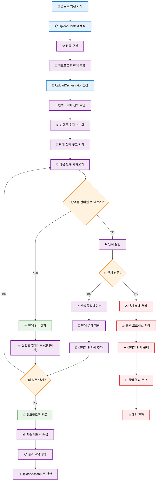
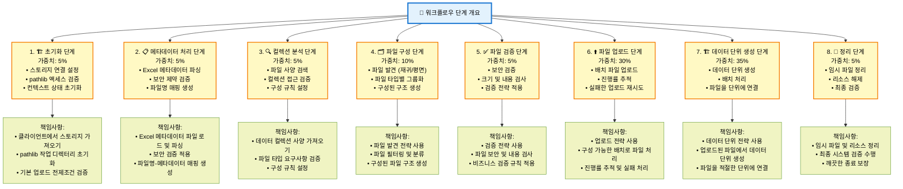

# 업로드 플러그인

업로드 플러그인은 포괄적인 메타데이터 지원, 보안 검증 및 체계적인 데이터 단위 생성을 통해 파일을 Synapse 플랫폼으로 처리하기 위한 파일 업로드 및 데이터 수집 작업을 제공합니다.

## 개요

**사용 가능한 액션:**

- `upload` - 선택적 Excel 메타데이터 처리를 통한 파일 및 디렉토리 스토리지 업로드

**사용 사례:**

- 메타데이터 주석을 포함한 대량 파일 업로드
- Excel 기반 메타데이터 매핑 및 검증
- 재귀적 디렉토리 처리
- 타입 기반 파일 구성
- 배치 데이터 단위 생성
- 크기 및 내용 검증을 통한 안전한 파일 처리

**지원되는 업로드 소스:**

- 로컬 파일 시스템 경로 (파일 및 디렉토리)
- 재귀적 디렉토리 스캔
- 향상된 파일 주석을 위한 Excel 메타데이터 파일
- 자동 구성을 통한 혼합 파일 타입

## 업로드 액션 아키텍처

업로드 시스템은 검증된 디자인 패턴을 기반으로 구축된 현대적이고 확장 가능한 아키텍처를 사용합니다. 리팩토링된 구현은 이전의 모놀리식 접근 방식을 관심사의 명확한 분리가 있는 모듈식 전략 기반 시스템으로 변환합니다.

### 디자인 패턴

아키텍처는 여러 핵심 디자인 패턴을 활용합니다:

- **전략 패턴**: 검증, 파일 발견, 메타데이터 처리, 업로드 작업 및 데이터 단위 생성을 위한 플러그형 동작
- **파사드 패턴**: UploadOrchestrator는 복잡한 워크플로우를 조정하기 위한 단순화된 인터페이스를 제공
- **팩토리 패턴**: StrategyFactory는 런타임 매개변수를 기반으로 적절한 전략 구현을 생성
- **컨텍스트 패턴**: UploadContext는 워크플로우 구성 요소 간의 공유 상태 및 통신을 유지

### 컴포넌트 아키텍처

```mermaid
classDiagram
    %% Light/Dark mode compatible colors
    classDef coreClass fill:#e3f2fd,stroke:#1976d2,stroke-width:2px,color:#000000
    classDef strategyClass fill:#e8f5e8,stroke:#388e3c,stroke-width:2px,color:#000000
    classDef stepClass fill:#fff9c4,stroke:#f57c00,stroke-width:2px,color:#000000
    classDef contextClass fill:#ffebee,stroke:#d32f2f,stroke-width:2px,color:#000000

    class UploadAction {
        +name: str = "upload"
        +category: PluginCategory.UPLOAD
        +method: RunMethod.JOB
        +run_class: UploadRun
        +params_model: UploadParams
        +strategy_factory: StrategyFactory
        +step_registry: StepRegistry

        +start() dict
        +get_workflow_summary() dict
        +_configure_workflow() None
        +_configure_strategies() dict
    }

    class UploadOrchestrator {
        +context: UploadContext
        +step_registry: StepRegistry
        +strategies: dict
        +executed_steps: list
        +current_step_index: int
        +rollback_executed: bool

        +execute() dict
        +get_workflow_summary() dict
        +get_executed_steps() list
        +is_rollback_executed() bool
        +_execute_step(step) StepResult
        +_handle_step_failure(step, error) None
        +_rollback_executed_steps() None
    }

    class UploadContext {
        +params: dict
        +run: UploadRun
        +client: Any
        +storage: Any
        +pathlib_cwd: Path
        +metadata: dict
        +file_specifications: dict
        +organized_files: list
        +uploaded_files: list
        +data_units: list
        +metrics: dict
        +errors: list
        +strategies: dict
        +rollback_data: dict

        +update(result: StepResult) None
        +get_result() dict
        +has_errors() bool
        +update_metrics(category, metrics) None
    }

    class StepRegistry {
        +_steps: list
        +register(step: BaseStep) None
        +get_steps() list
        +get_total_progress_weight() float
        +clear() None
    }

    class StrategyFactory {
        +create_validation_strategy(params, context) BaseValidationStrategy
        +create_file_discovery_strategy(params, context) BaseFileDiscoveryStrategy
        +create_metadata_strategy(params, context) BaseMetadataStrategy
        +create_upload_strategy(params, context) BaseUploadStrategy
        +create_data_unit_strategy(params, context) BaseDataUnitStrategy
        +get_available_strategies() dict
    }

    class BaseStep {
        <<abstract>>
        +name: str
        +progress_weight: float
        +execute(context: UploadContext) StepResult
        +can_skip(context: UploadContext) bool
        +rollback(context: UploadContext) None
        +create_success_result(data) StepResult
        +create_error_result(error) StepResult
        +create_skip_result() StepResult
    }

    class StepResult {
        +success: bool
        +data: dict
        +error: str
        +rollback_data: dict
        +skipped: bool
        +original_exception: Exception
        +timestamp: datetime
    }

    %% Strategy Base Classes
    class BaseValidationStrategy {
        <<abstract>>
        +validate_files(files, context) bool
        +validate_security(file_path) bool
    }

    class BaseFileDiscoveryStrategy {
        <<abstract>>
        +discover_files(path, context) list
        +organize_files(files, specs, context) list
    }

    class BaseMetadataStrategy {
        <<abstract>>
        +process_metadata(context) dict
        +extract_metadata(file_path) dict
    }

    class BaseUploadStrategy {
        <<abstract>>
        +upload_files(files, context) list
        +upload_batch(batch, context) list
    }

    class BaseDataUnitStrategy {
        <<abstract>>
        +generate_data_units(files, context) list
        +create_data_unit_batch(batch, context) list
    }

    %% Workflow Steps
    class InitializeStep {
        +name = "initialize"
        +progress_weight = 0.05
    }

    class ProcessMetadataStep {
        +name = "process_metadata"
        +progress_weight = 0.05
    }

    class AnalyzeCollectionStep {
        +name = "analyze_collection"
        +progress_weight = 0.05
    }

    class OrganizeFilesStep {
        +name = "organize_files"
        +progress_weight = 0.10
    }

    class ValidateFilesStep {
        +name = "validate_files"
        +progress_weight = 0.05
    }

    class UploadFilesStep {
        +name = "upload_files"
        +progress_weight = 0.30
    }

    class GenerateDataUnitsStep {
        +name = "generate_data_units"
        +progress_weight = 0.35
    }

    class CleanupStep {
        +name = "cleanup"
        +progress_weight = 0.05
    }

    %% Relationships
    UploadAction --> UploadOrchestrator : creates and executes
    UploadAction --> StrategyFactory : configures strategies
    UploadAction --> StepRegistry : manages workflow steps
    UploadOrchestrator --> UploadContext : coordinates state
    UploadOrchestrator --> StepRegistry : executes steps from
    UploadOrchestrator --> BaseStep : executes
    BaseStep --> StepResult : returns
    UploadContext --> StepResult : updates with
    StrategyFactory --> BaseValidationStrategy : creates
    StrategyFactory --> BaseFileDiscoveryStrategy : creates
    StrategyFactory --> BaseMetadataStrategy : creates
    StrategyFactory --> BaseUploadStrategy : creates
    StrategyFactory --> BaseDataUnitStrategy : creates
    StepRegistry --> BaseStep : contains

    %% Step inheritance
    InitializeStep --|> BaseStep : extends
    ProcessMetadataStep --|> BaseStep : extends
    AnalyzeCollectionStep --|> BaseStep : extends
    OrganizeFilesStep --|> BaseStep : extends
    ValidateFilesStep --|> BaseStep : extends
    UploadFilesStep --|> BaseStep : extends
    GenerateDataUnitsStep --|> BaseStep : extends
    CleanupStep --|> BaseStep : extends

    %% Note: Class styling defined above - Mermaid will apply based on classDef definitions
```



### 단계 기반 워크플로우 실행

리팩토링된 아키텍처는 UploadOrchestrator에 의해 조정되는 단계 기반 워크플로우를 사용합니다. 각 단계는 정의된 책임과 진행률 가중치를 가집니다.

#### 워크플로우 단계 개요

| 단계 | 이름                | 가중치 | 책임                               |
| ---- | ------------------- | ------ | ---------------------------------- |
| 1    | Initialize          | 5%     | 스토리지, pathlib, 기본 검증 설정  |
| 2    | Process Metadata    | 5%     | 제공된 Excel 메타데이터 처리       |
| 3    | Analyze Collection  | 5%     | 데이터 컬렉션 사양 검색 및 검증    |
| 4    | Organize Files      | 10%    | 타입별 파일 발견 및 구성           |
| 5    | Validate Files      | 5%     | 보안 및 내용 검증                  |
| 6    | Upload Files        | 30%    | 스토리지에 파일 업로드             |
| 7    | Generate Data Units | 35%    | 업로드된 파일에서 데이터 단위 생성 |
| 8    | Cleanup             | 5%     | 임시 리소스 정리                   |

#### 실행 플로우



#### 단계 실행 세부사항



#### 전략 통합 지점

전략은 워크플로우의 특정 지점에서 주입됩니다:

- **검증 전략**: ValidateFilesStep에서 사용
- **파일 발견 전략**: OrganizeFilesStep에서 사용
- **메타데이터 전략**: ProcessMetadataStep에서 사용
- **업로드 전략**: UploadFilesStep에서 사용
- **데이터 단위 전략**: GenerateDataUnitsStep에서 사용

#### 오류 처리 및 롤백

오케스트레이터는 자동 롤백 기능을 제공합니다:

1. **예외 캡처**: 디버깅을 위해 원본 예외 보존
2. **롤백 실행**: 성공적으로 실행된 모든 단계에서 역순으로 rollback() 호출
3. **우아한 저하**: 개별 단계 롤백이 실패해도 롤백 계속 진행
4. **상태 보존**: 실패 후 분석을 위한 실행 상태 유지

## 개발 가이드

이 섹션은 사용자 정의 전략과 워크플로우 단계로 업로드 액션을 확장하기 위한 포괄적인 가이드를 제공합니다.

### 사용자 정의 전략 생성

전략은 업로드 프로세스의 다양한 측면에 대한 특정 동작을 구현합니다. 각 전략 타입은 잘 정의된 인터페이스를 가지고 있습니다.

#### 사용자 정의 검증 전략

```python
from synapse_sdk.plugins.categories.upload.actions.upload.strategies.validation.base import BaseValidationStrategy
from synapse_sdk.plugins.categories.upload.actions.upload.context import UploadContext

class CustomValidationStrategy(BaseValidationStrategy):
    """고급 보안 검사를 포함한 사용자 정의 검증 전략."""

    def validate_files(self, files: List[Path], context: UploadContext) -> bool:
        """사용자 정의 비즈니스 규칙을 사용하여 파일 검증."""
        for file_path in files:
            # 사용자 정의 검증 로직
            if not self._validate_custom_rules(file_path):
                return False

            # 보안 검증 호출
            if not self.validate_security(file_path):
                return False
        return True

    def validate_security(self, file_path: Path) -> bool:
        """사용자 정의 보안 검증."""
        # 사용자 정의 보안 검사 구현
        if file_path.suffix in ['.exe', '.bat', '.sh']:
            return False

        # 파일 크기 검사
        if file_path.stat().st_size > 100 * 1024 * 1024:  # 100MB
            return False

        return True

    def _validate_custom_rules(self, file_path: Path) -> bool:
        """도메인별 검증 규칙 구현."""
        # 사용자 정의 비즈니스 로직
        return True
```

#### 사용자 정의 파일 발견 전략

```python
from synapse_sdk.plugins.categories.upload.actions.upload.strategies.file_discovery.base import BaseFileDiscoveryStrategy
from pathlib import Path
from typing import List, Dict, Any

class CustomFileDiscoveryStrategy(BaseFileDiscoveryStrategy):
    """고급 필터링을 포함한 사용자 정의 파일 발견."""

    def discover_files(self, path: Path, context: UploadContext) -> List[Path]:
        """사용자 정의 필터링 규칙으로 파일 발견."""
        files = []

        if context.get_param('is_recursive', False):
            files = list(path.rglob('*'))
        else:
            files = list(path.iterdir())

        # 사용자 정의 필터링 적용
        return self._apply_custom_filters(files, context)

    def organize_files(self, files: List[Path], specs: Dict[str, Any], context: UploadContext) -> List[Dict[str, Any]]:
        """사용자 정의 분류를 사용하여 파일 구성."""
        organized = []

        for file_path in files:
            if file_path.is_file():
                category = self._determine_category(file_path)
                organized.append({
                    'file_path': file_path,
                    'category': category,
                    'metadata': self._extract_file_metadata(file_path)
                })

        return organized

    def _apply_custom_filters(self, files: List[Path], context: UploadContext) -> List[Path]:
        """도메인별 파일 필터 적용."""
        filtered = []
        for file_path in files:
            if self._should_include_file(file_path):
                filtered.append(file_path)
        return filtered

    def _determine_category(self, file_path: Path) -> str:
        """사용자 정의 로직을 사용하여 파일 카테고리 결정."""
        # 사용자 정의 분류 로직
        ext = file_path.suffix.lower()
        if ext in ['.jpg', '.png', '.gif']:
            return 'images'
        elif ext in ['.pdf', '.doc', '.docx']:
            return 'documents'
        else:
            return 'other'
```

#### 사용자 정의 업로드 전략

```python
from synapse_sdk.plugins.categories.upload.actions.upload.strategies.upload.base import BaseUploadStrategy
from typing import List, Dict, Any

class CustomUploadStrategy(BaseUploadStrategy):
    """고급 재시도 로직을 포함한 사용자 정의 업로드 전략."""

    def upload_files(self, files: List[Dict[str, Any]], context: UploadContext) -> List[Dict[str, Any]]:
        """사용자 정의 배치 및 재시도 로직으로 파일 업로드."""
        uploaded_files = []
        batch_size = context.get_param('upload_batch_size', 10)

        # 사용자 정의 배치로 처리
        for i in range(0, len(files), batch_size):
            batch = files[i:i + batch_size]
            batch_results = self.upload_batch(batch, context)
            uploaded_files.extend(batch_results)

        return uploaded_files

    def upload_batch(self, batch: List[Dict[str, Any]], context: UploadContext) -> List[Dict[str, Any]]:
        """재시도 로직으로 파일 배치 업로드."""
        results = []

        for file_info in batch:
            max_retries = 3
            for attempt in range(max_retries):
                try:
                    result = self._upload_single_file(file_info, context)
                    results.append(result)
                    break
                except Exception as e:
                    if attempt == max_retries - 1:
                        # 최종 시도 실패
                        context.add_error(f"Failed to upload {file_info['file_path']}: {e}")
                    else:
                        # 재시도 전 대기
                        time.sleep(2 ** attempt)

        return results

    def _upload_single_file(self, file_info: Dict[str, Any], context: UploadContext) -> Dict[str, Any]:
        """사용자 정의 로직으로 단일 파일 업로드."""
        # 사용자 정의 업로드 구현
        file_path = file_info['file_path']

        # 컨텍스트에서 스토리지 사용
        storage = context.storage

        # 여기에 사용자 정의 업로드 로직
        uploaded_file = {
            'file_path': str(file_path),
            'storage_path': f"uploads/{file_path.name}",
            'size': file_path.stat().st_size,
            'checksum': self._calculate_checksum(file_path)
        }

        return uploaded_file
```

### 사용자 정의 워크플로우 단계 생성

사용자 정의 워크플로우 단계는 기본 단계 클래스를 확장하고 필수 인터페이스를 구현합니다.

#### 사용자 정의 처리 단계

```python
from synapse_sdk.plugins.categories.upload.actions.upload.steps.base import BaseStep
from synapse_sdk.plugins.categories.upload.actions.upload.context import UploadContext, StepResult
from pathlib import Path

class CustomProcessingStep(BaseStep):
    """특수 파일 처리를 위한 사용자 정의 처리 단계."""

    @property
    def name(self) -> str:
        return 'custom_processing'

    @property
    def progress_weight(self) -> float:
        return 0.15  # 전체 워크플로우의 15%

    def execute(self, context: UploadContext) -> StepResult:
        """사용자 정의 처리 로직 실행."""
        try:
            # 사용자 정의 처리 로직
            processed_files = self._process_files(context)

            # 결과로 컨텍스트 업데이트
            return self.create_success_result({
                'processed_files': processed_files,
                'processing_stats': self._get_processing_stats()
            })

        except Exception as e:
            return self.create_error_result(f'Custom processing failed: {str(e)}')

    def can_skip(self, context: UploadContext) -> bool:
        """단계를 건너뛸 수 있는지 결정."""
        # 처리할 파일이 없으면 건너뛰기
        return len(context.organized_files) == 0

    def rollback(self, context: UploadContext) -> None:
        """사용자 정의 처리 작업 롤백."""
        # 처리 중에 생성된 리소스 정리
        self._cleanup_processing_resources(context)

    def _process_files(self, context: UploadContext) -> List[Dict]:
        """사용자 정의 파일 처리 구현."""
        processed = []

        for file_info in context.organized_files:
            # 사용자 정의 처리 로직
            result = self._process_single_file(file_info)
            processed.append(result)

        return processed

    def _process_single_file(self, file_info: Dict) -> Dict:
        """단일 파일 처리."""
        # 사용자 정의 처리 구현
        return {
            'original': file_info,
            'processed': True,
            'timestamp': datetime.now()
        }
```

### 전략 팩토리 확장

사용자 정의 전략을 사용 가능하게 하려면 StrategyFactory를 확장하세요:

```python
from synapse_sdk.plugins.categories.upload.actions.upload.factory import StrategyFactory

class CustomStrategyFactory(StrategyFactory):
    """사용자 정의 전략을 포함한 확장 팩토리."""

    def create_validation_strategy(self, params: Dict, context=None):
        """사용자 정의 옵션으로 검증 전략 생성."""
        validation_type = params.get('custom_validation_type', 'default')

        if validation_type == 'strict':
            return CustomValidationStrategy()
        else:
            return super().create_validation_strategy(params, context)

    def create_file_discovery_strategy(self, params: Dict, context=None):
        """사용자 정의 옵션으로 파일 발견 전략 생성."""
        discovery_mode = params.get('discovery_mode', 'default')

        if discovery_mode == 'advanced':
            return CustomFileDiscoveryStrategy()
        else:
            return super().create_file_discovery_strategy(params, context)
```

### 사용자 정의 업로드 액션

포괄적인 커스터마이제이션을 위해서는 UploadAction 자체를 확장하세요:

```python
from synapse_sdk.plugins.categories.upload.actions.upload.action import UploadAction
from synapse_sdk.plugins.categories.decorators import register_action

@register_action
class CustomUploadAction(UploadAction):
    """확장 워크플로우를 포함한 사용자 정의 업로드 액션."""

    name = 'custom_upload'

    def __init__(self, *args, **kwargs):
        super().__init__(*args, **kwargs)
        # 사용자 정의 전략 팩토리 사용
        self.strategy_factory = CustomStrategyFactory()

    def _configure_workflow(self) -> None:
        """추가 단계로 사용자 정의 워크플로우 구성."""
        # 표준 단계 등록
        super()._configure_workflow()

        # 사용자 정의 처리 단계 추가
        self.step_registry.register(CustomProcessingStep())

    def _configure_strategies(self, context=None) -> Dict[str, Any]:
        """사용자 정의 매개변수로 전략 구성."""
        strategies = super()._configure_strategies(context)

        # 사용자 정의 전략 추가
        strategies['custom_processing'] = self._create_custom_processing_strategy()

        return strategies

    def _create_custom_processing_strategy(self):
        """사용자 정의 처리 전략 생성."""
        return CustomProcessingStrategy(self.params)
```

### 사용자 정의 컴포넌트 테스트

#### 사용자 정의 전략 테스트

```python
import pytest
from unittest.mock import Mock
from pathlib import Path

class TestCustomValidationStrategy:

    def setup_method(self):
        self.strategy = CustomValidationStrategy()
        self.context = Mock()

    def test_validate_files_success(self):
        """성공적인 파일 검증 테스트."""
        files = [Path('/test/file1.txt'), Path('/test/file2.jpg')]
        result = self.strategy.validate_files(files, self.context)
        assert result is True

    def test_validate_files_security_failure(self):
        """보안상 이유로 검증 실패 테스트."""
        files = [Path('/test/malware.exe')]
        result = self.strategy.validate_files(files, self.context)
        assert result is False

    def test_validate_large_file_failure(self):
        """큰 파일에 대한 검증 실패 테스트."""
        # 큰 크기를 반환하도록 파일 stat 모킹
        large_file = Mock(spec=Path)
        large_file.suffix = '.txt'
        large_file.stat.return_value.st_size = 200 * 1024 * 1024  # 200MB

        result = self.strategy.validate_security(large_file)
        assert result is False
```

#### 사용자 정의 단계 테스트

```python
class TestCustomProcessingStep:

    def setup_method(self):
        self.step = CustomProcessingStep()
        self.context = Mock()
        self.context.organized_files = [
            {'file_path': '/test/file1.txt'},
            {'file_path': '/test/file2.jpg'}
        ]

    def test_execute_success(self):
        """성공적인 단계 실행 테스트."""
        result = self.step.execute(self.context)

        assert result.success is True
        assert 'processed_files' in result.data
        assert len(result.data['processed_files']) == 2

    def test_can_skip_with_no_files(self):
        """단계 건너뛰기 로직 테스트."""
        self.context.organized_files = []
        assert self.step.can_skip(self.context) is True

    def test_rollback_cleanup(self):
        """롤백 정리 테스트."""
        # 이것은 예외를 발생시키지 않아야 함
        self.step.rollback(self.context)
```

## 업로드 매개변수

업로드 액션은 포괄적인 매개변수 검증을 위해 `UploadParams`를 사용합니다:

### 필수 매개변수

| 매개변수          | 타입  | 설명                    | 검증                   |
| ----------------- | ----- | ----------------------- | ---------------------- |
| `name`            | `str` | 읽기 쉬운 업로드 이름   | 빈 값이 아니어야 함    |
| `path`            | `str` | 소스 파일/디렉토리 경로 | 유효한 경로여야 함     |
| `storage`         | `int` | 대상 스토리지 ID        | API를 통해 존재해야 함 |
| `data_collection` | `int` | 데이터 컬렉션 ID        | API를 통해 존재해야 함 |

### 선택적 매개변수

| 매개변수                        | 타입          | 기본값  | 설명                        |
| ------------------------------- | ------------- | ------- | --------------------------- |
| `description`                   | `str \| None` | `None`  | 업로드 설명                 |
| `project`                       | `int \| None` | `None`  | 프로젝트 ID (제공시 검증됨) |
| `excel_metadata_path`           | `str \| None` | `None`  | Excel 메타데이터 파일 경로  |
| `is_recursive`                  | `bool`        | `False` | 디렉토리를 재귀적으로 스캔  |
| `max_file_size_mb`              | `int`         | `50`    | 최대 파일 크기 (MB)         |
| `creating_data_unit_batch_size` | `int`         | `100`   | 데이터 단위 배치 크기       |
| `use_async_upload`              | `bool`        | `True`  | 비동기 처리 사용            |

### 매개변수 검증

시스템은 실시간 검증을 수행합니다:

```python
# 스토리지 검증
@field_validator('storage', mode='before')
@classmethod
def check_storage_exists(cls, value: str, info) -> str:
    action = info.context['action']
    client = action.client
    try:
        client.get_storage(value)
    except ClientError:
        raise PydanticCustomError('client_error', 'Storage not found')
    return value
```

**검증 규칙:**

- `source_path`: 읽기 가능한 디렉터리 또는 파일이어야 함
- 모든 ID 필드: 비어있지 않은 문자열이어야 함
- `batch_size`: 1 이상의 정수
- `max_workers`: 1 이상의 정수
- `include_patterns`/`exclude_patterns`: 유효한 glob 패턴 목록

### UploadRun

업로드 실행과 로깅을 관리합니다.

```python
class UploadRun(BaseRun):
    def __init__(self, action_name: str = "upload"):
        """업로드 실행을 초기화합니다."""

    def log_message_with_code(self, log_code: LogCode, **kwargs):
        """로그 코드를 사용하여 메시지를 로깅합니다."""

    def log_upload_event(self, event_type: str, details: Dict):
        """업로드 이벤트를 로깅합니다."""
```

### 열거형

#### LogCode

업로드 작업에 대한 타입 안전 로깅 코드:

```python
class LogCode(Enum):
    UPLOAD_STARTED = "UPLOAD_001"
    FILE_DISCOVERED = "UPLOAD_002"
    FILE_PROCESSED = "UPLOAD_003"
    BATCH_COMPLETED = "UPLOAD_004"
    UPLOAD_COMPLETED = "UPLOAD_005"
    UPLOAD_FAILED = "UPLOAD_006"
    # ... 총 36개 코드
```

#### UploadStatus

업로드 작업 상태:

```python
class UploadStatus(Enum):
    SUCCESS = "success"
    FAILED = "failed"
```

### 유틸리티 클래스

#### ExcelSecurityConfig

Excel 파일 보안 설정:

```python
class ExcelSecurityConfig:
    max_file_size_mb: int = 10      # 파일 크기 제한 (MB)
    max_rows: int = 100000          # 행 수 제한
    max_columns: int = 50           # 열 수 제한

    @classmethod
    def from_action_config(cls, action_config) -> 'ExcelSecurityConfig':
        """config.yaml에서 설정을 로드합니다."""
```

#### PathAwareJSONEncoder

Path 및 datetime 객체를 위한 사용자 정의 JSON 인코더:

```python
class PathAwareJSONEncoder:
    """JSON 직렬화를 위한 사용자 정의 인코더"""

    @staticmethod
    def default(obj):
        """지원되는 타입을 JSON 호환 형식으로 변환"""
        if isinstance(obj, Path):
            return str(obj)
        elif isinstance(obj, datetime):
            return obj.isoformat()
        return json.JSONEncoder.default(obj)
```

**지원 타입:**

- Path 객체 (문자열로 변환)
- Datetime 객체 (ISO 형식)
- 표준 JSON 직렬화 가능 타입

## Excel 메타데이터 처리

업로드 플러그인은 포괄적인 파일명 매칭, 유연한 헤더 지원 및 최적화된 성능을 통한 고급 Excel 메타데이터 처리를 제공합니다:

### Excel 파일 형식

Excel 파일은 유연한 헤더 형식과 포괄적인 파일명 매칭을 지원합니다:

#### 지원되는 헤더 형식

대소문자를 구분하지 않는 매칭으로 두 헤더 형식 모두 지원됩니다:

**옵션 1: "filename" 헤더**
| filename | category | description | custom_field |
| ---------- | -------- | ------------------ | ------------ |
| image1.jpg | nature | Mountain landscape | high_res |
| image2.png | urban | City skyline | processed |

**옵션 2: "file_name" 헤더**  
| file_name | category | description | custom_field |
| ---------- | -------- | ------------------ | ------------ |
| image1.jpg | nature | Mountain landscape | high_res |
| image2.png | urban | City skyline | processed |

#### 파일명 매칭 전략

시스템은 파일과 메타데이터를 연결하기 위해 포괄적인 5단계 우선순위 매칭 알고리즘을 사용합니다:

1. **정확한 stem 매칭** (최우선): `image1`이 `image1.jpg`와 매칭
2. **정확한 파일명 매칭**: `image1.jpg`가 `image1.jpg`와 매칭
3. **메타데이터 키 stem 매칭**: `path/image1.ext` stem이 `image1`과 매칭
4. **부분 경로 매칭**: `/uploads/image1.jpg`에 `image1` 포함
5. **전체 경로 매칭**: 복잡한 구조에 대한 완전한 경로 매칭

이 강력한 매칭은 파일 구성이나 명명 규칙에 관계없이 메타데이터가 올바르게 연결되도록 보장합니다.

### 보안 검증

Excel 파일은 포괄적인 보안 검증을 받습니다:

```python
class ExcelSecurityConfig:
    max_file_size_mb: int = 10      # 파일 크기 제한 (MB)
    max_rows: int = 100000          # 행 수 제한
    max_columns: int = 50           # 열 수 제한
```

#### 고급 보안 기능

- **파일 형식 검증**: Excel 파일 시그니처 확인 (.xlsx의 경우 PK, .xls의 경우 복합 문서)
- **메모리 추정**: 대용량 스프레드시트로 인한 메모리 고갈 방지
- **내용 정화**: 지나치게 긴 값의 자동 잘라내기
- **오류 복원력**: 손상되거나 접근할 수 없는 파일의 우아한 처리

### config.yaml을 통한 구성

보안 제한 및 처리 옵션을 구성할 수 있습니다:

```yaml
actions:
  upload:
    excel_config:
      max_file_size_mb: 10 # Excel 파일 최대 크기 (MB)
      max_rows: 100000 # 허용되는 최대 행 수
      max_columns: 50 # 허용되는 최대 열 수
```

### 성능 최적화

Excel 메타데이터 처리에는 여러 성능 향상 기능이 포함되어 있습니다:

#### 메타데이터 인덱싱

- **O(1) 해시 검색**: 정확한 stem 및 파일명 매칭용
- **사전 구축된 인덱스**: 일반적인 매칭 패턴용
- **대체 알고리즘**: 복잡한 경로 매칭 시나리오용

#### 효율적인 처리

- **최적화된 행 처리**: 빈 행을 조기에 건너뛰기
- **메모리 인식 작업**: 배치로 파일 처리
- **스마트 파일 발견**: 반복되는 변환을 피하기 위한 경로 문자열 캐시

### 메타데이터 처리 플로우

1. **보안 검증**: 파일 크기, 형식 및 내용 제한
2. **헤더 검증**: 대소문자를 구분하지 않는 매칭으로 "filename" 및 "file_name" 모두 지원
3. **인덱스 구축**: 성능을 위한 O(1) 검색 구조 생성
4. **내용 처리**: 최적화를 통한 행별 메타데이터 추출
5. **데이터 정화**: 자동 잘라내기 및 검증
6. **패턴 매칭**: 5단계 파일명 연결 알고리즘
7. **매핑 생성**: 최적화된 파일명에서 메타데이터로의 매핑

### Excel 메타데이터 매개변수

사용자 정의 Excel 메타데이터 파일 경로를 지정할 수 있습니다:

```python
params = {
    "name": "Excel 메타데이터 업로드",
    "path": "/data/files",
    "storage": 1,
    "data_collection": 5,
    "excel_metadata_path": "/data/custom_metadata.xlsx"  # 사용자 정의 Excel 파일
}
```

#### 경로 해결

- **절대 경로**: 존재하고 접근 가능한 경우 직접 사용
- **상대 경로**: 업로드 경로에 상대적으로 해결
- **기본 발견**: 경로가 지정되지 않은 경우 자동으로 `meta.xlsx` 또는 `meta.xls` 검색
- **스토리지 통합**: 적절한 경로 해결을 위해 스토리지 구성 사용

### 오류 처리

포괄적인 오류 처리로 강력한 작업을 보장합니다:

```python
# Excel 처리 오류는 우아하게 처리됩니다
try:
    metadata = process_excel_metadata(excel_path)
except ExcelSecurityError as e:
    # 보안 위반 - 파일이 너무 크거나 행이 너무 많음 등
    log_security_violation(e)
except ExcelParsingError as e:
    # 파싱 실패 - 손상된 파일, 잘못된 형식 등
    log_parsing_error(e)
```

#### 오류 복구

- **우아한 성능 저하**: Excel이 실패하면 빈 메타데이터로 처리 계속
- **상세 로깅**: 다양한 실패 유형에 대한 특정 오류 코드
- **경로 검증**: 매개변수 처리 중 포괄적인 검증
- **대체 동작**: 메타데이터를 처리할 수 없을 때 스마트 기본값

## 파일 구성

업로드 시스템은 파일을 타입에 따라 자동으로 구성합니다:

### 타입 감지

파일은 다음을 기반으로 분류됩니다:

- 파일 확장자 패턴
- MIME 타입 감지
- 내용 분석
- 사용자 정의 타입 규칙

### 디렉토리 구조

```
upload_output/
├── images/
│   ├── image1.jpg
│   └── image2.png
├── documents/
│   ├── report.pdf
│   └── data.xlsx
└── videos/
    └── presentation.mp4
```

### 배치 처리

파일은 구성 가능한 배치로 처리됩니다:

```python
# 배치 크기 구성
params = {
    "creating_data_unit_batch_size": 100,
    "use_async_upload": True
}
```

## 진행률 추적 및 메트릭

### 진행률 카테고리

업로드 액션은 세 가지 주요 단계에서 진행률을 추적합니다:

| 카테고리              | 비율 | 설명                     |
| --------------------- | ---- | ------------------------ |
| `analyze_collection`  | 2%   | 매개변수 검증 및 설정    |
| `upload_data_files`   | 38%  | 파일 업로드 처리         |
| `generate_data_units` | 60%  | 데이터 단위 생성 및 완료 |

### 메트릭 수집

모니터링을 위해 실시간 메트릭이 수집됩니다:

```python
metrics_categories = {
    'data_files': {
        'stand_by': 0,    # 처리 대기 중인 파일
        'failed': 0,      # 업로드 실패한 파일
        'success': 0,     # 성공적으로 업로드된 파일
    },
    'data_units': {
        'stand_by': 0,    # 생성 대기 중인 단위
        'failed': 0,      # 생성 실패한 단위
        'success': 0,     # 성공적으로 생성된 단위
    },
}
```

## 타입 안전 로깅

업로드 시스템은 일관성을 위해 열거형 기반 로깅을 사용합니다:

### 로그 코드

```python
class LogCode(str, Enum):
    VALIDATION_FAILED = 'VALIDATION_FAILED'
    NO_FILES_FOUND = 'NO_FILES_FOUND'
    EXCEL_SECURITY_VIOLATION = 'EXCEL_SECURITY_VIOLATION'
    EXCEL_PARSING_ERROR = 'EXCEL_PARSING_ERROR'
    FILES_DISCOVERED = 'FILES_DISCOVERED'
    UPLOADING_DATA_FILES = 'UPLOADING_DATA_FILES'
    GENERATING_DATA_UNITS = 'GENERATING_DATA_UNITS'
    IMPORT_COMPLETED = 'IMPORT_COMPLETED'
```

### 로깅 사용법

```python
# 기본 로깅
run.log_message_with_code(LogCode.FILES_DISCOVERED, file_count)

# 사용자 정의 레벨로
run.log_message_with_code(
    LogCode.EXCEL_SECURITY_VIOLATION,
    filename,
    level=Context.DANGER
)

# 업로드 특정 이벤트
run.log_upload_event(LogCode.UPLOADING_DATA_FILES, batch_size)
```

## 마이그레이션 가이드

### 레거시에서 리팩토링된 아키텍처로

업로드 액션은 **100% 하위 호환성**을 유지하면서 현대적인 디자인 패턴을 사용하여 리팩토링되었습니다. 기존 코드는 변경 없이 계속 작동합니다.

#### 주요 변경 사항

**이전 (레거시 모놀리식):**

- 모든 로직을 포함한 단일 900+ 줄 액션 클래스
- 검증, 파일 발견 등에 대한 하드코딩된 동작
- 확장성이나 커스터마이제이션 옵션 없음
- 전반에 걸친 수동 오류 처리

**이후 (전략/파사드 패턴):**

- 8개 워크플로우 단계로 명확한 관심사 분리
- 다양한 동작을 위한 플러그형 전략
- 사용자 정의 구현을 위한 확장 가능한 아키텍처
- 자동 롤백 및 포괄적인 오류 처리

#### 하위 호환성

```python
# 이 레거시 사용법은 동일하게 작동합니다
from synapse_sdk.plugins.categories.upload.actions.upload.action import UploadAction

params = {
    "name": "My Upload",
    "path": "/data/files",
    "storage": 1,
    "data_collection": 5  # 'collection'에서 'data_collection'으로 변경
}

action = UploadAction(params=params, plugin_config=config)
result = action.start()  # 이전과 동일하게 작동
```

#### 향상된 기능

리팩토링된 아키텍처는 새로운 기능을 제공합니다:

```python
# 자세한 워크플로우 정보 가져오기
action = UploadAction(params=params, plugin_config=config)
workflow_info = action.get_workflow_summary()
print(f"Configured with {workflow_info['step_count']} steps")
print(f"Available strategies: {workflow_info['available_strategies']}")

# 실행하고 자세한 결과 가져오기
result = action.start()
print(f"Success: {result['success']}")
print(f"Uploaded files: {result['uploaded_files_count']}")
print(f"Generated data units: {result['generated_data_units_count']}")
print(f"Errors: {result['errors']}")
print(f"Metrics: {result['metrics']}")
```

#### 매개변수 변경

하나의 매개변수 이름만 변경되었습니다:

| 레거시             | 리팩토링          | 상태          |
| ------------------ | ----------------- | ------------- |
| `collection`       | `data_collection` | **필수 변경** |
| 기타 모든 매개변수 | 변경 없음         | 완전 호환     |

#### 마이그레이션의 이점

- **더 나은 오류 처리**: 실패 시 자동 롤백
- **진행률 추적**: 워크플로우 단계 전반의 자세한 진행률 메트릭
- **확장성**: 사용자 정의 전략 및 단계 추가
- **테스트**: 모킹 친화적인 아키텍처로 더 나은 테스트 가능성
- **유지보수성**: 명확한 관심사 분리
- **성능**: 더 효율적인 리소스 관리

## 사용 예제

### 기본 파일 업로드 (리팩토링된 아키텍처)

```python
from synapse_sdk.plugins.categories.upload.actions.upload.action import UploadAction

# 새 아키텍처로 기본 업로드 구성
params = {
    "name": "Dataset Upload",
    "description": "Training dataset for ML model",
    "path": "/data/training_images",
    "storage": 1,
    "data_collection": 5,  # 참고: 'collection' 대신 'data_collection'
    "is_recursive": True,
    "max_file_size_mb": 100
}

action = UploadAction(
    params=params,
    plugin_config=plugin_config
)

# 자동 단계 기반 워크플로우 및 롤백으로 실행
result = action.start()

# 향상된 결과 정보
print(f"Upload successful: {result['success']}")
print(f"Uploaded {result['uploaded_files_count']} files")
print(f"Generated {result['generated_data_units_count']} data units")
print(f"Workflow errors: {result['errors']}")

# 자세한 메트릭에 액세스
workflow_metrics = result['metrics'].get('workflow', {})
print(f"Total steps executed: {workflow_metrics.get('current_step', 0)}")
print(f"Progress completed: {workflow_metrics.get('progress_percentage', 0)}%")
```

### 진행률 추적이 포함된 Excel 메타데이터 업로드

```python
# Excel 메타데이터 및 진행률 모니터링으로 업로드
params = {
    "name": "Annotated Dataset Upload",
    "path": "/data/images",
    "storage": 1,
    "data_collection": 5,
    "excel_metadata_path": "/data/metadata.xlsx",
    "is_recursive": False,
    "creating_data_unit_batch_size": 50
}

action = UploadAction(
    params=params,
    plugin_config=plugin_config
)

# 실행 전 워크플로우 요약 가져오기
workflow_info = action.get_workflow_summary()
print(f"Workflow configured with {workflow_info['step_count']} steps")
print(f"Total progress weight: {workflow_info['total_progress_weight']}")
print(f"Steps: {workflow_info['steps']}")

# 향상된 오류 처리로 실행
try:
    result = action.start()
    if result['success']:
        print("Upload completed successfully!")
        print(f"Files: {result['uploaded_files_count']}")
        print(f"Data units: {result['generated_data_units_count']}")
    else:
        print("Upload failed with errors:")
        for error in result['errors']:
            print(f"  - {error}")
except Exception as e:
    print(f"Upload action failed: {e}")
```

### 사용자 정의 전략 업로드

```python
from synapse_sdk.plugins.categories.upload.actions.upload.action import UploadAction
from my_custom_strategies import CustomValidationStrategy

# 사용자 정의 팩토리로 액션 생성
class CustomUploadAction(UploadAction):
    def _configure_strategies(self, context=None):
        strategies = super()._configure_strategies(context)

        # 사용자 정의 검증으로 오버라이드
        if self.params.get('use_strict_validation'):
            strategies['validation'] = CustomValidationStrategy()

        return strategies

# 사용자 정의 액션 사용
params = {
    "name": "Strict Validation Upload",
    "path": "/data/sensitive_files",
    "storage": 1,
    "data_collection": 5,
    "use_strict_validation": True,
    "max_file_size_mb": 10  # 더 엄격한 제한
}

action = CustomUploadAction(
    params=params,
    plugin_config=plugin_config
)

result = action.start()
```

### 사용자 정의 구성을 포함한 배치 처리

```python
import os

# Excel 처리 제한 구성
os.environ['EXCEL_MAX_FILE_SIZE_MB'] = '20'
os.environ['EXCEL_MAX_ROWS'] = '20000'

# 사용자 정의 설정을 포함한 대량 배치 업로드
params = {
    "name": "Large Batch Upload",
    "path": "/data/large_dataset",
    "storage": 2,
    "data_collection": 10,
    "is_recursive": True,
    "max_file_size_mb": 500,
    "creating_data_unit_batch_size": 200,
    "use_async_upload": True
}

action = UploadAction(
    params=params,
    plugin_config=plugin_config
)

# 진행률 모니터링으로 실행
result = action.start()

# 결과 분석
print(f"Batch upload summary:")
print(f"  Success: {result['success']}")
print(f"  Files processed: {result['uploaded_files_count']}")
print(f"  Data units created: {result['generated_data_units_count']}")

# 카테고리별 메트릭 확인
metrics = result['metrics']
if 'data_files' in metrics:
    files_metrics = metrics['data_files']
    print(f"  Files - Success: {files_metrics.get('success', 0)}")
    print(f"  Files - Failed: {files_metrics.get('failed', 0)}")

if 'data_units' in metrics:
    units_metrics = metrics['data_units']
    print(f"  Units - Success: {units_metrics.get('success', 0)}")
    print(f"  Units - Failed: {units_metrics.get('failed', 0)}")
```

### 오류 처리 및 롤백

```python
# 자동 롤백을 포함한 향상된 오류 처리 시연
params = {
    "name": "Error Recovery Example",
    "path": "/data/problematic_files",
    "storage": 1,
    "data_collection": 5,
    "is_recursive": True
}

action = UploadAction(
    params=params,
    plugin_config=plugin_config
)

try:
    result = action.start()

    if not result['success']:
        print("Upload failed, but cleanup was automatic:")
        print(f"Errors encountered: {len(result['errors'])}")
        for i, error in enumerate(result['errors'], 1):
            print(f"  {i}. {error}")

        # 롤백이 수행되었는지 확인 (오케스트레이터 내부를 통해)
        workflow_metrics = result['metrics'].get('workflow', {})
        current_step = workflow_metrics.get('current_step', 0)
        total_steps = workflow_metrics.get('total_steps', 0)
        print(f"Workflow stopped at step {current_step} of {total_steps}")

except Exception as e:
    print(f"Critical upload failure: {e}")
    # 예외 전파 전에 롤백이 자동으로 수행됨
```

## 오류 처리

### 예외 타입

업로드 시스템은 특정 예외를 정의합니다:

```python
# 보안 위반
try:
    action.start()
except ExcelSecurityError as e:
    print(f"Excel security violation: {e}")

# 파싱 오류
except ExcelParsingError as e:
    print(f"Excel parsing failed: {e}")

# 일반 업로드 오류
except ActionError as e:
    print(f"Upload action failed: {e}")
```

### 검증 오류

매개변수 검증은 자세한 오류 메시지를 제공합니다:

```python
from pydantic import ValidationError

try:
    params = UploadParams(**invalid_params)
except ValidationError as e:
    for error in e.errors():
        print(f"Field {error['loc']}: {error['msg']}")
```

## API 레퍼런스

### 핵심 컴포넌트

#### UploadAction

파일 처리 작업을 위한 전략 및 파사드 패턴을 구현하는 메인 업로드 액션 클래스입니다.

**클래스 속성:**

- `name = 'upload'` - 액션 식별자
- `category = PluginCategory.UPLOAD` - 플러그인 카테고리
- `method = RunMethod.JOB` - 실행 방법
- `run_class = UploadRun` - 전문 실행 관리
- `params_model = UploadParams` - 매개변수 검증 모델
- `strategy_factory: StrategyFactory` - 전략 구현 생성
- `step_registry: StepRegistry` - 워크플로우 단계 관리

**주요 메서드:**

- `start() -> Dict[str, Any]` - 오케스트레이션된 업로드 워크플로우 실행
- `get_workflow_summary() -> Dict[str, Any]` - 구성된 워크플로우 요약 가져오기
- `_configure_workflow() -> None` - 실행 순서로 워크플로우 단계 등록
- `_configure_strategies(context=None) -> Dict[str, Any]` - 전략 인스턴스 생성

**진행률 카테고리:**

```python
progress_categories = {
    'analyze_collection': {'proportion': 2},
    'upload_data_files': {'proportion': 38},
    'generate_data_units': {'proportion': 60},
}
```

#### UploadOrchestrator

자동 롤백을 포함한 완전한 업로드 워크플로우를 조정하는 파사드 컴포넌트입니다.

**클래스 속성:**

- `context: UploadContext` - 워크플로우 전반의 공유 상태
- `step_registry: StepRegistry` - 워크플로우 단계 레지스트리
- `strategies: Dict[str, Any]` - 전략 구현
- `executed_steps: List[BaseStep]` - 성공적으로 실행된 단계
- `current_step_index: int` - 워크플로우의 현재 위치
- `rollback_executed: bool` - 롤백이 수행되었는지 여부

**주요 메서드:**

- `execute() -> Dict[str, Any]` - 오류 처리를 포함한 완전한 워크플로우 실행
- `get_workflow_summary() -> Dict[str, Any]` - 실행 요약 및 메트릭 가져오기
- `get_executed_steps() -> List[BaseStep]` - 성공적으로 실행된 단계 목록 가져오기
- `is_rollback_executed() -> bool` - 롤백이 수행되었는지 확인
- `_execute_step(step: BaseStep) -> StepResult` - 개별 워크플로우 단계 실행
- `_handle_step_failure(step: BaseStep, error: Exception) -> None` - 단계 실패 처리
- `_rollback_executed_steps() -> None` - 실행된 단계를 역순으로 롤백

#### UploadContext

워크플로우 컴포넌트 간의 공유 상태 및 통신을 유지하는 컨텍스트 객체입니다.

**상태 속성:**

- `params: Dict` - 업로드 매개변수
- `run: UploadRun` - 실행 관리 인스턴스
- `client: Any` - 외부 작업을 위한 API 클라이언트
- `storage: Any` - 스토리지 구성 객체
- `pathlib_cwd: Path` - 현재 작업 디렉토리 경로
- `metadata: Dict[str, Dict[str, Any]]` - 파일 메타데이터 매핑
- `file_specifications: Dict[str, Any]` - 데이터 컬렉션 파일 사양
- `organized_files: List[Dict[str, Any]]` - 구성된 파일 정보
- `uploaded_files: List[Dict[str, Any]]` - 성공적으로 업로드된 파일
- `data_units: List[Dict[str, Any]]` - 생성된 데이터 단위

**진행률 및 메트릭:**

- `metrics: Dict[str, Any]` - 워크플로우 메트릭 및 통계
- `errors: List[str]` - 축적된 오류 메시지
- `step_results: List[StepResult]` - 실행된 단계의 결과

**전략 및 롤백:**

- `strategies: Dict[str, Any]` - 주입된 전략 구현
- `rollback_data: Dict[str, Any]` - 롤백 작업을 위한 데이터

**주요 메서드:**

- `update(result: StepResult) -> None` - 단계 결과로 컨텍스트 업데이트
- `get_result() -> Dict[str, Any]` - 최종 결과 딕셔너리 생성
- `has_errors() -> bool` - 축적된 오류 확인
- `get_last_step_result() -> Optional[StepResult]` - 가장 최근 단계 결과 가져오기
- `update_metrics(category: str, metrics: Dict[str, Any]) -> None` - 메트릭 업데이트
- `add_error(error: str) -> None` - 컨텍스트에 오류 추가
- `get_param(key: str, default: Any = None) -> Any` - 기본값이 있는 매개변수 가져오기

#### StepRegistry

워크플로우 단계의 컬렉션 및 실행 순서를 관리하는 레지스트리입니다.

**속성:**

- `_steps: List[BaseStep]` - 실행 순서로 등록된 워크플로우 단계

**주요 메서드:**

- `register(step: BaseStep) -> None` - 워크플로우 단계 등록
- `get_steps() -> List[BaseStep]` - 순서대로 모든 등록된 단계 가져오기
- `get_total_progress_weight() -> float` - 총 진행률 가중치 계산
- `clear() -> None` - 모든 등록된 단계 지우기
- `__len__() -> int` - 등록된 단계 수 가져오기

#### StrategyFactory

매개변수를 기반으로 적절한 전략 구현을 생성하는 팩토리 컴포넌트입니다.

**주요 메서드:**

- `create_validation_strategy(params: Dict, context=None) -> BaseValidationStrategy` - 검증 전략 생성
- `create_file_discovery_strategy(params: Dict, context=None) -> BaseFileDiscoveryStrategy` - 파일 발견 전략 생성
- `create_metadata_strategy(params: Dict, context=None) -> BaseMetadataStrategy` - 메타데이터 처리 전략 생성
- `create_upload_strategy(params: Dict, context: UploadContext) -> BaseUploadStrategy` - 업로드 전략 생성 (컨텍스트 필요)
- `create_data_unit_strategy(params: Dict, context: UploadContext) -> BaseDataUnitStrategy` - 데이터 단위 전략 생성 (컨텍스트 필요)
- `get_available_strategies() -> Dict[str, List[str]]` - 사용 가능한 전략 타입 및 구현 가져오기

### 워크플로우 단계

#### BaseStep (추상)

공통 인터페이스 및 유틸리티를 제공하는 모든 워크플로우 단계의 기본 클래스입니다.

**추상 속성:**

- `name: str` - 고유한 단계 식별자
- `progress_weight: float` - 진행률 계산을 위한 가중치 (합은 1.0이어야 함)

**추상 메서드:**

- `execute(context: UploadContext) -> StepResult` - 단계 로직 실행
- `can_skip(context: UploadContext) -> bool` - 단계를 건너뛸 수 있는지 결정
- `rollback(context: UploadContext) -> None` - 단계 작업 롤백

**유틸리티 메서드:**

- `create_success_result(data: Dict = None) -> StepResult` - 성공 결과 생성
- `create_error_result(error: str, original_exception: Exception = None) -> StepResult` - 오류 결과 생성
- `create_skip_result() -> StepResult` - 건너뛰기 결과 생성

#### StepResult

워크플로우 단계 실행에서 반환되는 결과 객체입니다.

**속성:**

- `success: bool` - 단계가 성공적으로 실행되었는지 여부
- `data: Dict[str, Any]` - 단계 결과 데이터
- `error: str` - 단계가 실패한 경우 오류 메시지
- `rollback_data: Dict[str, Any]` - 롤백에 필요한 데이터
- `skipped: bool` - 단계가 건너뛰어졌는지 여부
- `original_exception: Optional[Exception]` - 디버깅을 위한 원본 예외
- `timestamp: datetime` - 실행 타임스탬프

**사용법:**

```python
# 불린 평가
if step_result:
    # 단계가 성공함
    process_success(step_result.data)
```

#### 구체적인 단계

**InitializeStep** (`name: "initialize"`, `weight: 0.05`)

- 스토리지 연결 및 pathlib 작업 디렉토리 설정
- 기본 업로드 전제조건 검증

**ProcessMetadataStep** (`name: "process_metadata"`, `weight: 0.05`)

- 제공된 Excel 메타데이터 처리
- 메타데이터 보안 및 형식 검증

**AnalyzeCollectionStep** (`name: "analyze_collection"`, `weight: 0.05`)

- 데이터 컬렉션 파일 사양 검색 및 검증
- 파일 구성 규칙 설정

**OrganizeFilesStep** (`name: "organize_files"`, `weight: 0.10`)

- 파일 발견 전략을 사용한 파일 발견
- 타입 및 사양별 파일 구성

**ValidateFilesStep** (`name: "validate_files"`, `weight: 0.05`)

- 검증 전략을 사용한 파일 검증
- 보안 및 내용 검사 수행

**UploadFilesStep** (`name: "upload_files"`, `weight: 0.30`)

- 업로드 전략을 사용한 파일 업로드
- 배치 및 진행률 추적 처리

**GenerateDataUnitsStep** (`name: "generate_data_units"`, `weight: 0.35`)

- 데이터 단위 전략을 사용한 데이터 단위 생성
- 업로드된 파일을 데이터 단위에 연결

**CleanupStep** (`name: "cleanup"`, `weight: 0.05`)

- 임시 리소스 및 파일 정리
- 최종 검증 수행

### 전략 기본 클래스

#### BaseValidationStrategy (추상)

파일 검증 전략의 기본 클래스입니다.

**추상 메서드:**

- `validate_files(files: List[Path], context: UploadContext) -> bool` - 파일 컬렉션 검증
- `validate_security(file_path: Path) -> bool` - 개별 파일 보안 검증

#### BaseFileDiscoveryStrategy (추상)

파일 발견 및 구성 전략의 기본 클래스입니다.

**추상 메서드:**

- `discover_files(path: Path, context: UploadContext) -> List[Path]` - 경로에서 파일 발견
- `organize_files(files: List[Path], specs: Dict[str, Any], context: UploadContext) -> List[Dict[str, Any]]` - 발견된 파일 구성

#### BaseMetadataStrategy (추상)

메타데이터 처리 전략의 기본 클래스입니다.

**추상 메서드:**

- `process_metadata(context: UploadContext) -> Dict[str, Any]` - 컨텍스트에서 메타데이터 처리
- `extract_metadata(file_path: Path) -> Dict[str, Any]` - 파일에서 메타데이터 추출

#### BaseUploadStrategy (추상)

파일 업로드 전략의 기본 클래스입니다.

**추상 메서드:**

- `upload_files(files: List[Dict[str, Any]], context: UploadContext) -> List[Dict[str, Any]]` - 파일 컬렉션 업로드
- `upload_batch(batch: List[Dict[str, Any]], context: UploadContext) -> List[Dict[str, Any]]` - 파일 배치 업로드

#### BaseDataUnitStrategy (추상)

데이터 단위 생성 전략의 기본 클래스입니다.

**추상 메서드:**

- `generate_data_units(files: List[Dict[str, Any]], context: UploadContext) -> List[Dict[str, Any]]` - 데이터 단위 생성
- `create_data_unit_batch(batch: List[Dict[str, Any]], context: UploadContext) -> List[Dict[str, Any]]` - 데이터 단위 배치 생성

### 레거시 컴포넌트

#### UploadRun

업로드 작업을 위한 전문 실행 관리 (레거시에서 변경 없음).

**로깅 메서드:**

- `log_message_with_code(code, *args, level=None)` - 타입 안전 로깅
- `log_upload_event(code, *args, level=None)` - 업로드 특정 이벤트

**중첩 모델:**

- `UploadEventLog` - 업로드 이벤트 로깅
- `DataFileLog` - 데이터 파일 처리 로그
- `DataUnitLog` - 데이터 단위 생성 로그
- `TaskLog` - 작업 실행 로그
- `MetricsRecord` - 메트릭 추적

#### UploadParams

Pydantic 통합을 포함한 매개변수 검증 모델 (레거시에서 변경 없음).

**필수 매개변수:**

- `name: str` - 업로드 이름
- `path: str` - 소스 경로
- `storage: int` - 스토리지 ID
- `data_collection: int` - 데이터 컬렉션 ID

**선택적 매개변수:**

- `description: str | None = None` - 업로드 설명
- `project: int | None = None` - 프로젝트 ID
- `excel_metadata_path: str | None = None` - Excel 메타데이터 파일 경로
- `is_recursive: bool = False` - 재귀적 파일 발견
- `max_file_size_mb: int = 50` - 최대 파일 크기
- `creating_data_unit_batch_size: int = 100` - 데이터 단위 배치 크기
- `use_async_upload: bool = True` - 비동기 업로드 처리

**검증 기능:**

- storage/data_collection/project에 대한 실시간 API 검증
- 문자열 정화 및 길이 검증
- 타입 검사 및 변환
- 사용자 정의 검증자 메서드

### 유틸리티 클래스

#### ExcelSecurityConfig

Excel 파일 처리를 위한 보안 구성입니다.

**구성 속성:**

- 파일 크기 및 메모리 제한
- 행 및 열 개수 제한
- 문자열 길이 제한
- 환경 변수 오버라이드

#### ExcelMetadataUtils

Excel 메타데이터 처리를 위한 유틸리티 메서드입니다.

**주요 메서드:**

- `validate_and_truncate_string()` - 문자열 정화
- `is_valid_filename_length()` - 파일명 검증

#### PathAwareJSONEncoder

Path 및 datetime 객체를 위한 사용자 정의 JSON 인코더입니다.

**지원되는 타입:**

- Path 객체 (문자열로 변환)
- Datetime 객체 (ISO 형식)
- 표준 JSON 직렬화 가능한 타입

### 열거형

#### LogCode

업로드 작업을 위한 타입 안전 로깅 코드입니다.

**카테고리:**

- 검증 코드 (VALIDATION_FAILED, STORAGE_VALIDATION_FAILED)
- 파일 처리 코드 (NO_FILES_FOUND, FILES_DISCOVERED)
- Excel 처리 코드 (EXCEL_SECURITY_VIOLATION, EXCEL_PARSING_ERROR)
- 진행률 코드 (UPLOADING_DATA_FILES, GENERATING_DATA_UNITS)

#### UploadStatus

업로드 처리 상태 열거형입니다.

**값:**

- `SUCCESS = 'success'` - 작업이 성공적으로 완료됨
- `FAILED = 'failed'` - 작업이 오류로 실패함

### 예외

#### ExcelSecurityError

Excel 파일이 보안 제약을 위반할 때 발생합니다.

**일반적인 원인:**

- 파일 크기가 제한을 초과함
- 메모리 사용량 추정이 너무 높음
- 내용 보안 위반

#### ExcelParsingError

Excel 파일을 파싱할 수 없을 때 발생합니다.

**일반적인 원인:**

- 파일 형식 손상
- 유효하지 않은 Excel 구조
- 필요한 열 누락
- 내용 파싱 실패

## 모범 사례

### 아키텍처 패턴

1. **전략 선택**: 사용 사례 요구사항에 따라 적절한 전략을 선택하세요

   - 깊은 디렉토리 구조에는 `RecursiveFileDiscoveryStrategy` 사용
   - 표준 파일 검증에는 `BasicValidationStrategy` 사용
   - 큰 파일 세트에는 `AsyncUploadStrategy` 사용

2. **단계 순서**: 논리적 단계 종속성을 유지하세요

   - Initialize → Process Metadata → Analyze Collection → Organize Files → Validate → Upload → Generate Data Units → Cleanup
   - 사용자 정의 단계는 워크플로우의 적절한 지점에 삽입해야 함

3. **컨텍스트 관리**: 상태 공유를 위해 UploadContext를 활용하세요
   - 다운스트림 단계를 위해 컨텍스트에 중간 결과 저장
   - 단계 간 통신에 컨텍스트 사용
   - 정리 작업을 위해 롤백 데이터 보존

### 성능 최적화

1. **배치 처리**: 시스템 리소스를 기반으로 최적의 배치 크기를 구성하세요

   ```python
   params = {
       "creating_data_unit_batch_size": 200,  # 메모리에 따라 조정
       "upload_batch_size": 10,               # 업로드 전략을 위한 사용자 정의 매개변수
   }
   ```

2. **비동기 작업**: I/O 바인딩 작업에 비동기 처리를 활성화하세요

   ```python
   params = {
       "use_async_upload": True,  # 네트워크 작업의 더 나은 처리량
   }
   ```

3. **메모리 관리**: 사용자 정의 전략에서 메모리 사용량을 모니터링하세요

   - 모든 파일을 메모리에 로드하지 말고 청크 단위로 처리
   - 큰 파일 컬렉션에 제너레이터 사용
   - Excel 보안 제한을 적절히 구성

4. **진행률 모니터링**: 자세한 진행률 추적을 구현하세요
   ```python
   # 진행률 업데이트가 포함된 사용자 정의 단계
   def execute(self, context):
       total_files = len(context.organized_files)
       for i, file_info in enumerate(context.organized_files):
           # 파일 처리
           progress = (i + 1) / total_files * 100
           context.update_metrics('custom_step', {'progress': progress})
   ```

### 보안 고려사항

1. **입력 검증**: 모든 입력 매개변수 및 파일 경로를 검증하세요

   ```python
   # 전략에서 사용자 정의 검증
   def validate_files(self, files, context):
       for file_path in files:
           if not self._is_safe_path(file_path):
               return False
       return True
   ```

2. **파일 내용 보안**: 내용 기반 보안 검사를 구현하세요

   - 악성 파일 서명 스캔
   - 파일 헤더가 확장자와 일치하는지 검증
   - 임베디드 실행 파일 검사

3. **Excel 보안**: 적절한 보안 제한을 구성하세요

   ```python
   import os
   os.environ['EXCEL_MAX_FILE_SIZE_MB'] = '10'
   os.environ['EXCEL_MAX_MEMORY_MB'] = '30'
   ```

4. **경로 정화**: 모든 파일 경로를 검증하고 정화하세요
   - 경로 순회 공격 방지
   - 파일 확장자 검증
   - 파일 권한 확인

### 오류 처리 및 복구

1. **우아한 저하**: 부분 실패 시나리오를 위해 설계하세요

   ```python
   class RobustUploadStrategy(BaseUploadStrategy):
       def upload_files(self, files, context):
           successful_uploads = []
           failed_uploads = []

           for file_info in files:
               try:
                   result = self._upload_file(file_info)
                   successful_uploads.append(result)
               except Exception as e:
                   failed_uploads.append({'file': file_info, 'error': str(e)})
                   # 완전히 실패하지 말고 다른 파일로 계속 진행

           # 부분 결과로 컨텍스트 업데이트
           context.add_uploaded_files(successful_uploads)
           if failed_uploads:
               context.add_error(f"Failed to upload {len(failed_uploads)} files")

           return successful_uploads
   ```

2. **롤백 설계**: 포괄적인 롤백 전략을 구현하세요

   ```python
   def rollback(self, context):
       # 작업의 역순으로 정리
       if hasattr(self, '_created_temp_files'):
           for temp_file in self._created_temp_files:
               try:
                   temp_file.unlink()
               except Exception:
                   pass  # 정리 문제로 인한 롤백 실패 방지
   ```

3. **자세한 로깅**: 디버깅을 위한 구조화된 로깅을 사용하세요

   ```python
   def execute(self, context):
       try:
           context.run.log_message_with_code(
               'CUSTOM_STEP_STARTED',
               {'step': self.name, 'file_count': len(context.organized_files)}
           )
           # 여기에 단계 로직
       except Exception as e:
           context.run.log_message_with_code(
               'CUSTOM_STEP_FAILED',
               {'step': self.name, 'error': str(e)},
               level=Context.DANGER
           )
           raise
   ```

### 개발 가이드라인

1. **사용자 정의 전략 개발**: 확립된 패턴을 따르세요

   ```python
   # 항상 적절한 기본 클래스를 확장
   class MyCustomStrategy(BaseValidationStrategy):
       def __init__(self, config=None):
           self.config = config or {}

       def validate_files(self, files, context):
           # 검증 로직 구현
           return True

       def validate_security(self, file_path):
           # 보안 검증 구현
           return True
   ```

2. **테스트 전략**: 포괄적인 테스트 커버리지

   ```python
   # 성공 및 실패 시나리오 모두 테스트
   class TestCustomStrategy:
       def test_success_case(self):
           strategy = MyCustomStrategy()
           result = strategy.validate_files([Path('valid_file.txt')], mock_context)
           assert result is True

       def test_security_failure(self):
           strategy = MyCustomStrategy()
           result = strategy.validate_security(Path('malware.exe'))
           assert result is False

       def test_rollback_cleanup(self):
           step = MyCustomStep()
           step.rollback(mock_context)
           # 정리가 수행되었는지 확인
   ```

3. **확장 지점**: 확장성을 위해 팩토리 패턴 사용

   ```python
   class CustomStrategyFactory(StrategyFactory):
       def create_validation_strategy(self, params, context=None):
           validation_type = params.get('validation_type', 'basic')

           strategy_map = {
               'basic': BasicValidationStrategy,
               'strict': StrictValidationStrategy,
               'custom': MyCustomValidationStrategy,
           }

           strategy_class = strategy_map.get(validation_type, BasicValidationStrategy)
           return strategy_class(params)
   ```

4. **구성 관리**: 환경 변수 및 매개변수 사용

   ```python
   class ConfigurableStep(BaseStep):
       def __init__(self):
           # 런타임 구성 허용
           self.batch_size = int(os.getenv('STEP_BATCH_SIZE', '50'))
           self.timeout = int(os.getenv('STEP_TIMEOUT_SECONDS', '300'))

       def execute(self, context):
           # 구성된 값 사용
           batch_size = context.get_param('step_batch_size', self.batch_size)
           timeout = context.get_param('step_timeout', self.timeout)
   ```

### 피해야 할 안티패턴

1. **강한 결합**: 전략을 특정 구현에 결합하지 마세요
2. **상태 변형**: update() 메서드 외부에서 컨텍스트 상태를 직접 수정하지 마세요
3. **예외 삼킴**: 적절한 처리 없이 예외를 잡아서 무시하지 마세요
4. **블로킹 작업**: 진행률 업데이트 없이 장시간 실행되는 동기 작업을 수행하지 마세요
5. **메모리 누수**: 단계 인스턴스에서 큰 객체에 대한 참조를 보유하지 마세요

### 문제 해결 가이드

1. **단계 실패**: 단계 실행 순서 및 종속성 확인
2. **전략 문제**: 전략 팩토리 구성 및 매개변수 전달 확인
3. **컨텍스트 문제**: 적절한 컨텍스트 업데이트 및 상태 관리 확인
4. **롤백 실패**: 멱등적 롤백 작업 설계
5. **성능 문제**: 배치 크기 및 비동기 작업 사용량 프로파일링

### 마이그레이션 체크리스트

레거시 구현에서 업그레이드할 때:

- [ ] 매개변수 이름을 `collection`에서 `data_collection`으로 업데이트
- [ ] 호환성을 위한 기존 워크플로우 테스트
- [ ] 새 아키텍처 기회에 대한 사용자 정의 확장 검토
- [ ] 새 롤백 기능을 활용하도록 오류 처리 업데이트
- [ ] 특수 요구사항에 대한 사용자 정의 전략 구현 고려
- [ ] 새 워크플로우 단계를 검증하도록 테스트 케이스 업데이트
- [ ] 향상된 정보에 대한 로깅 및 메트릭 수집 검토

BaseUploader 템플릿을 사용한 커스텀 업로드 플러그인 개발에 대한 자세한 정보는 [업로드 템플릿 개발하기](./developing-upload-template.md) 가이드를 참조하세요.
