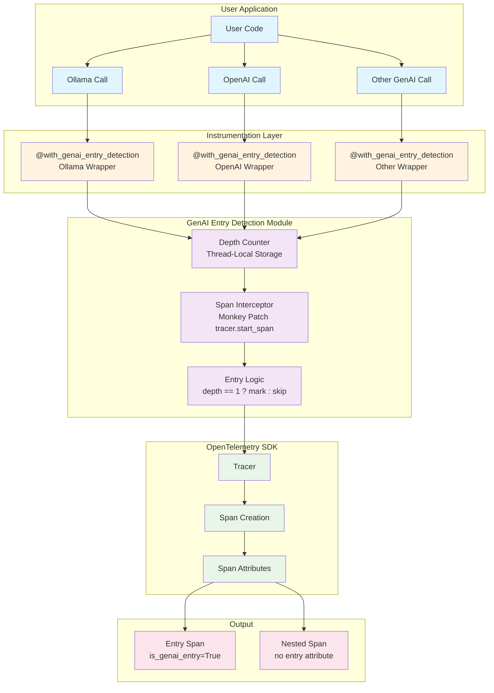
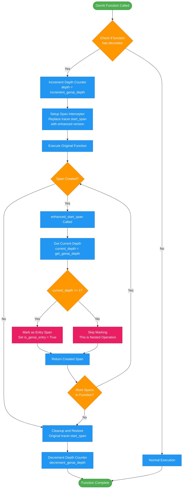
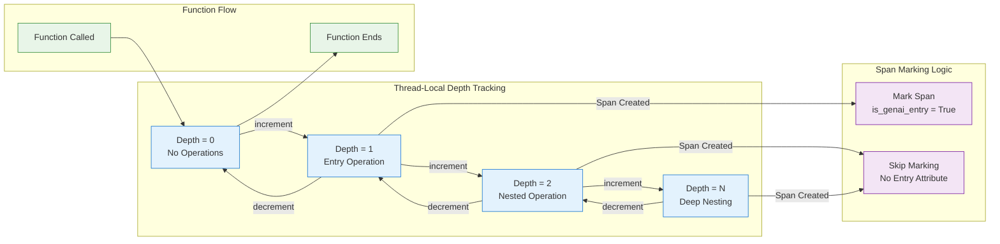
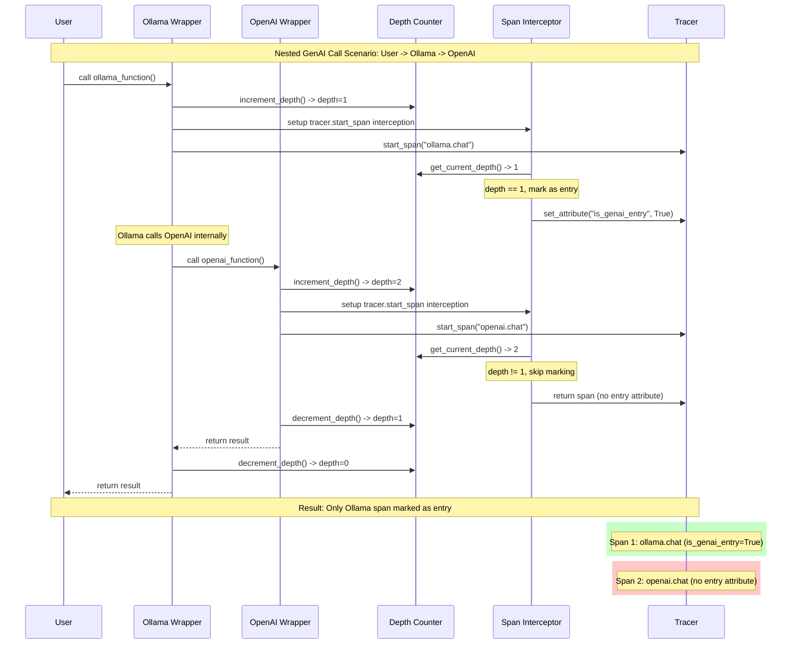

This file shows the overall logic of genai span entry.

### Configuration

export OTEL_MARK_GENAI_ENTRY=true(default) 整个功能启用/禁用

export OTEL_GENAI_ENTRY_SAFE_MODE=false(default) 遇到错误时保护性禁用

### Overview

## Function flow

## Sequence

