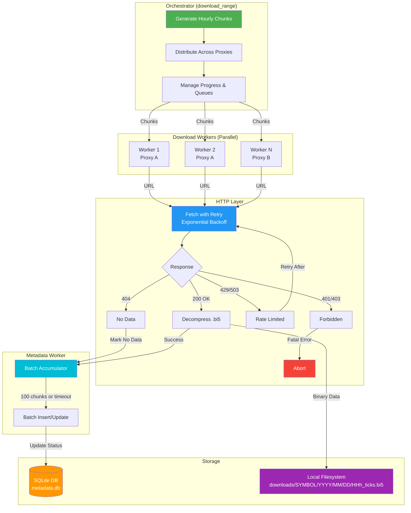

<div align="center">

# TickVault 🏦

**A high-performance Python library for downloading, storing, and accessing financial tick data from Dukascopy Bank's historical datafeed. Built for quantitative researchers and algorithmic traders who need reliable access to high-resolution market data.**

[](https://www.python.org/downloads/) [](https://opensource.org/licenses/MIT) [](https://github.com/psf/black)

</div>

---

## ✨ Highlights

### Two clean layers
- **Downloader**: concurrent, fault-tolerant fetchers that mirror Dukascopy’s on-disk layout **1:1**.
- **Reader**: decodes compressed hourly blobs on demand and returns tidy pandas DataFrames.

### High-Performance Downloading
- **Concurrent Downloads**: Multi-worker architecture with configurable parallelism
- **Resume Capability**: Intelligent resume functionality with metadata tracking
- **Proxy Support**: Distributed downloading across multiple proxies
- **Error Resilience**: Comprehensive retry logic with exponential backoff
- **Progress Tracking**: Real-time progress monitoring with beautiful progress bars

### Smart Storage
- **Mirrored Structure**: Local filesystem mirrors Dukascopy's directory hierarchy
- **Compression-Aware**: Stores data in original compressed `.bi5` format
- **Metadata Tracking**: SQLite database tracks download status and data availability
- **Space Efficient**: 10-15GB for assets with decades of history (like Gold)

### Powerful Data Access
- **Fast Decoding**: Efficient LZMA decompression and NumPy-based decoding
- **Pandas Integration**: Returns clean, structured DataFrames ready for analysis
- **Gap Detection**: Automatic data continuity verification
- **Flexible Queries**: Easy time-range based data retrieval

### Production Ready
- **Comprehensive Logging**: Structured logging with configurable levels
- **Configuration Management**: Environment-based configuration with validation
- **Type Safety**: Full type annotations with Pydantic models
- **Error Handling**: Graceful handling of network issues and data gaps

### Modern Python
  * Tested on **Python 3.14**. Works with **3.11–3.14**.
  * Async I/O (`httpx`), Pydantic v2 settings, tqdm, NumPy, pandas.

## Supported Assets
All dukascopy assets are supported for downloading. Since price scales differ between assets(each have their own pipet scale), you will need the scaling factor to correctly scale the price values. I have added some of the popular asset's price scales to the registry for convenience, and will add more as we go:

- **Forex Majors**: EURUSD, GBPUSD, USDJPY, AUDUSD, USDCAD, USDCHF, NZDUSD
- **Precious Metals**: XAUUSD (Gold), XAGUSD (Silver)
- **Cryptocurrencies**: BTCUSD, ETHUSD

> For other assets you should identify the price scale manually for reading. Think of price scale as the lowest resolution of price for that asset. For example, the pipet size/price resolution for **"XAUUSD"** is **"0.001"**.

---
## 🚀 Quick Start

### Installation

1) Clone the repo:
```bash
git clone https://github.com/keyhankamyar/TickVault.git
cd TickVault
```
2) Create a custom environment:
```bash
python -m venv .venv
source .venv/bin/activate

# Or use conda
conda create --prefix .conda python -y
conda activate ./.conda
```
3) Install the package:
```bash
# Install dependencies
pip install -r requirements.txt

# Or install in development mode
pip install -e .
```

### Basic Usage

### 1) Download Historical Data (resumable)

```python
from datetime import datetime
from tick_vault import download_range, reload_config

# Optional: configure base directory, worker counts, etc.
reload_config(
    base_directory="./tick_vault_data",
    worker_per_proxy=10,                 # default 10
    fetch_max_retry_attempts=3,          # default 3
    fetch_base_retry_delay=1.0,          # default 1.0s
)

# Download one month of gold (XAU/USD) tick data
await download_range(
    symbol='XAUUSD',
    start=datetime(2024, 1, 1),
    end=datetime(2024, 2, 1)
)

# Download with multiple proxies for faster speeds
await download_range(
    symbol='EURUSD',
    start=datetime(2024, 1, 1),
    end=datetime.now(),
    proxies=[
        'http://proxy1.example.com:8080',
        'http://proxy2.example.com:8080'
    ]
)
```

Re-running the same call later will **resume** and only attempt hours not yet recorded in the metadata database.

### 2) Read and Analyze Data (on-demand decode → DataFrame)

```python
from tick_vault import read_tick_data

# Read all available data for a symbol
df = read_tick_data(symbol='XAUUSD')

# Read specific date range
df = read_tick_data(
    symbol='EURUSD',
    start=datetime(2024, 1, 1),
    end=datetime(2024, 2, 1)
)

# Validation and progressbar
df = read_tick_data(
    symbol="XAUUSD",
    strict=True,         # verify requested range is fully present (raises on gaps)
    show_progress=True,  # tqdm while decoding hourly chunks
)

print(df.head())
print(f"Total ticks: {len(df)}")
print(f"Time range: {df['time'].min()} to {df['time'].max()}")
# columns: time, ask, bid, ask_volume, bid_volume
```

### 3) Configuration

```python
from tick_vault import reload_config

# Customize settings programmatically
reload_config(
    base_directory='./my_tick_data',
    worker_per_proxy=15,
    fetch_max_retry_attempts=5
)
```
Or use environment variables
```python
import os

os.environ['TICK_VAULT_BASE_DIRECTORY'] = './my_tick_data'
os.environ['TICK_VAULT_WORKER_PER_PROXY'] = 15
```

---
## 🏗️ Architecture

### Download Pipeline



**Design Principles**:
- Multiple download workers for parallelism
- Single metadata worker to avoid database contention
- Queue-based communication for clean separation
- Batch database writes for efficiency

### Storage layout (mirrors source 1:1)

TickVault mirrors Dukascopy's URL structure on your local filesystem:

```
tick_vault_data/
├── downloads/
│   └── XAUUSD/
│       └── 2024/
│           └── 02/          # Month, 0-indexed(00=Jan ... 11=Dec)
│               └── 15/      # Day
│                   ├── 00h_ticks.bi5
│                   ├── 01h_ticks.bi5
│                   └── ...
├── metadata.db              # SQLite database tracking download status
└── logs.log                 # Detailed operation logs
```

### Data Flow
1. **Orchestrator** generates hourly chunks and manages worker distribution
2. **Download Workers** fetch compressed `.bi5` files concurrently
3. **Metadata Worker** batches updates to track download status
4. **Reader** decompresses and decodes data into structured arrays
5. **Pandas** provides the final DataFrame interface

### Project Structure

```
TickVault/
├── .gitignore
├── pyproject.toml
├── requirements.txt
├── README.md
├── CHANGELOG.md
├── LICENSE
├── MANIFEST.in
└── tick_vault/
    ├── __init__.py           # Public API: download_range, read_tick_data, reload_config
    ├── py.typed              # Type hints marker for mypy
    ├── constants.py          # Base URL, pipette scales
    ├── config.py             # Pydantic settings + computed paths
    ├── logger.py             # Centralized logging (console + file)
    ├── utils.py              # Date/hour generators, path formatting (0-index month)
    ├── chunk.py              # TickChunk model (url/path/save/load)
    ├── fetcher.py            # HTTP fetch with strong error taxonomy + retry
    ├── download_worker.py    # Async worker: get → save → emit
    ├── metadata.py           # SQLite DB: tracking, gap checks, available hours
    ├── metadata_worker.py    # Single writer, batched inserts
    ├── decoder.py            # LZMA decode → structured NumPy
    ├── downloader.py         # Download orchestrator
    └── reader.py             # Orchestrates decoding → pandas DataFrame
```

---
## 📖 Detailed Usage

### Supported Assets

TickVault includes pre-configured pipet scales for common assets:

**Forex Majors**: EURUSD, AUDUSD, GBPUSD, NZDUSD, USDCAD, USDCHF, USDJPY  
**Metals**: XAUUSD (Gold), XAGUSD (Silver)  
**Crypto**: BTCUSD, ETHUSD

For other assets, provide the `pipet_scale` parameter:

```python
df = read_tick_data(
    symbol='CUSTOM_PAIR',
    start=datetime(2024, 1, 1),
    end=datetime(2024, 2, 1),
    pipet_scale=0.01  # Custom scaling factor
)
```

### Resumable Downloads

TickVault automatically tracks download progress in a SQLite database. If a download is interrupted:

```python
# Simply run the same command again
await download_range(
    symbol='XAUUSD',
    start=datetime(2020, 1, 1),  # Large historical range
    end=datetime(2024, 1, 1)
)

# TickVault will skip already-downloaded chunks and resume where it left off
```

### Incremental Updates

Update your dataset with recent data:

```python
from datetime import datetime, UTC

# Download only the last week
await download_range(
    symbol='EURUSD',
    start=datetime(2024, 3, 25),
    end=datetime.now(tz=UTC)
)
```

### Gap Detection and Data Integrity

```python
# Strict mode (default): raises error if data is incomplete
df = read_tick_data(
    symbol='XAUUSD',
    start=datetime(2024, 1, 1),
    end=datetime(2024, 2, 1),
    strict=True  # Ensures no gaps in data
)

# Non-strict mode: clips to available data range
df = read_tick_data(
    symbol='XAUUSD',
    start=datetime(2020, 1, 1),  # May be before first available
    end=datetime(2030, 1, 1),    # May be after last available
    strict=False  # Automatically adjusts to available range
)
```

### Working with the Metadata Database

```python
from tick_vault.metadata import MetadataDB

with MetadataDB() as db:
    # Find what's available
    first = db.first_chunk('XAUUSD')
    last = db.last_chunk('XAUUSD')
    print(f"Data range: {first.time} to {last.time}")
    
    # Find chunks that haven't been downloaded yet
    pending = db.find_not_attempted_chunks(
        symbol='EURUSD',
        start=datetime(2024, 1, 1),
        end=datetime(2024, 2, 1)
    )
    print(f"Pending downloads: {len(pending)}")
    
    # Verify data continuity
    try:
        db.check_for_gaps(
            symbol='XAUUSD',
            start=datetime(2024, 1, 1),
            end=datetime(2024, 2, 1)
        )
        print("✓ No gaps found")
    except RuntimeError as e:
        print(f"✗ Gaps detected: {e}")
```

---

## ⚙️ Configuration Reference

| Setting                         | Type             | Default             | Notes                                                        |
| ------------------------------- | ---------------- | ------------------- | ------------------------------------------------------------ |
| `base_directory`                | `Path`           | `./tick_vault_data` | Root containing `downloads/`, `metadata.db`, and `logs.log`. |
| `fetch_max_retry_attempts`      | `int [0..10]`    | `3`                 | Retries beyond initial attempt.                              |
| `fetch_base_retry_delay`        | `float (0..60]`  | `1.0`               | Exponential backoff base (seconds).                          |
| `worker_per_proxy`              | `int [1..100]`   | `10`                | Concurrency per proxy entry (or 1 if no proxies provided).   |
| `worker_queue_timeout`          | `float > 0`      | `60.0`              | Fails workers if the pipeline stalls.                        |
| `metadata_update_batch_timeout` | `float > 0`      | `1.0`               | Flush partial batches frequently.                            |
| `metadata_update_batch_size`    | `int [1..10000]` | `100`               | Larger = more throughput, more unflushed work on crash.      |
| `base_log_level`                | enum             | `DEBUG`             | File handler gets everything at DEBUG.                       |
| `console_log_level`             | enum             | `INFO`              | Must be ≥ base severity.                                     |


**Configuration via Environment Variables**:

```bash
export TICK_VAULT_BASE_DIRECTORY=/data/ticks
export TICK_VAULT_WORKER_PER_PROXY=15
export TICK_VAULT_FETCH_MAX_RETRY_ATTEMPTS=5
```

**Configuration via .env file**:

```env
# .env
TICK_VAULT_BASE_DIRECTORY=/data/ticks
TICK_VAULT_WORKER_PER_PROXY=15
TICK_VAULT_FETCH_MAX_RETRY_ATTEMPTS=5
TICK_VAULT_BASE_LOG_LEVEL=INFO
```

---
## 🗺️ Roadmap

**Downloading**:
- [ ] Async stop events for graceful worker termination
- [ ] Dynamic worker auto-balancing with throughput monitoring
- [ ] Adaptive worker scaling based on performance metrics

**Reading**:
- [ ] Multi-threading and multi-processing support for decoding
- [ ] Streaming pipeline to SQLite for memory-efficient processing
- [ ] HDF5 storage backend option for large datasets

**General**:
- [ ] Unified download-and-read convenience function
- [ ] Reorganized module structure (separate core, download, read packages)
- [ ] Comprehensive pytest test suite
- [ ] CLI interface for command-line operations
- [ ] Enhanced documentation with usage examples
- [ ] Jupyter notebook tutorials

---
## 📄 License

This project is licensed under the MIT License - see the [LICENSE](LICENSE) file for details.

---
## 🙏 Acknowledgments

- Data provided by [Dukascopy Bank](https://www.dukascopy.com/)
- Built with [httpx](https://www.python-httpx.org/), [pandas](https://pandas.pydata.org/), [numpy](https://numpy.org/), and [pydantic](https://docs.pydantic.dev/)

---
## 📬 Contributing

Contributions are warmly welcome ❤️
Please open an issue or PR with clear rationale, tests (where applicable), and thoughtful naming. The codebase favors small, composable modules and explicit error handling.

---

> **TickVault**: Because your backtests deserve clean, complete, and trustworthy data.  
> Crafted with precision for quants, traders, and data engineers who refuse to compromise.