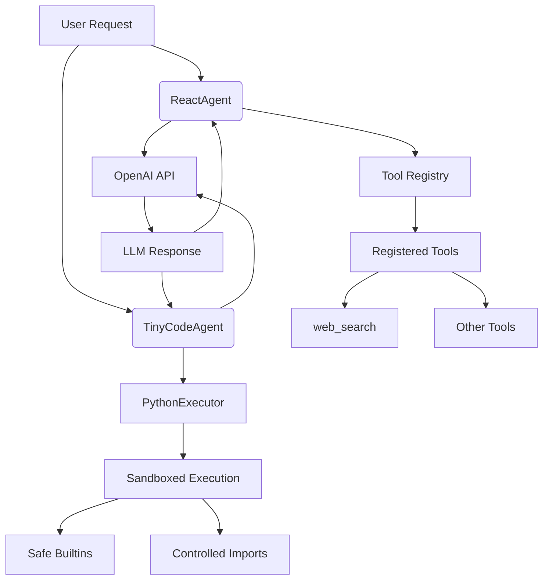

# TinyAgent Architecture

This document describes the overall architecture of TinyAgent, including its main components and how they interact.

## System Overview

TinyAgent consists of two main agent types that share common infrastructure:

1. **ReactAgent** - A JSON-based tool calling agent
2. **TinyCodeAgent** - A Python code execution agent

Both agents utilize a shared tool registry system and can be configured with various tools.

## Component Diagram

## Component Descriptions

### ReactAgent
The ReactAgent implements a ReAct (Reason + Act) loop with JSON-based tool calling. It:
- Uses system prompts to guide LLM behavior
- Parses JSON responses to determine actions
- Manages tool execution and observation collection
- Handles error recovery and step limiting

### TinyCodeAgent
The TinyCodeAgent executes Python code in a sandboxed environment. It:
- Extracts Python code blocks from LLM responses
- Executes code in a restricted environment
- Provides a `final_answer()` mechanism for results
- Handles execution errors and key validation

### Tool Registry
The tool registry system provides:
- Decorator-based tool registration (`@tool`)
- Runtime tool discovery and validation
- Argument binding and execution
- Immutable registry views

### PythonExecutor
The PythonExecutor provides a secure execution environment:
- Restricted built-in functions
- Controlled import system
- Standard output capture
- Final answer detection

## Data Flow

1. User submits a request to an agent
2. Agent generates system prompt with available tools
3. LLM processes request and responds with action
4. Agent parses response and executes tools
5. Results are fed back to LLM for next step
6. Process continues until final answer is generated

## Security Considerations

- Python execution is sandboxed with limited builtins
- Import system is restricted to approved modules
- Maximum execution steps prevent infinite loops
- Output truncation prevents prompt injection
