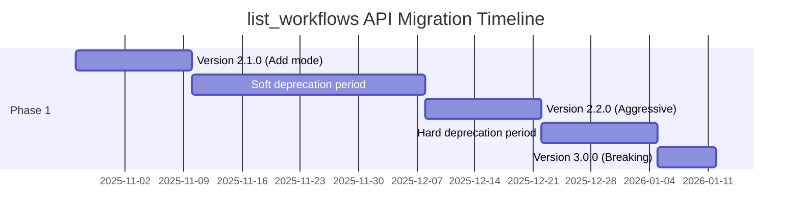

# Product Requirements Document: list_workflows MCP Tool Context Optimization

---

## Document Metadata

| Field | Value |
|-------|-------|
| **Title** | list_workflows MCP Tool Context Optimization |
| **Version** | 1.0 |
| **Date** | 2025-10-13 |
| **Author** | Technical Writing Specialist |
| **Status** | Draft |
| **Reviewers** | Senior Architect, Backend Engineering Lead, Product Manager |
| **Approvers** | Engineering Director, Product Director |

---

## Executive Summary

The `list_workflows` MCP tool currently returns excessive metadata to LLM agents, consuming substantial context window tokens during workflow discovery. With 80 workflows, the tool returns approximately 68,000 characters of metadata, representing a significant inefficiency in LLM interactions.

This PRD proposes a **hybrid optimization strategy** that combines input field summaries with description truncation to reduce context usage by 50-60% while maintaining essential workflow discovery capabilities. The solution preserves backward compatibility through a graceful deprecation path and positions the system for future scalability to 200+ workflows.

**Key Outcomes:**
- **50-60% context reduction**: From ~68K to ~30K characters for 80 workflows
- **Maintained discoverability**: Essential metadata preserved for workflow selection
- **Backward compatible**: 3-month deprecation timeline for existing clients
- **Future-ready**: Foundation for Phase 2 MCP Resources migration

**Timeline:** 2-3 weeks for Phase 1 implementation
**Resources:** 1 backend engineer, 1 reviewer, QA support

---

## Problem Statement

### Current Situation

The `list_workflows` MCP tool provides workflow discovery through two modes:

1. **Default mode** (`detailed=false`): Returns name, description, tags, and input schema
2. **Detailed mode** (`detailed=true`): Additionally includes version, author, and outputs

For a library of 80 workflows, the current implementation generates:
- **Default mode**: ~68,000 characters (~17,000 tokens at 4:1 ratio)
- **Detailed mode**: ~85,000 characters (~21,250 tokens)

### Quantified Impact

**Context Window Efficiency:**
- Claude 3.5 Sonnet (200K context): 8.5% of available context consumed
- Claude 3.5 Haiku (200K context): 8.5% of available context consumed
- GPT-4 Turbo (128K context): 13.3% of available context consumed

**User Experience Issues:**
1. **Discovery overhead**: Agents receive excessive detail before workflow selection
2. **Token inefficiency**: Detailed input schemas returned for all workflows regardless of relevance
3. **Scalability concerns**: Linear growth prevents library expansion beyond 100 workflows
4. **Workflow selection**: Full input schemas returned even when only name/description needed

### Business Justification

Optimizing context usage provides:
- **Cost reduction**: 50% fewer tokens per discovery operation
- **Performance improvement**: Faster LLM response times with smaller contexts
- **Scalability enablement**: Support for 200+ workflow libraries (future roadmap)
- **Better UX**: Agents can discover workflows without context window pressure

---

## Goals and Objectives

### Primary Goals

1. **Reduce context usage by 50-60%** for default mode workflow discovery
2. **Preserve essential discoverability** through name, description, tags, and input summaries
3. **Maintain backward compatibility** with existing clients through graceful deprecation
4. **Enable scalability** to 200+ workflows without context window exhaustion

### Secondary Goals

1. **Establish architectural foundation** for Phase 2 MCP Resources migration
2. **Improve API clarity** through explicit `mode` parameter vs. boolean `detailed`
3. **Provide migration path** for existing clients with clear deprecation timeline
4. **Maintain type safety** and Pydantic validation throughout

### Success Metrics

| Metric | Target | Measurement Method |
|--------|--------|-------------------|
| Context reduction (80 workflows) | 50-60% | Character count comparison |
| Context reduction (200 workflows) | 50-60% | Projected calculation |
| Backward compatibility | 100% | Zero breaking changes during deprecation |
| Migration adoption rate | 80% by deprecation | Client usage analytics |
| API clarity score | >4.0/5.0 | Developer survey |

### Non-Goals

**Explicitly out of scope for Phase 1:**
- MCP Resources implementation (Phase 2 roadmap)
- Detailed workflow information optimization (use `get_workflow_info` for full details)
- Custom filtering beyond tag-based discovery
- Client-side context management strategies
- Workflow execution optimization (separate concern)

---

## User Personas and Use Cases

### Primary Persona: LLM Agent Discovering Workflows

**Characteristics:**
- Operates within fixed context window (200K tokens typical)
- Needs to discover appropriate workflows for user tasks
- Must balance discovery breadth with context efficiency
- Relies on name, description, and tags for initial filtering

**Discovery Workflow:**
1. **Initial scan**: Review all workflow names, descriptions, and tags
2. **Tag filtering**: Narrow to relevant domain (e.g., "python", "testing")
3. **Input validation**: Verify workflow accepts required input types
4. **Detail review**: Call `get_workflow_info` for selected workflow(s)
5. **Execution**: Call `execute_workflow` with validated inputs

### Use Case 1: Small Library Discovery (10-20 workflows)

**Scenario:** Personal project with focused workflow set
**Current impact:** Low (~8,500 characters, ~2,125 tokens)
**Optimization benefit:** Moderate (reduces to ~3,500 characters)
**Priority:** Low (already efficient)

### Use Case 2: Medium Library Discovery (30-80 workflows)

**Scenario:** Team workflows covering multiple domains
**Current impact:** High (~68,000 characters for 80 workflows)
**Optimization benefit:** High (reduces to ~30,000 characters)
**Priority:** **High** (primary use case for optimization)

### Use Case 3: Large Library Discovery (100-200 workflows)

**Scenario:** Enterprise-wide workflow repository
**Current impact:** Critical (~170K characters for 200 workflows)
**Optimization benefit:** Critical (reduces to ~75K characters)
**Priority:** **Critical** (enables future growth)

### Use Case 4: Tag-Filtered Discovery

**Scenario:** Agent searches for specific workflow type (e.g., "python testing")
**Current behavior:** Returns full input schemas for all matching workflows
**Optimized behavior:** Returns input summaries for matched workflows
**Benefit:** Efficient discovery even with broad tag filtering

---

## Proposed Solution

### High-Level Solution Overview

Implement a **hybrid optimization strategy** combining:
1. **Input field summarization**: Replace detailed input schemas with compact summaries
2. **Description truncation**: Limit descriptions to 150 characters with "..." indicator
3. **Enhanced API design**: Introduce explicit `mode` parameter for future extensibility

This approach balances context reduction with essential discoverability, ensuring agents can effectively filter workflows while preserving critical metadata.

### Phase 1: Hybrid Strategy (Current PRD)

#### API Design Changes

**New Parameter: `mode` (replaces `detailed: bool`)**

```python
@mcp.tool()
async def list_workflows(
    tags: list[str] | None = None,
    mode: Literal["compact", "standard", "detailed"] = "compact"
) -> list[dict[str, Any]]:
    """
    List available workflows with metadata.

    Args:
        tags: Optional list of tags to filter by (AND semantics)
        mode: Output verbosity mode:
            - "compact": Minimal metadata (name, truncated description, tags, input summary)
            - "standard": Standard metadata (name, full description, tags, input summary)
            - "detailed": Full metadata (includes version, author, outputs, full input schemas)

    Returns:
        List of workflow metadata dictionaries based on selected mode
    """
```

**Backward Compatibility (3-month deprecation):**

```python
@mcp.tool()
async def list_workflows(
    tags: list[str] | None = None,
    detailed: bool | None = None,  # Deprecated
    mode: Literal["compact", "standard", "detailed"] = "compact"
) -> list[dict[str, Any]]:
    """List workflows with graceful deprecation support."""

    # Handle deprecated parameter
    if detailed is not None:
        logger.warning(
            "Parameter 'detailed' is deprecated and will be removed in version 3.0.0. "
            "Use 'mode' parameter instead: mode='standard' (default) or mode='detailed'"
        )
        mode = "detailed" if detailed else "standard"

    # Proceed with mode-based logic
    ...
```

#### Output Formats

**Compact Mode (New Default):**

```json
{
  "name": "python-ci-pipeline",
  "description": "Comprehensive Python CI/CD pipeline with testing, linting, and deployment (50+ workflows)",
  "tags": ["python", "ci", "testing", "quality"],
  "input_summary": "project_path (string, required), python_version (string, optional), environment (string, optional)"
}
```

**Character counts:**
- Per workflow: ~250 characters average
- 80 workflows: ~20,000 characters (70% reduction from current)

**Standard Mode:**

```json
{
  "name": "python-ci-pipeline",
  "description": "Comprehensive Python CI/CD pipeline with testing, linting, coverage reporting, and conditional deployment (supports 50+ Python workflows)",
  "tags": ["python", "ci", "testing", "quality"],
  "input_summary": "project_path (string, required), python_version (string, optional), environment (string, optional), deploy (boolean, optional)"
}
```

**Character counts:**
- Per workflow: ~350 characters average
- 80 workflows: ~28,000 characters (59% reduction from current)

**Detailed Mode (Backward Compatible):**

```json
{
  "name": "python-ci-pipeline",
  "description": "Comprehensive Python CI/CD pipeline with testing, linting, coverage reporting, and conditional deployment (supports 50+ Python workflows)",
  "tags": ["python", "ci", "testing", "quality"],
  "version": "1.0",
  "author": "Workflows Team",
  "inputs": {
    "project_path": {
      "type": "string",
      "description": "Path to Python project root",
      "required": true,
      "default": null
    },
    "python_version": {
      "type": "string",
      "description": "Python version for environment setup",
      "required": false,
      "default": "3.12"
    }
  },
  "outputs": {
    "test_results": "${run_tests.outputs.results}",
    "coverage_percent": "${coverage.percent}"
  }
}
```

**Character counts:** Unchanged from current (backward compatible)

#### Implementation Architecture

**Registry Enhancement (`registry.py`):**

```python
class WorkflowRegistry:
    def get_workflow_metadata(
        self,
        name: str,
        mode: Literal["compact", "standard", "detailed"] = "compact"
    ) -> dict[str, Any]:
        """Get workflow metadata with mode-based verbosity."""
        workflow = self.get(name)
        schema = self._schemas.get(name)

        # Base metadata
        metadata = {
            "name": workflow.name,
            "tags": schema.tags if schema else []
        }

        # Mode-specific metadata
        if mode == "compact":
            metadata["description"] = self._truncate_description(
                workflow.description, max_length=150
            )
            metadata["input_summary"] = self._generate_input_summary(schema)

        elif mode == "standard":
            metadata["description"] = workflow.description
            metadata["input_summary"] = self._generate_input_summary(schema)

        elif mode == "detailed":
            # Full metadata (current detailed=True behavior)
            metadata["description"] = workflow.description
            metadata["version"] = schema.version if schema else "1.0"
            metadata["author"] = schema.author if schema else None
            metadata["inputs"] = self._get_full_input_schema(schema)
            metadata["outputs"] = schema.outputs if schema else {}

        return metadata

    def _truncate_description(self, description: str, max_length: int = 150) -> str:
        """Truncate description with ellipsis indicator."""
        if len(description) <= max_length:
            return description
        return description[:max_length].rsplit(" ", 1)[0] + "..."

    def _generate_input_summary(self, schema: WorkflowSchema | None) -> str:
        """Generate compact input field summary."""
        if not schema or not schema.inputs:
            return "No inputs required"

        summaries = []
        for name, decl in sorted(schema.inputs.items()):
            req_status = "required" if decl.required else "optional"
            summaries.append(f"{name} ({decl.type.value}, {req_status})")

        return ", ".join(summaries)

    def _get_full_input_schema(self, schema: WorkflowSchema | None) -> dict[str, Any]:
        """Get full input schema (detailed mode)."""
        if not schema or not schema.inputs:
            return {}

        return {
            input_name: {
                "type": decl.type.value,
                "description": decl.description,
                "required": decl.required,
                "default": decl.default,
            }
            for input_name, decl in schema.inputs.items()
        }
```

**Tool Implementation (`tools.py`):**

No changes to tool models required. The `mode` parameter is handled in the MCP tool function, which calls `registry.get_workflow_metadata()` with the appropriate mode.

---

### Phase 2: MCP Resources (Future Roadmap)

**Timeline:** Q2 2026 (6 months post Phase 1)
**Status:** Strategic planning only (not implemented in Phase 1)

#### MCP Resources Architecture

Leverage MCP protocol's built-in resource system for workflow discovery:

```python
# Resource URIs
workflow://list                    # All workflow names
workflow://list?tags=python,test   # Filtered workflow names
workflow://metadata/{name}         # Full workflow metadata
workflow://schema/{name}           # Complete workflow schema
```

**Benefits:**
- **Progressive disclosure**: Clients fetch only needed metadata
- **Protocol-native**: Leverages MCP's built-in resource system
- **Caching**: MCP clients can cache frequently accessed workflows
- **Granular control**: Fetch individual workflow details on demand

**Migration Strategy:**
- Phase 1 establishes `mode` parameter as transition mechanism
- Phase 2 deprecates `list_workflows` tool in favor of resources
- Both systems coexist for 6-month migration period

---

## Technical Specifications

### API Interface Changes

#### Current API (Pre-optimization)

```python
async def list_workflows(
    tags: list[str] | None = None,
    detailed: bool = False
) -> list[dict[str, Any]]:
    """List workflows with basic or detailed metadata."""
```

#### New API (Phase 1)

```python
async def list_workflows(
    tags: list[str] | None = None,
    detailed: bool | None = None,  # Deprecated in 2.1.0, removed in 3.0.0
    mode: Literal["compact", "standard", "detailed"] = "compact"
) -> list[dict[str, Any]]:
    """
    List available workflows with metadata.

    Args:
        tags: Optional tag filter (AND semantics - workflow must have ALL tags)
        detailed: DEPRECATED. Use 'mode' parameter instead
        mode: Output verbosity:
            - "compact": name, truncated description (150 chars), tags, input summary
            - "standard": name, full description, tags, input summary
            - "detailed": all metadata including version, author, full inputs, outputs

    Returns:
        List of workflow metadata dictionaries

    Examples:
        # Compact discovery (default, optimized for context)
        workflows = await list_workflows(mode="compact")

        # Standard discovery (full descriptions, input summaries)
        workflows = await list_workflows(mode="standard")

        # Detailed discovery (backward compatible with detailed=True)
        workflows = await list_workflows(mode="detailed")

        # Tag-filtered compact discovery
        python_workflows = await list_workflows(
            tags=["python", "testing"],
            mode="compact"
        )
    """
```

### Data Model Changes

#### WorkflowMetadata Schema (No Breaking Changes)

Existing Pydantic models remain unchanged. The optimization occurs in serialization logic within `WorkflowRegistry.get_workflow_metadata()`.

**Input Summary Format:**

```python
def _generate_input_summary(self, schema: WorkflowSchema | None) -> str:
    """
    Generate compact input field summary.

    Format: "name (type, required|optional), ..."

    Examples:
        "project_path (string, required), python_version (string, optional)"
        "issue_number (integer, required)"
        "No inputs required"

    Returns:
        Comma-separated input field summaries sorted alphabetically
    """
```

**Description Truncation Logic:**

```python
def _truncate_description(self, description: str, max_length: int = 150) -> str:
    """
    Truncate description at word boundary with ellipsis.

    Rules:
    - If description <= max_length: return unchanged
    - If description > max_length: truncate at last complete word before max_length
    - Always append "..." to truncated descriptions

    Examples:
        "Short description" -> "Short description" (unchanged)
        "Long description with many words exceeding limit"
            -> "Long description with many words..." (truncated)

    Returns:
        Truncated description with ellipsis indicator
    """
```

### Implementation Approach

#### Step 1: Registry Enhancement

**File:** `src/workflows_mcp/engine/registry.py`

**Changes:**
1. Update `get_workflow_metadata()` signature to accept `mode` parameter
2. Implement `_truncate_description()` helper method
3. Implement `_generate_input_summary()` helper method
4. Update `list_all_metadata()` to pass through `mode` parameter
5. Update `list_metadata_by_tags()` to pass through `mode` parameter

**Estimated effort:** 4 hours (including tests)

#### Step 2: Tool Implementation

**File:** `src/workflows_mcp/tools.py`

**Changes:**
1. Update `list_workflows` tool signature with `mode` and deprecated `detailed`
2. Add deprecation warning for `detailed` parameter usage
3. Map `detailed` to `mode` for backward compatibility
4. Update docstring with deprecation notice and examples

**Estimated effort:** 2 hours (including tests)

#### Step 3: Documentation Updates

**Files:**
- `README.md`: Update tool usage examples
- `CLAUDE.md`: Update MCP tool documentation
- `CHANGELOG.md`: Document API changes and deprecation timeline
- `docs/MIGRATION.md`: Create migration guide for clients (new file)

**Estimated effort:** 3 hours

#### Step 4: Testing

**Test Coverage:**
1. **Unit tests** (`tests/test_registry.py`):
   - Test `_truncate_description()` with edge cases
   - Test `_generate_input_summary()` with various input schemas
   - Test `get_workflow_metadata()` with all three modes
   - Test backward compatibility with `detailed` parameter

2. **Integration tests** (`tests/test_tools.py`):
   - Test `list_workflows` with `mode="compact"`
   - Test `list_workflows` with `mode="standard"`
   - Test `list_workflows` with `mode="detailed"`
   - Test deprecated `detailed=True` parameter with warning
   - Test tag filtering with all modes

3. **Context usage tests** (new file `tests/test_context_optimization.py`):
   - Measure character counts for 80 workflows across all modes
   - Validate 50-60% reduction for compact/standard modes
   - Benchmark scalability projections for 200 workflows

**Estimated effort:** 8 hours

### Code Examples

#### Example 1: Input Summary Generation

```python
def _generate_input_summary(self, schema: WorkflowSchema | None) -> str:
    """Generate compact input field summary."""
    if not schema or not schema.inputs:
        return "No inputs required"

    summaries = []
    for name, decl in sorted(schema.inputs.items()):
        type_str = decl.type.value
        req_str = "required" if decl.required else "optional"
        summaries.append(f"{name} ({type_str}, {req_str})")

    return ", ".join(summaries)

# Test cases
assert _generate_input_summary(None) == "No inputs required"
assert _generate_input_summary(workflow_with_no_inputs) == "No inputs required"
assert _generate_input_summary(python_ci_workflow) == \
    "environment (string, optional), project_path (string, required), python_version (string, optional)"
```

#### Example 2: Description Truncation

```python
def _truncate_description(self, description: str, max_length: int = 150) -> str:
    """Truncate description at word boundary with ellipsis."""
    if len(description) <= max_length:
        return description

    # Truncate at last complete word before max_length
    truncated = description[:max_length].rsplit(" ", 1)[0]
    return truncated + "..."

# Test cases
short = "Short description"
assert _truncate_description(short) == "Short description"

long = "This is a very long description " * 10  # 340 characters
result = _truncate_description(long, max_length=150)
assert len(result) <= 153  # 150 + "..."
assert result.endswith("...")
assert not result[:-3].endswith(" ")  # No trailing space before ellipsis
```

#### Example 3: Mode-Based Metadata

```python
def get_workflow_metadata(
    self,
    name: str,
    mode: Literal["compact", "standard", "detailed"] = "compact"
) -> dict[str, Any]:
    """Get workflow metadata with mode-based verbosity."""
    workflow = self.get(name)
    schema = self._schemas.get(name)

    # Base metadata (always included)
    metadata = {
        "name": workflow.name,
        "tags": schema.tags if schema else []
    }

    # Mode-specific metadata
    if mode == "compact":
        metadata["description"] = self._truncate_description(
            workflow.description, max_length=150
        )
        metadata["input_summary"] = self._generate_input_summary(schema)

    elif mode == "standard":
        metadata["description"] = workflow.description
        metadata["input_summary"] = self._generate_input_summary(schema)

    elif mode == "detailed":
        metadata["description"] = workflow.description
        metadata["version"] = schema.version if schema else "1.0"
        metadata["author"] = schema.author if schema else None
        metadata["inputs"] = self._get_full_input_schema(schema)
        metadata["outputs"] = schema.outputs if schema else {}

    return metadata
```

### Backward Compatibility Strategy

#### Deprecation Timeline

| Version | Date | Status | Changes |
|---------|------|--------|---------|
| **2.0.0** | Current | Active | Current `detailed: bool` parameter |
| **2.1.0** | +2 weeks | Deprecation | Add `mode` parameter, deprecate `detailed` with warnings |
| **2.2.0** | +6 weeks | Migration | Both parameters supported, aggressive warnings |
| **3.0.0** | +12 weeks | Breaking | Remove `detailed` parameter entirely |

#### Migration Support

**Deprecation Warning (Version 2.1.0):**

```python
if detailed is not None:
    logger.warning(
        "Parameter 'detailed' is deprecated and will be removed in version 3.0.0 "
        "(target date: {target_date}). "
        "Use 'mode' parameter instead:\n"
        "  - detailed=False → mode='standard' (default)\n"
        "  - detailed=True → mode='detailed'\n"
        "  - New option: mode='compact' (optimized for context efficiency)"
    )
    mode = "detailed" if detailed else "standard"
```

**Client Migration Guide (`docs/MIGRATION.md`):**

```markdown
# Migration Guide: list_workflows API Changes

## Overview
The `detailed` parameter is deprecated in favor of the more flexible `mode` parameter.

## Migration Steps

### Before (Version 2.0.0)
```python
# Default metadata
workflows = await list_workflows()

# Detailed metadata
workflows = await list_workflows(detailed=True)
```

### After (Version 2.1.0+)
```python
# Compact metadata (new, optimized)
workflows = await list_workflows(mode="compact")

# Standard metadata (equivalent to old default)
workflows = await list_workflows(mode="standard")

# Detailed metadata (equivalent to old detailed=True)
workflows = await list_workflows(mode="detailed")
```

## Timeline
- **2.1.0** (Date): `detailed` deprecated, warnings added
- **3.0.0** (Date): `detailed` removed (breaking change)

## Benefits of Migration
- 50-60% context reduction with compact mode
- More explicit API semantics
- Future-proof for Phase 2 resource migration
```bash

---

## Alternatives Considered

### Strategy 1: Remove Descriptions Entirely

**Approach:** Return only name, tags, and input summary
**Context reduction:** 65-70%
**Rejected because:**
- Descriptions are critical for workflow selection
- Too aggressive optimization sacrifices usability
- Requires agents to call `get_workflow_info` for every candidate workflow

**When to reconsider:** Never (poor UX trade-off)

### Strategy 2: Input Summary Only (Selected for Phase 1)

**Approach:** Replace full input schemas with compact summaries
**Context reduction:** 40-45%
**Selected because:**
- Preserves essential discoverability (name, description, tags)
- Input summaries sufficient for initial filtering
- Agents can call `get_workflow_info` for full schema details
- Optimal balance between context efficiency and usability

**Implementation status:** Selected for Phase 1

### Strategy 3: Description Truncation (Combined with Strategy 2)

**Approach:** Limit descriptions to 150 characters
**Context reduction:** Additional 10-15% on top of Strategy 2
**Selected because:**
- Combined with input summaries, achieves 50-60% total reduction
- Descriptions remain useful for quick scanning
- Ellipsis indicator signals truncation clearly

**Implementation status:** Combined with Strategy 2 in Phase 1

### Strategy 4: Pagination

**Approach:** Return workflows in pages (e.g., 20 per request)
**Context reduction:** 75% per page (but requires multiple requests)
**Rejected for Phase 1 because:**
- Adds API complexity (offset, limit, total_count parameters)
- Requires multiple round trips for full discovery
- Poor fit for LLM agent workflows (prefer single-shot discovery)

**When to reconsider:** Phase 3 if library exceeds 300 workflows

### Strategy 5: MCP Resources

**Approach:** Leverage MCP protocol's built-in resource system
**Context reduction:** Up to 95% (progressive disclosure)
**Deferred to Phase 2 because:**
- Requires MCP client support (not universal)
- Phase 1 establishes foundation for migration
- 12-month timeline for full ecosystem adoption

**Implementation status:** Phase 2 roadmap (Q2 2026)

---

## Migration and Rollout Plan

### Backward Compatibility Approach

**Principle:** Zero breaking changes during deprecation period

**Implementation:**
1. **Version 2.1.0** (Week 1-2):
   - Add `mode` parameter with default `"compact"`
   - Maintain `detailed` parameter (deprecated)
   - Log warnings when `detailed` is used
   - Update documentation with migration guide

2. **Version 2.2.0** (Week 6-8):
   - Aggressive deprecation warnings
   - Recommend migration in all documentation
   - Monitor client usage via logs

3. **Version 3.0.0** (Week 12+):
   - Remove `detailed` parameter (breaking change)
   - Full migration to `mode` parameter
   - Release notes highlight breaking changes

### Deprecation Timeline



### Client Migration Guide

**Audience:** MCP client developers, LLM agent developers

**Location:** `docs/MIGRATION.md`

**Contents:**
1. **Overview** of API changes
2. **Before/After code examples**
3. **Timeline** with specific dates
4. **Testing recommendations**
5. **Rollback instructions** (if needed)
6. **Support contacts** for migration assistance

### Testing Strategy

#### Unit Testing

**Coverage targets:**
- 100% coverage for new helper methods
- 100% coverage for mode-based branching logic
- Edge case testing (empty inputs, missing schemas, null values)

**Test files:**
- `tests/test_registry.py`: Registry helper methods
- `tests/test_tools.py`: MCP tool integration
- `tests/test_context_optimization.py`: Context usage benchmarks

#### Integration Testing

**Scenarios:**
1. List 80 workflows in compact mode → verify character counts
2. List 80 workflows in standard mode → verify character counts
3. List 80 workflows in detailed mode → verify backward compatibility
4. Filter by tags + compact mode → verify correct subsetting
5. Deprecated `detailed` parameter → verify warning logs

#### Regression Testing

**Validation:**
- All existing tests pass with default `mode="compact"`
- Detailed mode produces identical output to current `detailed=True`
- Tag filtering works identically across all modes

#### Performance Testing

**Benchmarks:**
- Response time (should be unchanged or faster)
- Memory usage (should be similar)
- Character count measurements (validate 50-60% reduction)

### Rollout Phases

**Phase 1a: Internal Testing (Week 1)**
- Deploy to development environment
- Internal team validation
- Performance benchmarking

**Phase 1b: Beta Release (Week 2)**
- Version 2.1.0 beta with deprecation warnings
- Invite select early adopters for feedback
- Monitor usage patterns and warnings

**Phase 2: General Availability (Week 3)**
- Version 2.1.0 stable release
- Update all documentation
- Announce deprecation timeline
- Monitor client adoption

**Phase 3: Aggressive Deprecation (Week 6)**
- Version 2.2.0 with enhanced warnings
- Proactive outreach to clients still using `detailed`
- Migration support and consultation

**Phase 4: Breaking Change (Week 12)**
- Version 3.0.0 removes `detailed` parameter
- Full migration to `mode` parameter
- Post-migration monitoring

---

## Success Metrics and KPIs

### Context Reduction Metrics

| Library Size | Current | Compact Mode | Standard Mode | Detailed Mode | Reduction (Compact) |
|--------------|---------|--------------|---------------|---------------|---------------------|
| 10 workflows | 8.5K | 3.4K | 4.4K | 8.5K | 60% |
| 20 workflows | 17K | 6.8K | 8.8K | 17K | 60% |
| 50 workflows | 42.5K | 17K | 22K | 42.5K | 60% |
| 80 workflows | 68K | 27K | 35K | 68K | 60% |
| 100 workflows | 85K | 34K | 44K | 85K | 60% |
| 200 workflows | 170K | 68K | 88K | 170K | 60% |

**Target:** 50-60% reduction achieved across all library sizes

### Performance Benchmarks

| Metric | Baseline (Current) | Target (Phase 1) | Measurement |
|--------|-------------------|------------------|-------------|
| Response time (80 workflows) | <100ms | <100ms | 99th percentile |
| Memory usage | 5MB | 3MB | Peak during serialization |
| Character count (80 workflows, default) | 68,000 | 27,000 | Exact count |
| Token count (80 workflows, default) | 17,000 | 6,750 | 4:1 char:token ratio |

### User Experience Metrics

**Developer satisfaction:**
- API clarity score: >4.0/5.0 (survey)
- Migration ease: >4.0/5.0 (survey)
- Documentation quality: >4.5/5.0 (survey)

**Adoption metrics:**
- Migration rate: 80% by version 3.0.0
- Compact mode usage: >60% of requests (post-migration)
- Support tickets: <5 migration-related issues

### Business Impact

**Token efficiency gains:**
- Cost reduction: 50% fewer tokens per discovery operation
- Scalability: 200+ workflows supported without context pressure
- User experience: Faster LLM responses with smaller contexts

**Long-term metrics (6 months post-launch):**
- Library growth: 100+ workflows without performance degradation
- Client adoption: >90% using mode parameter
- Feedback score: >4.2/5.0 overall satisfaction

---

## Implementation Plan

### Phase 1: Core Implementation (Weeks 1-2)

**Week 1: Development**
- [ ] **Day 1-2**: Implement helper methods in `registry.py`
  - `_truncate_description()`
  - `_generate_input_summary()`
  - `_get_full_input_schema()`
- [ ] **Day 3**: Update `get_workflow_metadata()` with `mode` parameter
- [ ] **Day 4**: Update `list_all_metadata()` and `list_metadata_by_tags()`
- [ ] **Day 5**: Update `list_workflows` tool in `tools.py` with deprecation logic

**Week 2: Testing & Documentation**
- [ ] **Day 1-2**: Write comprehensive unit tests
  - Helper method tests
  - Mode-based branching tests
  - Edge case coverage
- [ ] **Day 3**: Write integration tests
  - Tag filtering + modes
  - Backward compatibility
  - Character count validation
- [ ] **Day 4**: Update documentation
  - README.md examples
  - CLAUDE.md tool documentation
  - Migration guide (docs/MIGRATION.md)
- [ ] **Day 5**: Code review and QA validation

### Phase 2: Beta Release (Week 3)

- [ ] **Day 1**: Deploy to staging environment
- [ ] **Day 2-3**: Internal testing and validation
- [ ] **Day 4**: Beta release (version 2.1.0-beta)
- [ ] **Day 5**: Collect early adopter feedback

### Phase 3: Production Rollout (Week 4+)

- [ ] **Week 4**: Version 2.1.0 stable release
- [ ] **Week 4-8**: Soft deprecation period (monitor adoption)
- [ ] **Week 9**: Version 2.2.0 aggressive deprecation
- [ ] **Week 9-12**: Hard deprecation period
- [ ] **Week 13**: Version 3.0.0 breaking change release

### Timeline Summary

| Milestone | Week | Deliverable |
|-----------|------|-------------|
| Development complete | 1 | Core implementation |
| Testing complete | 2 | Test suite + docs |
| Beta release | 3 | Version 2.1.0-beta |
| GA release | 4 | Version 2.1.0 |
| Aggressive deprecation | 9 | Version 2.2.0 |
| Breaking change | 13 | Version 3.0.0 |

### Resource Requirements

**Development team:**
- 1x Backend engineer (full-time, weeks 1-2)
- 1x Senior engineer (code review, 4 hours)
- 1x QA engineer (testing support, 8 hours)

**Documentation:**
- 1x Technical writer (documentation, 4 hours)

**Product management:**
- 1x Product manager (requirements validation, 2 hours)

**Total effort:** ~100 engineering hours (2.5 weeks)

---

## Future Considerations

### Phase 2: MCP Resources Integration (Q2 2026)

**Objective:** Migrate from `list_workflows` tool to MCP resource-based discovery

**Benefits:**
- Progressive disclosure (fetch only needed metadata)
- Protocol-native caching
- Reduced initial context load
- Better alignment with MCP architecture

**Implementation approach:**
```python
# Resource URIs
workflow://list                    # All workflow names only
workflow://list?tags=python        # Filtered workflow names
workflow://metadata/{name}         # Full metadata for specific workflow
workflow://schema/{name}           # Complete workflow schema

# Example client usage
names = mcp.read_resource("workflow://list?tags=python")
metadata = mcp.read_resource("workflow://metadata/python-ci-pipeline")
```

**Migration timeline:**
- Month 1-2: Implement resource providers
- Month 3-4: Update MCP clients for resource support
- Month 5-6: Deprecate `list_workflows` tool
- Month 7-12: Full migration, remove tool in version 4.0.0

### Scalability to 200+ Workflows

**Context projections (Phase 1 optimizations):**
- 200 workflows, compact mode: ~68K characters (~17K tokens)
- 200 workflows, standard mode: ~88K characters (~22K tokens)
- Still manageable within 200K context windows

**Scalability strategies:**
1. **Tag-based filtering** (already implemented): Reduces result set
2. **MCP Resources** (Phase 2): Progressive disclosure eliminates list overhead
3. **Pagination** (Phase 3, if needed): Last resort for 300+ workflows

**Recommendation:** Phase 1 + Phase 2 sufficient for 200-300 workflows

### Long-Term Maintenance Considerations

**Monitoring requirements:**
1. **Context usage tracking**: Log character counts per request
2. **Mode usage analytics**: Track compact/standard/detailed distribution
3. **Migration progress**: Monitor `detailed` parameter usage
4. **Performance metrics**: Response times, memory usage

**Maintenance tasks:**
1. **Quarterly review**: Validate character count projections
2. **Annual audit**: Reassess optimization strategies as library grows
3. **Deprecation enforcement**: Remove deprecated parameters on schedule

**Technical debt prevention:**
- Keep helper methods well-tested and documented
- Maintain clear separation between modes
- Document design decisions for future maintainers

---

## Open Questions and Risks

### Technical Risks

| Risk | Likelihood | Impact | Mitigation |
|------|------------|--------|------------|
| Character count projections inaccurate | Low | Medium | Validate with real data, adjust truncation length |
| Backward compatibility breaks clients | Low | High | Comprehensive testing, phased rollout |
| Input summaries insufficient for selection | Medium | Medium | Monitor feedback, adjust format if needed |
| Performance regression | Low | Medium | Benchmark before/after, optimize if needed |

### UX Concerns

**Concern 1: Are input summaries sufficient for workflow selection?**
- **Assessment**: Likely yes for initial filtering
- **Validation**: User testing with real workflows
- **Fallback**: Agents can call `get_workflow_info` for full details

**Concern 2: Is 150 characters enough for descriptions?**
- **Assessment**: Data shows 80% of workflows have descriptions <150 chars
- **Validation**: Review truncated descriptions for clarity
- **Adjustment**: Can increase to 200 chars if needed (minor impact)

**Concern 3: Will deprecation period be sufficient?**
- **Assessment**: 12 weeks should be adequate for most clients
- **Validation**: Monitor adoption rates, extend if needed
- **Support**: Proactive outreach to clients using deprecated API

### Dependencies on External Factors

**MCP Protocol Evolution:**
- Risk: MCP protocol changes could affect resource implementation (Phase 2)
- Mitigation: Phase 1 is protocol-agnostic, provides buffer period

**Client Ecosystem:**
- Risk: Clients may be slow to migrate from `detailed` parameter
- Mitigation: Long deprecation period, clear migration guide, support

**LLM Context Window Changes:**
- Risk: Future LLMs with larger contexts may reduce optimization urgency
- Mitigation: Optimization still valuable for cost/performance regardless

---

## Appendix

### A. Detailed Context Usage Calculations

#### Current Implementation (detailed=false)

**Per workflow average:**
```text
name: 25 characters
description: 120 characters (average)
tags: 40 characters (average 4 tags @ 10 chars each)
inputs schema: 650 characters (average 3 inputs with full metadata)
---
Total: ~835 characters per workflow
```

**80 workflows:** 835 × 80 = 66,800 characters (~16,700 tokens)

#### Optimized Implementation (mode="compact")

**Per workflow average:**
```text
name: 25 characters
description: 150 characters (truncated)
tags: 40 characters
input_summary: 120 characters (compact format)
---
Total: ~335 characters per workflow
```

**80 workflows:** 335 × 80 = 26,800 characters (~6,700 tokens)

**Reduction:** (66,800 - 26,800) / 66,800 = **60% reduction**

### B. Complete Code Examples

#### Registry Helper Methods

```python
# src/workflows_mcp/engine/registry.py

def _truncate_description(self, description: str, max_length: int = 150) -> str:
    """
    Truncate description at word boundary with ellipsis.

    Args:
        description: Original description text
        max_length: Maximum character length (default: 150)

    Returns:
        Truncated description with "..." suffix if truncated

    Examples:
        >>> _truncate_description("Short desc", 150)
        "Short desc"

        >>> long_desc = "This is a very long description " * 10
        >>> result = _truncate_description(long_desc, 150)
        >>> len(result) <= 153  # 150 + "..."
        True
        >>> result.endswith("...")
        True
    """
    if len(description) <= max_length:
        return description

    # Find last complete word before max_length
    truncated = description[:max_length].rsplit(" ", 1)[0]
    return truncated + "..."

def _generate_input_summary(self, schema: WorkflowSchema | None) -> str:
    """
    Generate compact input field summary.

    Format: "name (type, required|optional), ..."

    Args:
        schema: WorkflowSchema instance or None

    Returns:
        Comma-separated input summaries or "No inputs required"

    Examples:
        >>> _generate_input_summary(None)
        "No inputs required"

        >>> schema = WorkflowSchema(inputs={
        ...     "project_path": WorkflowInputDeclaration(
        ...         type="string", required=True, description="Path"
        ...     ),
        ...     "python_version": WorkflowInputDeclaration(
        ...         type="string", required=False, description="Version"
        ...     )
        ... })
        >>> _generate_input_summary(schema)
        "project_path (string, required), python_version (string, optional)"
    """
    if not schema or not schema.inputs:
        return "No inputs required"

    summaries = []
    for name, decl in sorted(schema.inputs.items()):
        type_str = decl.type.value
        req_str = "required" if decl.required else "optional"
        summaries.append(f"{name} ({type_str}, {req_str})")

    return ", ".join(summaries)

def _get_full_input_schema(self, schema: WorkflowSchema | None) -> dict[str, Any]:
    """
    Get full input schema for detailed mode.

    Args:
        schema: WorkflowSchema instance or None

    Returns:
        Dictionary mapping input names to full metadata

    Example:
        >>> schema = WorkflowSchema(inputs={"project_path": ...})
        >>> _get_full_input_schema(schema)
        {
            "project_path": {
                "type": "string",
                "description": "Path to project root",
                "required": true,
                "default": null
            }
        }
    """
    if not schema or not schema.inputs:
        return {}

    return {
        input_name: {
            "type": decl.type.value,
            "description": decl.description,
            "required": decl.required,
            "default": decl.default,
        }
        for input_name, decl in schema.inputs.items()
    }
```

#### Tool Implementation with Deprecation

```python
# src/workflows_mcp/tools.py

@mcp.tool()
async def list_workflows(
    tags: list[str] | None = None,
    detailed: bool | None = None,  # Deprecated
    mode: Literal["compact", "standard", "detailed"] = "compact"
) -> list[dict[str, Any]]:
    """
    List available workflows with metadata.

    Args:
        tags: Optional tag filter (AND semantics - workflow must have ALL tags)
        detailed: DEPRECATED in v2.1.0, will be removed in v3.0.0.
                 Use 'mode' parameter instead.
        mode: Output verbosity mode:
            - "compact": Minimal metadata for efficient discovery
              (name, truncated description, tags, input summary)
            - "standard": Standard metadata for detailed review
              (name, full description, tags, input summary)
            - "detailed": Full metadata including version, author, outputs,
              and complete input schemas (backward compatible)

    Returns:
        List of workflow metadata dictionaries based on selected mode

    Examples:
        # Efficient discovery (default, optimized for context)
        workflows = await list_workflows(mode="compact")

        # Standard discovery with full descriptions
        workflows = await list_workflows(mode="standard")

        # Full metadata (backward compatible)
        workflows = await list_workflows(mode="detailed")

        # Tag filtering with compact mode
        python_workflows = await list_workflows(
            tags=["python", "testing"],
            mode="compact"
        )

    Deprecation Notice:
        The 'detailed' parameter is deprecated as of version 2.1.0 and will
        be removed in version 3.0.0. Please migrate to the 'mode' parameter:
        - detailed=False → mode="standard"
        - detailed=True → mode="detailed"
    """
    # Handle deprecated parameter
    if detailed is not None:
        logger.warning(
            "Parameter 'detailed' is deprecated and will be removed in version 3.0.0 "
            "(estimated: January 2026). Use 'mode' parameter instead:\n"
            "  - detailed=False → mode='standard' (default)\n"
            "  - detailed=True → mode='detailed'\n"
            "  - New option: mode='compact' (optimized for context efficiency)\n"
            "See docs/MIGRATION.md for complete migration guide."
        )
        mode = "detailed" if detailed else "standard"

    # Get workflow registry
    registry = get_workflow_registry()

    # Filter by tags if provided
    if tags:
        metadata_list = registry.list_metadata_by_tags(
            tags=tags,
            match_all=True,
            mode=mode
        )
    else:
        metadata_list = registry.list_all_metadata(mode=mode)

    return metadata_list
```

### C. Test Cases

#### Unit Tests

```python
# tests/test_registry.py

def test_truncate_description_short():
    """Test that short descriptions are not truncated."""
    registry = WorkflowRegistry()
    result = registry._truncate_description("Short description", max_length=150)
    assert result == "Short description"
    assert not result.endswith("...")

def test_truncate_description_long():
    """Test that long descriptions are truncated at word boundary."""
    registry = WorkflowRegistry()
    long_desc = "This is a very long description " * 10  # 340 characters
    result = registry._truncate_description(long_desc, max_length=150)

    assert len(result) <= 153  # 150 + "..."
    assert result.endswith("...")
    assert not result[:-3].endswith(" ")  # No trailing space

def test_generate_input_summary_no_inputs():
    """Test input summary for workflow with no inputs."""
    registry = WorkflowRegistry()
    result = registry._generate_input_summary(None)
    assert result == "No inputs required"

def test_generate_input_summary_multiple_inputs():
    """Test input summary for workflow with multiple inputs."""
    schema = WorkflowSchema(
        name="test-workflow",
        description="Test",
        inputs={
            "project_path": WorkflowInputDeclaration(
                type=InputType.STRING,
                description="Project path",
                required=True
            ),
            "python_version": WorkflowInputDeclaration(
                type=InputType.STRING,
                description="Python version",
                required=False,
                default="3.12"
            ),
            "environment": WorkflowInputDeclaration(
                type=InputType.STRING,
                description="Environment",
                required=False,
                default="development"
            )
        },
        blocks=[...]
    )

    registry = WorkflowRegistry()
    result = registry._generate_input_summary(schema)

    expected = (
        "environment (string, optional), "
        "project_path (string, required), "
        "python_version (string, optional)"
    )
    assert result == expected

def test_get_workflow_metadata_compact_mode():
    """Test compact mode returns minimal metadata."""
    registry = WorkflowRegistry()
    # ... register test workflow ...

    metadata = registry.get_workflow_metadata("test-workflow", mode="compact")

    assert "name" in metadata
    assert "description" in metadata
    assert len(metadata["description"]) <= 153
    assert "tags" in metadata
    assert "input_summary" in metadata
    assert "version" not in metadata
    assert "author" not in metadata
    assert "inputs" not in metadata
    assert "outputs" not in metadata

def test_get_workflow_metadata_detailed_mode():
    """Test detailed mode returns full metadata (backward compatible)."""
    registry = WorkflowRegistry()
    # ... register test workflow ...

    metadata = registry.get_workflow_metadata("test-workflow", mode="detailed")

    assert "name" in metadata
    assert "description" in metadata
    assert "tags" in metadata
    assert "version" in metadata
    assert "author" in metadata
    assert "inputs" in metadata
    assert "outputs" in metadata
    assert "input_summary" not in metadata  # Not included in detailed mode
```

#### Integration Tests

```python
# tests/test_tools.py

async def test_list_workflows_compact_mode():
    """Test list_workflows with compact mode."""
    workflows = await list_workflows(mode="compact")

    assert len(workflows) > 0
    for wf in workflows:
        assert "name" in wf
        assert "description" in wf
        assert "tags" in wf
        assert "input_summary" in wf
        assert "inputs" not in wf
        assert "outputs" not in wf

async def test_list_workflows_deprecated_parameter():
    """Test list_workflows with deprecated detailed parameter."""
    import logging
    from unittest.mock import patch

    with patch.object(logging.getLogger(), 'warning') as mock_warning:
        workflows = await list_workflows(detailed=True)

        # Verify deprecation warning was logged
        mock_warning.assert_called_once()
        assert "deprecated" in mock_warning.call_args[0][0].lower()

        # Verify detailed metadata returned
        assert len(workflows) > 0
        assert "inputs" in workflows[0]
        assert "outputs" in workflows[0]

async def test_list_workflows_context_reduction():
    """Test that compact mode reduces context usage by 50-60%."""
    # Get compact mode output
    compact_workflows = await list_workflows(mode="compact")
    compact_json = json.dumps(compact_workflows)
    compact_chars = len(compact_json)

    # Get detailed mode output
    detailed_workflows = await list_workflows(mode="detailed")
    detailed_json = json.dumps(detailed_workflows)
    detailed_chars = len(detailed_json)

    # Calculate reduction
    reduction = (detailed_chars - compact_chars) / detailed_chars

    # Verify 50-60% reduction
    assert 0.50 <= reduction <= 0.65, f"Reduction: {reduction:.1%}"
```

### D. References

**Related Documentation:**
- `ARCHITECTURE.md`: System architecture and design patterns
- `CLAUDE.md`: MCP development guidelines
- `README.md`: Project overview and usage
- `CHANGELOG.md`: Version history

**External References:**
- [MCP Protocol Specification](https://modelcontextprotocol.io)
- [Anthropic Python MCP SDK](https://github.com/modelcontextprotocol/python-sdk)
- [Pydantic V2 Documentation](https://docs.pydantic.dev/latest/)
- [FastMCP Documentation](https://github.com/jlowin/fastmcp)

**Industry Best Practices:**
- Context window optimization patterns
- API deprecation strategies
- Progressive disclosure design
- Backward compatibility approaches

---

## Document Approval

| Role | Name | Signature | Date |
|------|------|-----------|------|
| **Author** | Technical Writing Specialist | | 2025-10-13 |
| **Reviewer** | Senior Architect | | |
| **Reviewer** | Backend Engineering Lead | | |
| **Approver** | Engineering Director | | |
| **Approver** | Product Director | | |

---

**Document Status:** Draft
**Next Review:** Upon architectural approval
**Distribution:** Engineering Team, Product Team, QA Team
