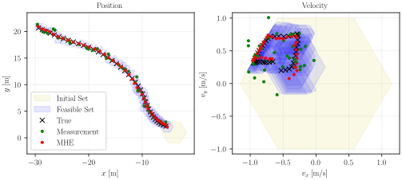

# ZonoOpt

This C++ header library provides classes and tailored optimization routines for zonotopes, constrained zonotopes, and hybrid zonotopes. To use, `#include "ZonoOpt.hpp"`. All classes and methods are implemented using sparse linear algebra via the Eigen library. Generators may optionally have range [0,1] instead of [-1,1]. 

Python bindings can be installed from PyPI with `pip install zonoopt`. To build the bindings from source, use `pip install .`. Note that a C++ compiler is required to build from source, and the Eigen submodule must be checked out (can be accomplished by running `python3 update_submodules.py`).

More information about ZonoOpt can be found in the the following publication. Please cite this if you publish work based on ZonoOpt: 
**Robbins, J.A., Siefert, J.A., and Pangborn, H.C., "Sparsity-Promoting Reachability Analysis and Optimization of Constrained Zonotopes," 2025. [https://arxiv.org/abs/2504.03885](https://doi.org/10.48550/arXiv.2504.03885).**

Auto-generated API documentation is available below.

[C++ API](https://psu-PAC-Lab.github.io/ZonoOpt/C++/html/index.html)

[Python API](https://psu-PAC-Lab.github.io/ZonoOpt/python/build/html/index.html)

