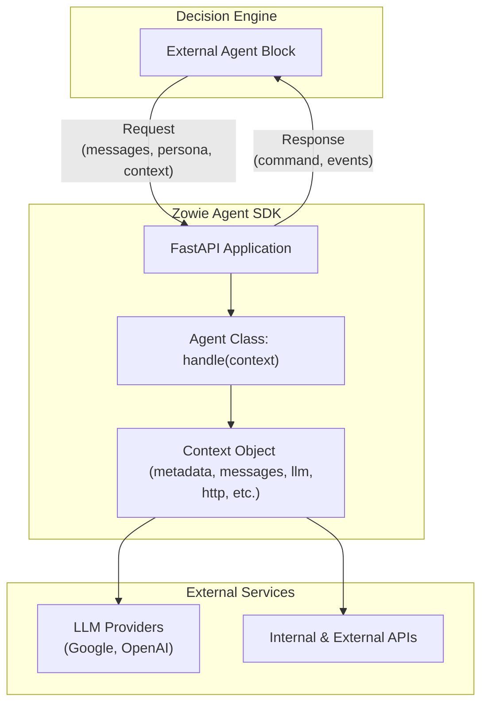

# Zowie Agent SDK for Python

A Python framework for building external agents that integrate with [Zowie Decision Engine](https://docs.zowie.ai/docs/process-automation).
With this SDK, you can build agents that:

- Process conversations and generate natural responses
- Connect to internal systems and private APIs
- Use LLMs (Google Gemini, OpenAI GPT) for reasoning
- Transfer conversations between workflow blocks
- Get **full observability** in [Zowie Supervisor](https://docs.zowie.ai/docs/improve#supervisor--observe--understand) (LLM calls + API calls auto-tracked)

The SDK handles all communication with the Decision Engine so you can focus on your business logic.

## Table of Contents

- [Architecture](#architecture)
- [Prerequisites](#prerequisites)
- [Installation](#installation)
- [Quick Start](#quick-start)
- [Configuration](#configuration)
  - [LLM Provider Configuration](#llm-provider-configuration)
  - [Authentication Configuration](#authentication-configuration)
- [Usage Guide and API Reference](#usage-guide-and-api-reference)
  - [Agent Class](#agent-class)
  - [Context Class](#context-class)
  - [Response Types](#response-types)
  - [LLM Client](#llm-client)
  - [HTTP Client](#http-client)
  - [Value Storage](#value-storage)
- [Performance and Concurrency](#performance-and-concurrency)
- [Event Tracking and Observability](#event-tracking-and-observability)
- [API Endpoints](#api-endpoints)
- [Request Validation](#request-validation)
- [Testing](#testing)
- [Development Setup](#development-setup)
- [Support and Contributing](#support-and-contributing)

---

## Architecture

The SDK is built on **FastAPI**, providing an HTTP server that integrates with Zowie's Decision Engine. Your agents receive conversation requests and fulfill them by connecting to LLMs for language understanding and external APIs to gather live data or execute tasks, then return responses.

### System Architecture Diagram



### Core Components

- **Agent Base Class**: Abstract base class defining the agent interface - implement your business logic here.
- **Context Management**: Request context with conversation history, metadata, and pre-configured clients.
- **LLM Integration**: Multi-provider support for Google Gemini and OpenAI GPT models with automatic event tracking.
- **HTTP Client**: Automatic request/response logging for private APIs and external services.
- **Authentication**: Multiple authentication methods for securing your agent endpoints.
- **Event Tracking**: All LLM calls and HTTP requests automatically logged and available in Supervisor.

---

## Prerequisites

- Python 3.9+
- An active Zowie AI Agent
- API keys for your chosen LLM provider (Google Gemini/OpenAI)

---

## Installation

### Using pip with virtual environment

```bash
# Create and activate virtual environment
python -m venv venv
source venv/bin/activate

# Install the SDK
pip install zowie-agent-sdk
```

### Using Poetry (recommended)

```bash
poetry add zowie-agent-sdk
```

### Using uv

```bash
uv add zowie-agent-sdk
```

### Dependencies

The SDK requires Python 3.9+ and includes the following core dependencies:

- **FastAPI**: Web framework for building the HTTP API
- **Pydantic v2**: Data validation and serialization
- **Google AI SDK**: For Google Gemini model integration
- **OpenAI SDK**: For OpenAI GPT model integration
- **Requests**: HTTP client library

---

## Quick Start

### 1\. Basic Agent Implementation

Create a simple agent that responds to user messages using an LLM.

```python
import os
from zowie_agent_sdk import (
    Agent,
    Context,
    ContinueConversationResponse,
    GoogleProviderConfig,
    AgentResponse
)

class CustomerSupportAgent(Agent):
    def handle(self, context: Context) -> AgentResponse:
        """Process incoming requests and generate responses."""
        response = context.llm.generate_content(
            messages=context.messages,
            system_instruction="You are a helpful customer support assistant. "
                             "Provide accurate and friendly assistance."
        )

        return ContinueConversationResponse(message=response)

# Configure the agent
agent = CustomerSupportAgent(
    llm_config=GoogleProviderConfig(
        api_key=os.getenv("GOOGLE_API_KEY", ""),
        model="gemini-2.5-flash"
    )
)

# The FastAPI application is accessible via agent.app
app = agent.app
```

### 2\. Running Your Agent

#### Development

Use `uvicorn` with auto-reload for a smooth development experience.

```bash
poetry run uvicorn example:app --host 0.0.0.0 --port 8000 --reload --log-level debug
```

#### Production

For production deployment, disable reload and use multiple workers to handle concurrent conversations.

```bash
poetry run uvicorn example:app --host 0.0.0.0 --port 8000 --workers 4 --log-level info
```

### 3\. Advanced Example: Document Verification Expert

The repository includes a complete example (`example.py`) demonstrating a **Document Verification Expert Agent** that showcases advanced SDK features:

- **Specialized Expertise**: Agent only handles document verification questions.
- **Scope Detection**: Uses structured analysis to determine if queries are within its domain.
- **Transfer Capability**: Automatically transfers out-of-scope questions to general support.
- **Internal System Integration**: Demonstrates connecting to internal APIs and private systems that cannot be exposed publicly.
- **Natural Responses**: Returns conversational answers to end users.

**Key Features Demonstrated:**

- `generate_structured_content()` for intent analysis
- `TransferToBlockResponse` for seamless handoffs
- `context.http` for internal API calls with automatic logging and Supervisor visibility
- Expert system pattern for specialized business logic

**Example interactions:**

- "What documents do I need?" → Detailed requirements
- "Why was my passport rejected?" → Specific guidance
- "Reset my password" → Transfer to general support

Run the example: `poetry run uvicorn example:app --reload`

---

## Configuration

### LLM Provider Configuration

Configure the LLM provider using one of the following configuration objects.

#### Google Gemini

```python
from zowie_agent_sdk import GoogleProviderConfig

llm_config = GoogleProviderConfig(
    api_key=os.getenv("GOOGLE_API_KEY", ""),
    model="gemini-2.5-flash",  # or "gemini-2.5-pro"
    thinking_budget=0  # Optional: control thinking level
)
```

- **api_key** (`str`): Your Google AI API key.
- **model** (`str`): The model name to use.
- **thinking_budget** (`Optional[int]`): Controls reasoning depth for Gemini 2.5+ models. Set to `0` to disable extended thinking (faster responses), or higher values for deeper reasoning. Default is `None` (dynamic thinking, meaning the model will adjust the budget based on the complexity of the request.).

#### OpenAI GPT

```python
from zowie_agent_sdk import OpenAIProviderConfig

llm_config = OpenAIProviderConfig(
    api_key=os.getenv("OPENAI_API_KEY", ""),
    model="gpt-5-mini",  # or "gpt-5", "o3", "o3-mini"
    reasoning_effort="low"  # Optional: For reasoning models - "minimal, "low", "medium", or "high"
)
```

- **api_key** (`str`): Your OpenAI API key.
- **model** (`str`): The model name to use.
- **reasoning_effort** (`Optional["minimal" | "low" | "medium" | "high"]`, optional): Controls the reasoning effort for reasoning models (o1, o3, GPT-5 series).
  - `"minimal"`: Minimal reasoning tokens, fastest time-to-first-token
  - `"low"`: Fewer reasoning tokens (faster)
  - `"medium"`: Balanced reasoning tokens (default when not specified)
  - `"high"`: More reasoning tokens (slower, more thorough)

### Authentication Configuration

Secure your agent's endpoint using an authentication strategy that matches your Zowie External Agent Block configuration.

#### API Key Authentication

```python
from zowie_agent_sdk import APIKeyAuth

auth_config = APIKeyAuth(
    header_name="X-API-Key",
    api_key=os.getenv("AGENT_API_KEY", "")
)
```

- **header_name** (`str`): Name of the HTTP header containing the API key.
- **api_key** (`str`): The expected API key value.

#### Basic Authentication

```python
from zowie_agent_sdk import BasicAuth

auth_config = BasicAuth(
    username=os.getenv("AGENT_USERNAME", "admin"),
    password=os.getenv("AGENT_PASSWORD", "")
)
```

- **username** (`str`): The expected username for HTTP Basic Auth.
- **password** (`str`): The expected password for HTTP Basic Auth.

#### Bearer Token Authentication

```python
from zowie_agent_sdk import BearerTokenAuth

auth_config = BearerTokenAuth(
    token=os.getenv("AGENT_BEARER_TOKEN", "")
)
```

- **token** (`str`): The expected bearer token value.

### Agent Configuration Parameters

You can customize the agent's behavior during initialization.

```python
agent = MyAgent(
    llm_config=llm_config,
    http_timeout_seconds=10.0,                  # Default HTTP timeout
    auth_config=auth_config,                    # Authentication (optional)
    include_persona_by_default=True,            # Include persona in LLM calls
    include_context_by_default=True,            # Include context in LLM calls
    include_http_headers_by_default=True,       # Include headers in event logs
    include_request_bodies_in_events_by_default=True,  # Include HTTP request bodies in events
    log_level="INFO"                            # Logging level
)
```

---

## Usage Guide and API Reference

### Naming Conventions: `snake_case` vs. `camelCase`

A key convention to be aware of is that the Python SDK exclusively uses **`snake_case`** for all object attributes, following Python's standard (PEP 8). However, the underlying JSON API that communicates with Zowie's Decision Engine uses **`camelCase`** for all JSON keys.

**The SDK handles this transformation for you automatically.** You will never need to write `camelCase` in your Python code.

This means when you create a response object in Python, the SDK will automatically convert its attributes to `camelCase` before sending it as a JSON payload.

**Example:**

In your Python agent, you use `snake_case`:

```python
# In your Python code, you use snake_case
return TransferToBlockResponse(
    next_block="human-handoff-block-key",
    message="Let me get a human for you."
)
```

The SDK converts this into the following JSON with `camelCase` keys:

```json
// The resulting JSON sent over the wire uses camelCase
{
  "command": {
    "type": "transfer_to_block",
    "payload": {
      "nextBlock": "human-handoff-block-key",
      "message": "Let me get a human for you."
    }
  },
  ...
}
```

You only need to remember this convention when comparing your Python objects to the raw JSON examples in the API documentation or when debugging network requests.

### Agent Class

The `Agent` class is the base for all agents. Inherit from this class and implement the `handle` method.

#### Agent Properties

- `logger: logging.Logger`: Logger instance for this agent, automatically configured with the agent's class name (e.g., `zowie_agent.MyAgent`).
- `app: FastAPI`: The FastAPI application instance exposed for deployment (e.g., `uvicorn myagent:agent.app`).

```python
from zowie_agent_sdk import Agent, Context, AgentResponse

class MyAgent(Agent):
    def handle(self, context: Context) -> AgentResponse:
        """
        Process the incoming request and return a response.

        Args:
            context: Request context containing messages, metadata, and clients.

        Returns:
            Either ContinueConversationResponse or TransferToBlockResponse.
        """
        # Your agent logic goes here
        response = context.llm.generate_content(
            messages=context.messages,
            system_instruction="You are a helpful assistant"
        )

        self.logger.info(f"Generated response: {response}")
        return ContinueConversationResponse(message=response)
```

#### Logging Configuration

The agent automatically sets up logging with the specified log level (default: "INFO"). You can customize the log level during agent initialization:

```python
agent = MyAgent(
    llm_config=llm_config,
    log_level="DEBUG"  # Options: DEBUG, INFO, WARNING, ERROR, CRITICAL
)
```

**Note**: The SDK automatically logs request start/end and errors. Use `self.logger` for business logic events, debugging, and monitoring specific to your agent's functionality.

For a complete example of effective logging usage, see the `DocumentVerificationExpertAgent` in `example.py`, which demonstrates logging for query analysis, scope decisions, and error handling.

### Context Class

The `Context` object provides access to all request data and pre-configured clients.

- `metadata: Metadata`: Request metadata (IDs, timestamps).
- `messages: List[Message]`: Conversation message history.
- `context: Optional[str]`: Context string from the Zowie configuration.
- `persona: Optional[Persona]`: Chatbot persona information.
- `llm: LLM`: LLM client with automatic context injection and event tracking.
- `http: HTTPClient`: HTTP client with automatic event tracking.
- `store_value: Callable[[str, Any], None]`: Function to store values in the Decision Engine.

The primary data objects within the `Context` have the following structure:

#### Metadata

Contains identifiers for the current request and conversation.

```python
from typing import Optional

class Metadata:
    requestId: str
    chatbotId: str
    conversationId: str
    interactionId: Optional[str]
```

#### Message

Represents a single message in the conversation history.

```python
from typing import Literal
from datetime import datetime

class Message:
    author: Literal["User", "Chatbot"]
    content: str
    timestamp: datetime
```

#### Persona

Describes the AI's personality, context, and tone, as configured in Zowie.

```python
from typing import Optional

class Persona:
    name: Optional[str]
    business_context: Optional[str]
    tone_of_voice: Optional[str]
```

### Response Types

Your `handle` method must return one of two response types.

#### ContinueConversationResponse

Continue the conversation in the current process block.

```python
from zowie_agent_sdk import ContinueConversationResponse

return ContinueConversationResponse(
    message="Your response message here"
)
```

#### TransferToBlockResponse

Transfer the conversation to another process block.

```python
from zowie_agent_sdk import TransferToBlockResponse

return TransferToBlockResponse(
    message="Optional message sent before transfer.",
    next_block="target-block-reference-key"
)
```

### LLM Client

The `context.llm` client provides methods for interacting with language models.

#### Text Generation

```python
response_text = context.llm.generate_content(
    messages=context.messages,
    system_instruction="Custom system prompt",
    include_persona=True,  # Override agent default
    include_context=True   # Override agent default
)
```

#### Structured Content Generation

Generate structured JSON output that conforms to a Pydantic model. This is ideal for tasks like intent detection, entity extraction, or data classification.

```python
# Example usage within your agent's handle() method
from pydantic import BaseModel, Field
from typing import Literal

class OrderAnalysis(BaseModel):
    urgency: int = Field(ge=1, le=5, description="Urgency level from 1 to 5")
    sentiment: Literal["positive", "neutral", "negative"]

def handle(self, context: Context) -> AgentResponse:
    analysis = context.llm.generate_structured_content(
    messages=context.messages,
    schema=OrderAnalysis,
    system_instruction="Analyze this customer service conversation about an order."
)

self.logger.info(f"Order analysis - Urgency: {analysis.urgency}, Sentiment: {analysis.sentiment}")

# Use the analysis to determine response
if analysis.urgency >= 4:
    return TransferToBlockResponse(
        message="This looks urgent. Let me connect you with a specialist.",
        next_block="urgent-support"
    )
else:
    return ContinueConversationResponse(
        message=f"I understand your {analysis.sentiment} feedback about the order. How can I help?"
    )
```

#### Basic Structured Output

For simple data extraction, you can use basic Pydantic models with just string fields:

```python
# Example usage within your agent's handle() method
from pydantic import BaseModel

class UserInfo(BaseModel):
    name: str
    email: str
    message: str

def handle(self, context: Context) -> AgentResponse:
    user_info = context.llm.generate_structured_content(
    messages=context.messages,
    schema=UserInfo,
    system_instruction="Extract the user's name, email, and main message from the conversation."
)

self.logger.info(f"Extracted user info - Name: {user_info.name}, Email: {user_info.email}")

return ContinueConversationResponse(
    message=f"Hello {user_info.name}! I see you're reaching out about: {user_info.message}. "
            f"I'll make sure to follow up with you at {user_info.email} if needed."
)
```

#### Advanced Structured Output

For complex business logic, you can use nested models with validation. Here's an example of a technical support diagnostic system that integrates with internal tools:

```python
# Example usage within your agent's handle() method
from pydantic import BaseModel, Field
from typing import List, Literal, Optional

class TechnicalDiagnostic(BaseModel):
    class SystemInfo(BaseModel):
        platform: Literal["windows", "macos", "linux", "ios", "android", "web"]
        version: Optional[str] = None
        browser: Optional[str] = None

    class IssueDetails(BaseModel):
        category: Literal["authentication", "performance", "connectivity", "data_sync", "feature_request"]
        severity: int = Field(ge=1, le=5, description="Severity from 1=low to 5=critical")
        reproducible: bool
        error_codes: List[str] = Field(default_factory=list)

    class SuggestedActions(BaseModel):
        immediate_steps: List[str] = Field(description="Steps user can try immediately")
        requires_escalation: bool
        estimated_resolution_time: int = Field(ge=0, le=72, description="Hours to resolve")
        internal_tools_needed: List[str] = Field(default_factory=list)

    system: SystemInfo
    issue: IssueDetails
    user_expertise: Literal["beginner", "intermediate", "advanced", "developer"]
    previous_tickets: int = Field(ge=0, description="Number of previous support tickets")
    actions: SuggestedActions
    confidence_score: float = Field(ge=0.0, le=1.0)

def handle(self, context: Context) -> AgentResponse:
    diagnostic = context.llm.generate_structured_content(
        messages=context.messages,
        schema=TechnicalDiagnostic,
        system_instruction="Analyze this technical support conversation and provide structured diagnostic information for internal systems integration."
    )

    # Use the diagnostic data to integrate with internal systems
    if diagnostic.actions.requires_escalation:
        self.logger.info(f"Critical {diagnostic.issue.category} issue - escalating to engineering")
        return TransferToBlockResponse(
            message="This requires our engineering team's attention. I'm escalating this now.",
            next_block="engineering-escalation"
        )
    else:
        self.logger.info(f"{diagnostic.issue.category} issue can be resolved in {diagnostic.actions.estimated_resolution_time}h")
        return ContinueConversationResponse(
            message=f"I can help resolve this {diagnostic.issue.category} issue. "
                   f"Based on my analysis, this should take about {diagnostic.actions.estimated_resolution_time} hours to fix."
        )
```

**Note**: Supported Pydantic features may vary by LLM provider. Refer to the [Google Gemini](https://ai.google.dev/gemini-api/docs/structured-output#schemas-in-python) and [OpenAI](https://platform.openai.com/docs/guides/structured-outputs) documentation for details.

### HTTP Client

The `context.http` client provides standard HTTP methods (`get`, `post`, `put`, etc.) with automatic event tracking for observability in Supervisor.

```python
# GET request to a document verification system
response = context.http.get(
    url="https://internal-docs.company.com/verify/passport/ABC123",
    headers={"Authorization": f"Bearer {os.getenv('DOC_SYSTEM_TOKEN', '')}"},
    timeout_seconds=5,
    include_headers=False # Don't include headers in events for this sensitive request
)

# POST request to a fraud detection service
fraud_check = context.http.post(
    url="https://fraud-detection.internal/analyze",
    json={"user_id": "12345", "transaction_id": "txn_abc"},
    headers={"X-API-Key": os.getenv('FRAUD_API_KEY', '')},
    include_request_bodies=False  # Don't include request body in events for this call
)

if fraud_check.status_code == 200:
    data = fraud_check.json()
    print(f"Fraud check result: {data}")
```

### Value Storage

Store key-value pairs within the conversation that can be used later in the Decision Engine.

```python
def handle(self, context: Context) -> AgentResponse:
    # Store a value for use in the current conversation
    context.store_value("user_preference", "email_notifications")

    return ContinueConversationResponse(message="Your preferences have been saved!")
```

---

## Performance and Concurrency

### Synchronous by Design

The SDK uses **synchronous handlers** for simplicity. You don't need to manage `async`/`await` patterns in your agent logic, which makes it easier to integrate with existing synchronous libraries and simplifies debugging.

```python
def handle(self, context: Context) -> AgentResponse:
    # Simple, readable synchronous code
    data = context.http.get(url, headers).json()
    response = context.llm.generate_content(messages=context.messages)
    return ContinueConversationResponse(message=response)
```

### Scaling with Workers

The underlying FastAPI server runs synchronously in a thread pool. To handle high traffic, you should scale horizontally by increasing the number of `uvicorn` workers.

- **Default Concurrency**: 40 concurrent requests (conversations) per worker.
- **Scaling**: A 4-worker setup can handle approximately 160 concurrent conversations.

<!-- end list -->

```bash
# Production with 4 workers = ~160 concurrent requests
poetry run uvicorn example:app --workers 4 --host 0.0.0.0 --port 8000
```

Consider adding more workers if your agent performs long-running I/O operations or if you expect sustained high request volumes.

---

## Event Tracking and Observability

The SDK automatically tracks all `context.http` and `context.llm` calls as events. These are sent back with every agent response and are visible in **Supervisor**, giving you complete observability into your agent's interactions with external systems.

### API Call Event Example

```json
{
  "type": "api_call",
  "payload": {
    "url": "https://fraud-detection.internal/analyze",
    "requestMethod": "POST",
    "requestHeaders": { "X-API-Key": "***" },
    "requestBody": "{\"user_id\": \"12345\"}",
    "responseStatusCode": 200,
    "responseBody": "{\"risk_score\": 0.15}",
    "durationInMillis": 245
  }
}
```

### LLM Call Event Example

```json
{
  "type": "llm_call",
  "payload": {
    "model": "gemini-2.5-flash",
    "prompt": "{\n  \"messages\": [\n    {\n      \"author\": \"User\",\n      \"content\": \"What documents do I need for verification?\",\n      \"timestamp\": \"2024-01-15T10:30:00.000Z\"\n    }\n  ],\n  \"system_instruction\": \"You are a document verification expert.\"\n}",
    "response": "For account verification, you'll need to provide a government-issued ID and proof of residence.",
    "durationInMillis": 1200
  }
}
```

---

## API Endpoints

Your agent server exposes the following HTTP endpoints.

### `POST /`

This is the main endpoint for processing conversation requests from the Zowie Decision Engine.

---

#### Request Body

The incoming request from Zowie will have the following JSON structure.

```json
{
  "metadata": {
    "requestId": "unique-request-id",
    "chatbotId": "chatbot-identifier",
    "conversationId": "conversation-identifier",
    "interactionId": "optional-interaction-id"
  },
  "messages": [
    {
      "author": "User",
      "content": "What documents do I need to submit?",
      "timestamp": "2024-01-15T10:30:00.000Z"
    }
  ],
  "context": "Optional context string from the Zowie automation.",
  "persona": {
    "name": "Document Expert",
    "businessContext": "This agent specializes in document verification.",
    "toneOfVoice": "Professional and helpful."
  }
}
```

---

#### Response Bodies

Your agent must return one of the two following JSON structures, corresponding to the response type you choose.

##### For `ContinueConversationResponse`

This response sends a message back to the user and continues the conversation in the current block.

```json
{
  "command": {
    "type": "send_message",
    "payload": {
      "message": "For verification, you'll need a government-issued ID and proof of residence. Would you like specific details about acceptable document types?"
    }
  },
  "valuesToSave": {
    "interaction_type": "document_inquiry",
    "timestamp": "2025-09-17T01:34:40Z"
  },
  "events": [
    {
      "type": "llm_call",
      "payload": {
        "model": "gemini-1.5-flash",
        "prompt": "...",
        "response": "For verification, you'll need...",
        "durationInMillis": 1200
      }
    }
  ]
}
```

##### For `TransferToBlockResponse`

This response transfers the conversation to a different block in your Zowie automation flow. You can optionally send a final message before the transfer occurs.

```json
{
  "command": {
    "type": "transfer_to_block",
    "payload": {
      "message": "One moment, I'll get someone from our support team to help with that.",
      "nextBlock": "human-handoff-block-key"
    }
  },
  "valuesToSave": {
    "transfer_reason": "out_of_scope_question"
  },
  "events": [
    {
      "type": "llm_call",
      "payload": {
        "model": "gemini-1.5-flash",
        "prompt": "...",
        "response": "...",
        "durationInMillis": 950
      }
    }
  ]
}
```

---

### `GET /health`

A simple health check endpoint for monitoring.

- **Response Body**: `{"status": "healthy", "agent": "YourAgentClassName"}`

---

## Request Validation

All incoming requests to the `POST /` endpoint are automatically validated against a Pydantic model. Invalid requests will receive an HTTP 422 Unprocessable Entity response with detailed validation errors.

The validation is forward-compatible, meaning new fields added by Zowie in the future will be ignored and won't break your agent.

---

## Testing

The SDK is designed to be easily testable. The repository includes a comprehensive test suite with mocks for external services.

### Running Tests

```bash
# Run all fast, mocked tests (recommended for CI/CD)
poetry run pytest tests/ -k "not real" -v

# Run real E2E tests against live APIs (requires API keys)
GOOGLE_API_KEY="..." OPENAI_API_KEY="..." poetry run pytest tests/test_e2e_real_apis.py -v

# Run tests with coverage report
poetry run pytest tests/ -k "not real" --cov=src/zowie_agent_sdk --cov-report=html
```

### Writing Tests

Use standard mocking libraries to test your agent's logic without making real network calls. The SDK provides test utilities in `tests/utils.py` to help create test data and assert outcomes.

```python
from unittest.mock import patch, Mock
from tests.utils import create_test_metadata, create_test_message

# Mocking an HTTP request
@patch('requests.request')
def test_agent_with_http_call(mock_request):
    mock_response = Mock(status_code=200)
    mock_response.json.return_value = {"data": "test"}
    mock_request.return_value = mock_response

    # Your agent testing logic here...

# Mocking an LLM call
@patch('zowie_agent_sdk.llm.google.GoogleProvider.generate_content')
def test_agent_with_llm_call(mock_generate):
    mock_generate.return_value = "Test response from LLM"

    # Your agent testing logic here...
```

---

## Development Setup

For contributors working on the SDK itself:

```bash
# Clone the repository
git clone https://github.com/chatbotizeteam/zowie-agent-sdk-python/
cd zowie-agent-sdk-python

# Install dependencies and set up pre-commit hooks
make setup

# Development commands

# Individual tools
make install     # Install dependencies only
make test        # Run tests (real API tests skipped if no keys)
make lint        # Check code style (with auto-fix)
make format      # Format code
make typecheck   # Run type checking on source and tests

# Individual checks (no fixes)
make check-lint    # Check linting without fixes
make check-format  # Check formatting without fixes

# Combined commands
make fix         # Auto-fix all formatting and linting issues
make check       # Run ALL checks (lint, format, types, tests)
make all         # Fix everything, then run all checks

# Utility
make clean       # Remove Python cache files
```

---

## Support and Contributing

For issues, questions, or contributions, please refer to the project repository.
